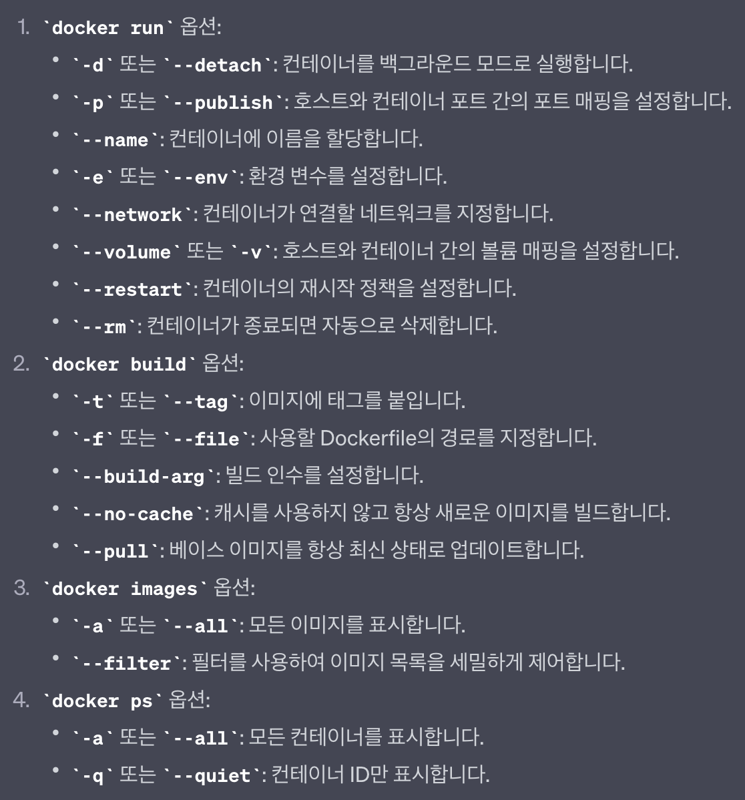
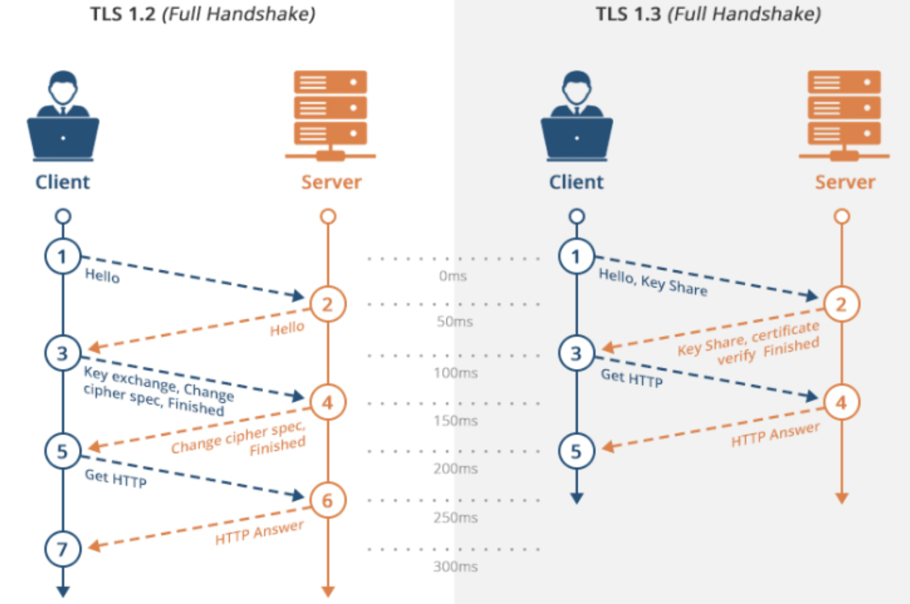

# Inception

## Index

- [Subject](#subject)
    - [General guidelines](#general-guidelines)
    - [Mandatory part](#mandatory-part)
        - [설정해야 할 것](#설정해야-할-것)
        - [그 외 주의사항](#그-외-주의사항)
- [개념](#개념)
    - [Docker](#docker)
      - [Container](#container)
      - [Image](#image)
      - [레이어 저장방식](#레이어-저장방식)
      - [Dockerfile](#dockerfile)
      - [Docker-compose](#docker-compose)
      - [Volume](#volume)
    - [PID 1](#pid-1)
        - [docker와의 관계](#docker와의-관계)
    - [Alpine Linux](#alpine-linux)
      - [apk](#apk)
    - [openssl](#openssl)
    - [daemon off](#daemon-off)
    - [서버 3계층 구조(3-tier architecture)](#서버-3계층-구조3-tier-architecture)
    - [TLS(Transport Layer Security)](#tlstransport-layer-security)
        - [TLS 1.2 vs TLS 1.3](#tls12-vs-tls13)
    - [PHP](#php)
    - [php-fpm](#php-fpm)
- [명령어](#명령어)
    - [docker 이미지 생성 및 실행](#docker-이미지-생성-및-실행)
    - [nginx](#nginx)
      - [nginx config 관련](#nginx-config-관련)
      - [nginx ssl 버전 확인](#nginx-ssl-버전-확인)
    - [mariadb 관련](#mariadb-관련)
        - [데이터베이스 초기화](#데이터베이스-초기화)
        - [데이터베이스 서버 동작 및 설정 제어](#데이터베이스-서버-동작-및-설정-제어)
        - [sql 관련](#sql-관련)
    - [php 관련](#php-관련)
- [참고 문헌](#참고-문헌)

## Subject

### General guidelines

- 이 프로젝트는 가상머신 위에서 작업해야 한다.
- 프로젝트 구성에 필요한 모든 파일은 `srcs` 폴더에 있어야 한다.
- `Makefile`은 `root` 폴더에 위치해야 한다. 또한 전체 애플리케이션을 설정해야 한다.
- 즉, `docker-compose.yml` 파일을 통해 `Docker image`를 빌드해야 한다.

### Mandatory part

이 프로젝트는 특정 규칙에 따라 다양한 서비스로 구성된 소규모 인프라를 설정하는 것으로 구성된다.
전체 프로젝트는 가상 머신에서 수행해야 하며 `docker compose`를 사용해야 한다.

- 각 docker image는 해당 서비스와 동일한 이름을 가져야 한다. 그리고 전용 컨테이너에서 실행되어야 한다.
- 성능 문제를 위해 컨테이너는 두 번째로 안정적인 버전(penultimate stable version)의 `Alpine`이나 `Debian`을 사용해야 한다.
- 또한 서비스당 하나씩 자체 `Dockerfiles`을 작성해야 한다. `Dockerfiles`은 반드시 Makefile에서 `docker-compose.yml`로 호출해야 한다.

> 즉, 프로젝트의 docker image를 직접 빌드해야 한다.

- 기존 docker image나 DockerHub 같은 서비스 사용은 금지된다. (Alpine, Debian은 제외)

#### 설정해야 할 것

- TLSv1.2나 TLSv1.3의 `NGINX`를 포함하는 도커 컨테이너
- nginx를 제외한 `WordPress` + `php-fpm`(반드시 설치 및 구성해야 한다.)를 포함한 도커 컨테이너
- nginx를 제외한 `MariaDB`를 포함한 도커 컨테이너
- `WordPress database`를 포함한 볼륨
- `WordPress website files`를 포함한 두번째 볼륨
- 컨테이너들을 연결하는 `docker-network`를 설정한다.
- 컨테이너가 crash나면 다시 시작해야 한다.

> Docker 컨테이너는 가상 머신이 아니다. 그러므로 `tail -f` 등을 기반으로 하는 hacky patch를 사용하지 않는 것이 좋다.
> demon의 작동 방식과 사용하는 것이 좋은지 나쁜지에 대해 읽어보면 좋다.

> host나 --link, links 등 네트워크 사용은 금지된다. 네트워크 줄은 docker-compose.yml 파일에 있어야 한다.  
> 컨테이너는 무한 루프를 실행하는 명령으로 시작하면 안 된다. 이는 entrypoint나 entrypoint scripts를 사용하는 모든 명령어에도 적용된다.  
> 다음은 몇 가지 금지된 hacky patches들이다.  
> ->  tail -f, bash, sleep infinity, while true.

> `PID 1`과 Dockrfiles 모범 사례에 대해 찾아보면 좋다.

- WordPress 데이터베이스 반드시 두 명의 사용자가 있어야 하며 그 중 하나는 관리자여야 한다. 이때 이름은 admin/Admin이란 단어가 포함되면 안 된다.

> 보은 도커를 사용하는 호스트 머신의 /home/login/data 폴더에서 사용할 수 있다. 물론 login은 사용자 계정으로 바꿔야 한다.

작업을 더욱 간단하게 하려면, 도메인 이름이 로컬 IP 주소를 가리키도록 구성해야 한다.

도메인의 이름은 반드시 `login.42.fr` 이어야 한다. 여기서도 사용자의 login 이름을 사용해야 한다.
예를 들어, 너가 myko라면 `myko.42.fr`이 myko의 웹사이트를 가리키는 IP 주소로 리다이렉트된다.

> #### 그 외 주의사항
> - 최신 태그는 금지된다.
> - Dockerfile들에는 비밀번호가 없어야 한다.
> - 환경 변수는 반드시 사용해야 한다.
> - 또한 `.env` 파일을 사용하여 환경 변수를 저장할 것을 강력히 권장한다. 이때, `.env` 파일은 `srcs` 폴더의 루트 폴더에 있어야 한다.
> - NGINX 컨테이너는 포트 443을 통해서만 인프라로 진입할 수 있어야 한다. 443 포트를 통해서만 인프라에 접속할 수 있으며, TLSv1.2나 TLSv1.3을 프로토콜로 사용해야 한다.

프로젝트의 다이어그램이다.


폴더 구조의 한 예시이다.


> 보안상의 이유로 모든 자격 증명, API 키, 환경 변수 등은 .env 파일에 로컬로 저장하고 git에선 무시해야 한다.
> 공개적으로 저장된 자격 증명을 사용하면 0점을 받게 된다.

---

## 개념

### Docker

- 컨테이너 기반의 오픈소스 가상화 플랫폼
- 다양한 프로그램, 실행환경을 컨테이너로 추상화하하고 동일한 인터페이스를 제공하여 프로그램의 배포 및 관리를 단순하게 해준다.
- 백엔드 프로그램, 데이터베이스 서버, 메시지 큐 등 어떤 프로그램도 컨테이너로 추상화 가능
- 그리고 어떤 환경에서도 실행 가능

<details>
<summary>docker option</summary>
<div markdown="1">



</div>
</details>

- docker는 리눅스 컨테이너를 사용하여 프로세스를 격리하고, 리눅스 커널을 공유한다.
- 그렇기에 linux kernel에 있는 기능을 사용하여 컨테이너를 생성한다.

<details>
<summary>docker container의 기능</summary>
<div markdown="1">

1. chroot(Change Root Directory) - 프로세스 격리
   - chroot를 통해 특정 디렉토리 경로를 root로 지정하여 환경 분리가 가능
   - 상위 디렉토리에 프로세스가 접근할 수 없도록 설정하는 것으로 해당 경로에 프로세스를 격리
   - 즉, `bin` , `boot` , `dev` 폴더 등을 새로 만들어서 가짜 루트 디렉토리를 만들어 프로세스를 격리하는데 사용한다.

2. namespace - 컨테이너 분리
    - 6가지 독립 기능을 지원한다.
      - pid(Process ID) - 독립적인 프로세스 공간 할당
      - net(Network) - namespace 간의 네트워크 격리(중복 포트 바인딩 등)
      - ipc(InterProcess Communication) - 프로세스 간 통신 격리
      - mnt(Mount) - 호스트 파일시스템에 구애받지 않고 독립적으로 파일 시스템을 관리
      - uts(UNIX Time-sharing System) - 호스트 이름과 도메인 이름 격리
      - user - 사용자와 그룹 격리

3. cgroup(Control Group) - 자원 제한
    - 자원에 대한 제어를 가능하게 해주는 리눅스 커널 기능
    - CPU, 메모리, 디스크 I/O, 네트워크, device 노드(/dev/) 등을 제어할 수 있다.

</div>
</details>

#### Container

- 격리된 공간에서 프로세스가 동작하는 기술
- 기존 가상화 대상이었던 OS 대신 프로세스를 격리하는 방식을 `리눅스 컨테이너`라고 한다.

#### Image

- 컨테이너 실행에 필요한 파일과 설정값 등을 포함하고 있는 것
- 상태값을 가지지 않고 변하지 않는다.
- 컨테이너는 이미지를 실행한 상태라고 볼 수 있으며 추가되거나 변하는 값은 컨테이너에 저장된다.

#### 레이어 저장방식

- 이미지는 여러 개의 읽기 전용 레이어로 구성되며 이 레이어를 바탕으로 파일 시스템을 구성한다.
- 그렇기에 기존 이미지에 파일을 추가해도 레이어 하나만 추가하기에 굉장히 효율적이다.

#### Dockerfile

```dockerfile
# vertx/vertx3 debian version
FROM subicura/vertx3:3.3.1
MAINTAINER chungsub.kim@purpleworks.co.kr

ADD build/distributions/app-3.3.1.tar /
ADD config.template.json /app-3.3.1/bin/config.json
ADD docker/script/start.sh /usr/local/bin/
RUN ln -s /usr/local/bin/start.sh /start.sh

EXPOSE 8080
EXPOSE 7000

CMD ["start.sh"]
```

- 이미지를 만들기 위한 설정 파일
- 자체 DSL(Domain Specific Language)을 사용하여 이미지 생성 과정을 정의한다.

| 명령         | 기능 및 설명                                                                                                                                                      | 예시                                                                                |
|:-----------|:-------------------------------------------------------------------------------------------------------------------------------------------------------------|:----------------------------------------------------------------------------------|
| FROM       | - 기본 이미지 지정                                                                                                                                                  | FROM alpine                                                                       |
| WORKDIR    | - 컨테이너 내에서 작업 디렉토리 설정                                                                                                                                        | WORKDIR /app                                                                      |
| COPY       | - 파일 또는 디렉토리를 복사할 때 경로를 지정                                                                                                                                   | COPY src/ /app (호스트 시스템의 src/ 폴더를 컨테이너의 /app 경로로 복사)                              |
| ADD        | - COPY + URL이나 압축 파일 다운 및 추출<br/>- Docker 공식 문서에서는 COPY를 먼저 고려하고 ADD는 필요한 경우에만 사용할 것을 권장                                                                     | ADD build/distributions/app-3.3.1.tar /                                           |
| RUN        | - 컨테이너 내에서 실행할 명령어<br/>- 이미지를 빌드하는 동안 실행되며, 그 결과는 이미지의 레이어로 저장된다.                                                                                            | RUN apt-get update && apt-get install -y python3                                  |
| ENV        | - 이미지 내에서 사용될 환경 변수 설정<br/>- .env 파일에 있는 환경 변수를 가져올 경우, docker-compose.yml에서 ${ENV_NAME}으로 사용 가능                                                             | ENV DB_HOST=localhost DB_PORT=5432                                                |
| EXPOSE     | - 컨테이너가 리스닝할 포트를 정의<br/>- 컨테이너 내부의 애플리케이션이 외부에 접근 가능한 포트를 열게 한다.                                                                                             | EXPOSE 80                                                                         |
| CMD        | - 컨테이너가 시작될 때 실행할 명령을 지정<br/>- default값을 갖는 param 역할을 하는 경우가 많다.<br/>- Exec 형식: JSON 배열 형식, `/bin/sh -c` 를 사용하여 명령 실행<br/>- Shell 형식: 문자열 형식, 쉘을 사용하여 명령을 실행 | CMD ["python", "app.py"] (Exec 방식)<br/>CMD python app.py (Shell 형삭)               |
| ENTRYPOINT | - CMD와 거의 유사하지만 Docker Compose에서 새로운 명령어를 지정해도 덮어쓰이지 않고 항상 실행된다.<br/>- 실행 방식은 CMD와 동일하며 핵심 실행 파일이 된다.                                                        | ENTRYPOINT ["python", "app.py"] (Exec 방식)<br/>ENTRYPOINT python app.py (Shell 형삭) |

> 만약 ENTRYPOINT와 CMD를 함께 사용한다면, CMD에 지정된 명령은 ENTRYPOINT 명령어에 인수로 처리된다.
> ```dockerfile
> ENTRYPOINT ["python", "app.py"]
> CMD ["--debug"]
> ```
> 위의 설정으로 실행하면 `python app.py --debug` 명령어가 실행된다.
> 하지만 `docker run` 명령어로 컨테이너를 시작할 때, `--debug` 대신 다른 인수를 지정할 수도 있다.

#### Docker compose

- 단일 서버에서 여러 개의 컨테이너를 하나의 서비스로 정의해 묶음으로 관리할 수 있는 작업 환경을 제공하는 도구
- 여러 개의 컨테이너가 하나의 어플리케이션으로 동작할 때 각각의 컨테이너 테스트를 위해 일일이 컨테이너를 실행하는 것은 매우 번거롭기 때문에 Docker compose를 사용한다.
- docker compose는 여러 개의 컨테이너의 옵션과 환경을 정의한 파일을 읽어 컨테이너를 순차적으로 생성하는 방식으로 동작한다.
- 이때, 각 컨테이너의 의존성, 네트워크, 볼륨 등과 컨테이너의 수 등도 조절할 수 있다.

<details>
<summary>docker-compose.yml</summary>
<div markdown="1">

```yaml
version: '3.9' # yaml 파일 포맷 버전

services: # 도커 컴포즈로 생성할 컨테이너 옵션 정의
  db: # 생성할 컨테이너 이름 
    image: mysql:8 # 사용할 이미지
    volumes: # 컨테이너에서 사용할 볼륨
      - db:/var/lib/mysql
    restart: unless-stopped # 컨테이너가 종료되었을 때 자동으로 재시작
    environment: # 컨테이너 내부에서 사용할 환경변수
      - MYSQL_ROOT_PASSWORD=seosh817
      - MYSQL_DATABASE=seosh817
      - MYSQL_USER=seosh817
      - MYSQL_PASSWORD=seosh817
    networks: # 컨테이너가 사용할 네트워크
      - wordpress

  wordpress:
    depends_on: # 특정 컨테이너와 의존 관계, 이 항목에 명시된 컨테이너가 먼저 실행
      - db
    image: wordpress:latest
    ports: # 서비스의 컨테이너를 개방할 포트
      - "8000:80"
    restart: unless-stopped
    environment:
      WORDPRESS_DB_HOST: db:3306
      WORDPRESS_DB_USER: seosh817
      WORDPRESS_DB_PASSWORD: seosh817
      WORDPRESS_DB_NAME: seosh817
    networks:
      - wordpress

volumes:
  db: { }

networks:
  wordpress: { }
```

> yaml 파일에서 들여쓰기는 tab이 아닌 공백 2칸으로 한다.

</div>
</details>

- docker-compose.yml은 기존 run 명령어를 yaml 파일로 변환한 것이다.
- 위 docker-compose.yml 파일은 wordpress와 mysql 두 개의 서비스가 존재하고 볼륨을 db, 네트워크를 wordpress로 정의하였다.

```shell
# Foreground로 도커 컴포즈 프로젝트 실행
$ docker-compose up

# Background로 도커 컴포즈 프로젝트 실행
$ docker-compose up -d

# 프로젝트 이름 my-project로 변경하여 도커 컴포즈 프로젝트 실행
$ docker-compose -p my-project up -d

# docker-compose scale 명령어로 각 서비스에 여러개의 컨테이너를 생성
# 단, scale 시 주의할 점은 포트를 여러개 지정하면 충돌이나므로 호스트 포트는 하나만 지정해주어야 함.
$ docker-compose scale [서비스명]=[컨테이너 갯수]
```

- `-d`: 도커 컴포즈 프로젝트를 백그라운드에서 실행
- `-p`: 프로젝트 이름 지정, 명시하지 않으면 현재 디렉토리의 이름

```shell
# 프로젝트 내 컨테이너 및 네트워크 종료 및 제거
$ docker-compose down

# 프로젝트 내 컨테이너, 네트워크 및 볼륨 종료 및 제거
$ docker-compose down -v
```

- `-v`: 프로젝트 내 볼륨까지 제거

```shell
# 프로젝트 내 컨테이너 목록 확인
$ docker-compose ps통
```

#### Volume
- Container의 생명주기와 관계없이 데이터를 영구적으로 저장할 수 있는 옵션 중 하나로 다른 방법으론 [Bind mounts](https://velog.io/@haeny01/Docker-%EB%8D%B0%EC%9D%B4%ED%84%B0-%EA%B4%80%EB%A6%AC1-Volume-%EA%B3%BC-Bind-mounts)가 있다.
- 여러 개의 컨테이너에서 동일한 호스트 디렉토리에 접근할 수 있도록 마운트 할 수 있다. 그렇기에 컨테이너 간 데이터 공유가 가능하다.

---

### PID 1

- 주로 시스템을 시작하고 종료하는데 사용되는 init process
- 커널이 첫 번째로 만든 프로세스
- 해당 프로세스를 통해 시그널을 처리한다.
- 모든 프로세스는 init 프로세스를 부모 프로세스로 가진다. (고아 프로세스도 입양한다.)
- 모든 스레드는 kthreadd(PID 2)를 부모 프로세스로 가진다.

#### docker와의 관계

- 컨테이너 내부에도 PID 1 프로세스가 존재하고 모든 프로세스의 부모 프로세스가 된다.
- 그렇기에 PID 1이 종료되면 컨테이너가 중지되고 종료되며 시그널을 캐치하고 처리할 수 있어야 한다.
- 리눅스와 달리 컨테이너는 init 프로세스가 PID 1이 아니다.

- 만약 init 프로세스의 역할을 수행하지 못하는 프로세스가 PID 1이 된다면 컨테이너는 정상적인 시그널 처리와 고아 프로세스 입양을 할 수 없게 된다.
- 그렇기에 init 프로세스의 역할을 해주는 프로그램인 dumb-init과 tini를 컨테이너의 PID 1로 지정해주는 방법이 있다.
- Dockerfile에서 `CMD`나 `ENTRYPOINT` 명령어로 PID 1로 실행될 어플리케이션을 지정할 수 있다.

```dockerfile
# 최초로 dumb-init을 실행한다.
ENTRYPOINT ["/usr/bin/dumb-init", "--"]

# dumb-init의 인자로 CMD의 내용이 들어오게 된다.
CMD ["sh", "/scripts/run.sh"]
```

---

### Alpine Linux

- 경량의 컨테이너에 기반해 서비스를 운영하는 마이크로서비스 아키텍처를 가능하게 하는 os
- `musl libc` , `BusyBox` 로 구성되어 있다.

<details>
<summary>musl libc, BusyBox 설명</summary>
<div markdown="1">

- musl libc
  - 경량의 임베디드 리눅스를 위한 신뢰성 있는 표준 C 라이브러리
  - C 표준 또는 POSIX의 표준을 준수하여 작성된 프로그램을 실행될 때 실제로 동작하고 사용하게 되는 연관 프로그램 라이브러리
- BusyBox
  - UNIX 계열 OS 내에 공통 유틸리티들 중에 서버 운영에 필요한 공통적인 패키지들만 모은 초경량 패키지
  - 리눅스 커널과 핵심 바이너리, 라이브러리만 포함
  - 그렇기에 yum과 같은 패키지 관리자가 없어 실행 파일을 직접 빌드해야 한다.
  - 실행 파일을 여러 파일이 아닌 하나의 실행 파일로 만들어 용량을 줄이고, 리눅스 시스템을 더욱 경량화시킨다.
  - 일반적으로 임베디드 장치에 사용하기 위해 만듬

</div>
</details>

#### apk

`alpine`에는 `apt` 대신 `apk`로 패키지를 관리한다.

```shell
apk update && apk upgrade && apk add --no-cache nginx openssl \
    && rm -rf /var/cache/apk/*
```

- `add`: 패키지 설치
- `--no-cache`: 캐시를 사용하지 않고 설치
- `rm -rf /var/cache/apk/*`: 캐시 삭제
    - 이미지 용량을 줄이기 위해

> `&&`로 묶은 이유
>
> `add` 명령어에 다른 라이브러리가 추가되었을 때, `apk update`와 `apk upgrade`가 상위 줄에 존재하면 이전 빌드 캐시로 인해 실행되지 않는다.
> 즉, `add`만 다시 실행되고 이는 설치 오류를 일으킬 수 있다.
> 그렇기에 `update`, `upgrade`, `add` 를 묶어서 실행한다.

### openssl

```shell
openssl openssl req -newkey rsa:4096 -days 365 -nodes -x509 \
    -subj "/C=KR/ST=Seoul/L=Seoul/O=42Seoul/OU=Ko/CN=localhost" \
    -keyout /etc/ssl/server.key -out /etc/ssl/server.crt \
```

- `openssl req`: SSL/TLS 인증서 요청을 생성하고 관리
- `-newkey rsa:4096`: RSA 알고리즘을 사용하고 4096비트의 키를 생성
- `-days 365`: 인증서의 유효기간을 365일로 설정
- `-nodes`: 비밀번호를 사용하지 않음, 즉 개인키를 암호화하지 않음
- `-x509`: 자체 서명된 인증서를 생성하기 위한 옵션
- `-subj`: 인증서의 주체 필드를 설정
    - `/C=KR`: 국가
    - `/ST=Seoul`: 주
    - `/L=Seoul`: 도시
    - `/O=42Seoul`: 조직
    - `/OU=Ko`: 조직 단위
    - `/CN=localhost`: 공용 이름
- `-keyout`: 개인키 파일의 경로
- `-out`: 인증서 파일의 경로

### daemon off

- `daemon off`는 nginx가 백그라운드에서 실행되지 않도록 한다.
- 이를 통해 `nginx`가 PID 1로 실행되고 nginx 자체 신호 핸들러를 사용할 수 있게 된다.

---

### 서버 3계층 구조(3-tier architecture)

- 3계층 구조는 어떤 플랫폼을 3계층으로 나눠 별도의 논리적/물리적 장치에 구축 및 운영하는 형태를 말한다.
- 다층 구조(Multi-tier / n-tier architecture)의 일종이다.
- Inception에서는 아래와 같은 세 가지 계층으로 분류한다.
  - Presentation Layer: 사용자 인터페이스(ex. wordpress, php-fpm)
    - 사용자가 직접 마주하게 되는 계층
    - 주로 UI를 지원하기에 이 외에 로직은 처리하지 않는다.
    - GUI, 프론트엔드 등이 여기에 해당한다.
  - Application Layer: 비즈니스 로직 계층 혹은 트랜잭션 계층(ex. nginx)
    - 사용자의 요청을 처리하고 가공하는 계층
    - 프레젠테이션 계층 입장에선 서버처럼, 데이터 계층 입장에선 클라이언트처럼 동작
    - 미들웨어나 백엔드 등이 여기에 해당한다.
  - Data Layer: 데이터 저장 계층(ex. mariadb)
    - 데이터를 저장하고 관리하는 계층
    - 여러 DBMS들을 사용한다.
    - 데이터 계층, 백엔드가 여기에 해당한다.

- 장점
  - 각 계층이 독립적으로 구성되어 있어 유지보수가 용이하다.
  - 업무 분담이 명확해지고 유지보수가 용이해진다.
  - 여러 대의 서버를 구축함으로 서버의 부하를 줄일 수 있다.
  - 특정 계층에 대해서만 서버 업그레이드가 가능하다.
- 단점
  - 구축 및 운영에 비용이 많이 든다.
  - 각 계층 간의 통신이 많아지면서 성능이 저하될 수 있다.
  - 문제가 발생하는 지점이 증가한다.

=> **서비스 규모 및 사용자 증가에 따라 계층 구조를 고려하여 설계해야 한다.**

### TLS(Transport Layer Security)

- 전송 계층의 보안
- SSL(Secure Sockets Layer)에서 발전한 것으로 차별성을 위해 이름을 바꿈
- 인터넷 상의 커뮤니케이션을 위한 개인 정보와 데이터 보안을 용이하게 만들기 위해 설계된 보안 프로토콜
- 서로 자신을 신뢰할 수 있음을 나타내는 전자 서명이 담긴 인증서를 포함한 통신내용을 암호화한 통신 프로토콜
- 주로 웹 브라우저와 서버 간 커뮤니케이션을 암호화하는데 사용된다.
- 수행하는 작업
	- 암호화: 제 3자로부터 전송되는 데이터를 숨김(암호화)
	- 인증: 정보를 교환하는 당사자가 실제 본인인지 확인(핸드쉐이크)
	- 무결성: 데이터가 위조되거나 변조되지 않았는지 확인(디지털 서명)
- 국제 표준 기구 IETE(Internet Engineering Task Force)에 의해 제안됨
- 1999년 첫 발표 이후, 가장 최신 버전은 2018년에 나온 TLS1.3
- TLS위에 HTTP를 올린 것을 HTTPS라고 함

#### TLS1.2 vs TLS1.3
- TLS1.2는 수십 개의 사이퍼 수트를 지원하지만 실제로 안전하다고 여겨지는 것은 소수에 불과하다.
> 	사이퍼 수트: 키 교환 알고리즘, 암호화/복호화, 인증, HASH 기술로 어떤 것을 사용할 지 정해둔 통신 프로토콜

- TLS1.3은 TLS1.2를 호환해주기에 서로 통신이 가능하다.
- TLS1.3은 핸드쉐이킹이 간소화되었다.
	

### PHP
- c언어를 기반으로 만들어진 서버 측에서 실행되는 서버 사이드 스크립트 언어
- 동적 웹 페이지를 쉽고 빠르게 만들어준다.

### PHP-FPM
- FastCGI 프로세스 관리자
- PHP 프로세스를 관리하는 스크립트
- NGINX에서 수신되는 지시를 기다렸다가 구성된 환경에서 요청된 PHP 스크립트를 실행

### 해킹 패치
- 소프트웨어나 시스템에서 발견된 보안 취약점을 수정 및 보완하는 업데이트
- Docker Container와 가상 머신의 차이점을 강조하기 위해 금지
- tail -f
	- 로그 파일을 실시간으로 출력하는 명령어
	- 컨테이너 실행 시 로그를 확인하거나 어떤 프로세스가 실행 중인지를 확인하기 위한 간단한 방법
- bash, sleep infinity, while true
	- 컨테이너가 지속적으로 실행이 유지되도록 만드는 명령어
	- 보안 취약
## 명령어

### docker 이미지 생성 및 실행

```shell
# 이미지 생성
$ docker build -t {NAME} {DOCKERFILE_PATH}
```

```shell
# 이미지 실행
$ docker run -d --rm -p 80:443 --name {CONTAINER_NAME} {IMAGE_NAME}
```

```shell
# 컨테이너 내부로 들어가기
$ docker exec -it {CONTAINER_NAME} sh
```

```shell
# 컨테이너 종료
$ docker stop {CONTAINER_NAME}
```

```shell
# 이미지 삭제
$ docker rmi {IMAGE_NAME}
```

### nginx

#### nginx config 관련

```nginx configuration
listen 443 ssl;  # ipv4 443 포트로 ssl 연결
listen [::]:443 ssl;  # ipv6 주소로 ssl 연결
```

#### nginx ssl 버전 확인

```shell
$ openssl s_client -connect localhost:{PORT_NUMBER} -tls1_2  # TLSv1.2 확인
$ openssl s_client -connect localhost:{PORT_NUMBER} -tls1_3  # TLSv1.3 확인

$ openssl s_client -connect localhost:{PORT_NUMBER} -tls1  # TLSv1 확인
```

### mariadb 관련

#### 데이터베이스 초기화

일반적으로 mysql을 설치하면 첫 번째 실행 시 자동으로 수행된다. 그러나 docker 컨테이너처럼 커스텀 설치나 특수한 환경에서는 수동으로 명령어를 실행해야 한다.

```shell
# mysql 초기화 및 데이터베이스 시스템 설정
$ mysql_install_db {OPTIONS}
```

- `--user={USER_NAME}`: mysql을 실행할 사용자 지정, 기본적으로 `mysql` 사용자로 사용
- `--datadir={DATA_DIR}`: 데이터 디렉토리 지정, 데이터베이스 파일이 해당 디렉토리에 생성된다.
- `--basedir={BASE_DIR}`: mysql 설치 디렉토리 지정, 실행 파일과 라이브러리 파일이 해당 디렉토리에 생성된다.
- `--force`: 데이터 디렉토리가 이미 존재하는 경우에도 강제로 초기화
- `--rpm`: RPM 패키지를 설치할 때 사용
- `--skip-test-db`: 테스트 데이터베이스를 생성하지 않음

더 많은 옵션은 [공식문서](https://mariadb.com/kb/en/mariadb-install-db/)를 참고하면 된다.

#### 데이터베이스 서버 동작 및 설정 제어

`/etc/my.cnf.d/mairadb-server.cnf` 에는 데이터베이스 서버의 설정이 저장되어 있다.

- `skip-networking`
    - `1`로 설정되어 있으면 서버는 TCP/IP 연결을 수신하지 않는다.
    - 그렇기에 로컬 클라이언트만 서버에 연결하고 싶은 경우 사용하면 된다.
    - 기본값은 `0`으로 설정되어 있다. 근데 `alpine`에서 설치할 땐, 기본이 1로 되어있다.
- `bind-address`
    - 데이터베이스 서버가 특정 IP 주소에만 바인딩되도록 한다.
    - 기본적으론 모든 주소를 연결하도록 되어있지만 Debian이나 Ubuntu같은 일부 시스템은 `127.0.0.1`로 설정되어 있어 로컬만 수신하도록 되어있다.
    - `0.0.0.0`으로 설정하여 모든 주소를 수신하도록 설정할 수 있다.
- `skip-name-resolve`
    - mysql 서버가 외부로부터 접속 요청을 받으면 인증을 위해 ip 주소를 호스트 네임으로 변경한다.
    - 이때, 호스트 네임을 확인하기 위해 DNS 서버에 요청을 보내는데 이는 시간이 오래 걸리기 때문에 `skip-name-resolve`를 사용하여 DNS 서버에 요청을 보내지 않도록 설정할 수 있다.
- `skip-host-cache`
    - 호스트 이름 캐시를 비활성화 시킨다.

더 많은 옵션은 [공식문서](https://mariadb.com/kb/en/server-system-variables/)를 참고하면 된다.

#### sql 관련

```text
USE mysql;                               # mysql 데이터베이스 사용
FLUSH PRIVILEGES;                        # 권한 설정을 새로고침해서 현재까지 변경 사항 적용
DELETE FROM mysql.user WHERE User='';    # 빈 사용자 계정 삭제
DROP DATABASE test;                      # test 데이터베이스 삭제
DELETE FROM mysql.db WHERE Db='test';    # test 데이터베이스에 대한 권한 삭제

# root 계정 중 호스트 주소가 로컬 호스트가 아닌 것을 삭제 -> 원격 접속 제한
DELETE FROM mysql.user WHERE User='root' AND Host NOT IN ('localhost', '127.0.0.1', '::1');

ALTER USER 'root'@'localhost' IDENTIFIED BY 'root';                    # root 계정의 비밀번호 변경
CREATE DATABASE wordpress CHARACTER SET utf8 COLLATE utf8_general_ci;  # wordpress 데이터베이스 생성
CREATE USER 'myko'@'%' IDENTIFIED by '1234';                           # 모든 호스트에서 접속 가능한 wordpress 사용자 생성
GRANT ALL PRIVILEGES ON wordpress.* TO 'myko'@'%';                     # wordpress 데이터베이스에 대한 모든 권한 부여

#ALTER USER 'root'@'localhost' IDENTIFIED BY '${DB_ROOT}';
#CREATE DATABASE ${DB_NAME} CHARACTER SET utf8 COLLATE utf8_general_ci;
#CREATE USER '${DB_USER}'@'%' IDENTIFIED by '${DB_PASS}';
#GRANT ALL PRIVILEGES ON wordpress.* TO '${DB_USER}'@'%';

FLUSH PRIVILEGES; # 권한 설정을 새로고침해서 현재까지 변경 사항 적용
```

### php 관련

2023년 9월 기준으로 php7은 apk로 받을 수 없는 듯 하다. php8 버전을 사용해야 한다.

### linux root 관련

```shell
$ sudo passwd root
```

위 명령어로 root 비밀번호를 변경할 수 있다. 평가 첫 부분에서 docker를 초기화가 권한에 막힌다면 root 계정으로 접근해서 할 것

## 참고 문헌

- [42seoul, inception](./en.subject.pdf)
- [Shane's planet, Ubuntu 20.04 LTS) Docker 설치하기](https://shanepark.tistory.com/237)
- [subicura, 초보를 위한 도커 안내서 - 도커란 무엇인가?](https://subicura.com/2017/01/19/docker-guide-for-beginners-1.html)
- [seunghwaan, 도커 컴포즈 - 개념 정리 및 사용법](https://seosh817.tistory.com/387)
- [aqualung5150.log, [Inception] 3. PID 1과 dumb-init](https://velog.io/@rockaria/Inception-3.-PID-1%EA%B3%BC-dumb-init)
- [하이초로그, [42seoul] 5 circle - INCEPTION](https://velog.io/@highcho/42seoul-INCEPTION)
- [Jseo Doodle, Inception](https://bigpel66.oopy.io/library/42/inner-circle/20)
- [Alpine Linux, Release Branches](https://alpinelinux.org/releases/)
- [docker docs, Best pracies for writing Dockerfiles](https://docs.docker.com/develop/develop-images/dockerfile_best-practices/)
- [Google cloud, 컨테이너 빌드에 대한 권장사항](https://cloud.google.com/architecture/best-practices-for-building-containers?hl=ko)
- [swalloow, 컨테이너 환경을 위한 초기화 시스템(Tini, Dumb-Init)](https://swalloow.github.io/container-tini-dumb-init/)
- [자유인을 위하여, 웹/리눅스 서버에서의 TLS/SSL 버전 확인 및 설정 방법](https://iamfreeman.tistory.com/entry/%EC%84%9C%EB%B2%84%EC%97%90%EC%84%9C%EC%9D%98-TLS-SSL-%EB%B2%84%EC%A0%84-%ED%99%95%EC%9D%B8-%EB%B0%A9%EB%B2%95)
- [MariaDB, Server System Variables](https://mariadb.com/kb/en/server-system-variables/)
- [MariaDB, mysql_install_db](https://mariadb.com/kb/en/mariadb-install-db/)
- [Server Training/일상, mysql 최적화 하기](https://jy-p.tistory.com/48)
- [brixxt27 github, inception](https://github.com/brixxt27/inception)
- [윤주 조의 Notion, Docker & Inception](https://www.notion.so/Docker-9da7d28f9e684b8aa2db195c83301b0b)
- [haney-dev v.log, Docker 데이터 관리1 - Volume 과 Bind mounts](https://velog.io/@haeny01/Docker-%EB%8D%B0%EC%9D%B4%ED%84%B0-%EA%B4%80%EB%A6%AC1-Volume-%EA%B3%BC-Bind-mounts)
