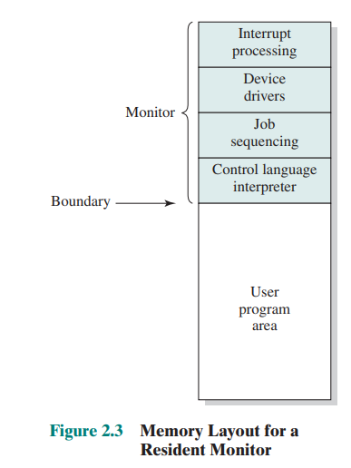
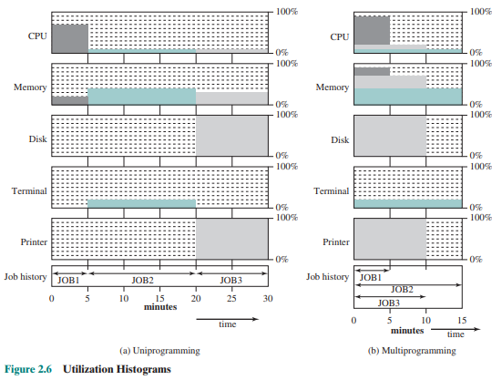
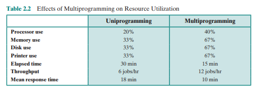

# Operating System

## 0. 개요
이 문서는 [이 곳](https://letsmakemyselfprogrammer.tistory.com/category/CS/Operating%20System?page=2)의 정리들을 토대로 다시 정리한 것이며 원본글을 보는 것이 이해가 더 쉬울 수 있다.

## 1 OS의 발전 이야기

### OS의 목적
OS는 **자원관리자**로서의 성격이 강하다.
주로 기기 사용자가 안전하고 효율적으로 하드웨어를 사용할 수 있도록 돕는다.
이러한 OS의 목적은 크게 3가지로 나타낼 수 있다.

- **편의성**: 컴퓨터 사용자가 하드웨어를 조작하기 위한 instruction이나 구현방법 등을 알지 못해도 안전하게 사용할 수 있게 한다.
- **효율성**: 사용자 경험을 최대화하기 위해 cpu utilization, cache memory, scheduling 등 자원을 관리 한다.
- **유연함**: OS가 개선될 때, 기존 User Application에 영향을 주지 않으면서 발전할 수 있도록 한다.

### OS의 발전

#### 1) Serial Processing System
애니악이 활동하던 시기에는 OS는 존재하지 않았다.
왜냐하면 애니악은 매우 비쌌으며 세계의 연구소들이 사용하기 위해 예약을 했다.
뚀한 사용하기 위해 complier에 해당하는 펀치카드(프로그램)을 로딩한 후에, 수행하고자 하는 본래의 펀치카드(프로그램)을 로딩하고 결과물을 테이프에 저장해서 가져가는 형식이었기 때문이다.

이처럼 사람이 직접 개입하여 작업들을 진행하는 **job-to-job transition**에는 두 가지 문제가 필연적으로 발생한다. 

- Scheduling time  
한정된 자원을 여러 사용자들이 나누어서 사용해야하기에 컴퓨터 시간을 분배해야 한다. 사용자 사용 시간을 분배하는 일부터, 정해진 시간이 되면 해당 프로그램을 종료시키고 다음 사용자가 사용할 수 있도록 준비하는 일이 포함된다.

- Set-up time
원하는 프로그램을 수행하기 위해서 complier와 같은 프로그램을 로딩하고, 언로딩하는 일이 필요하다.

그렇기에 **스케쥴링을 자동화하고, set-up time을 줄이는 방향으로 OS가 발전**하기 시작한다.

#### 2) Simple Batch System

set-up time을 줄이기 위해, 동일한 컴파일러를 사용하는 job을 묶어서 처리하려는 batch 시스템이 고안된다.
또 사람이 일일이 개입하는 job-to-job transition을 자동화하기 위해, JCL(Job Control Language)이 등장한다. 이 시기를 Simple Batch System이라고 한다.

이 시기에 **최초의 batch OS격인 Monitor**가 등장한다.
사람이 아닌 OS가 처음으로 등장하면서 요구되는 사항이 생기기 시작한다.

- job sequencing을 수행하기 위해서는 OS가 항상 메모리에 상주해야하기 때문에, OS와 사용자 프로그램의 메모리 공간을 분리해야 한다. (Memory Protection)
- 한 프로그램이 CPU를 독점하는 것을 방지하기 위한 System timer가 필요해진다. (CPU Protection)
- 그 당시 컴퓨터는 국가적 자원이었기에 CPU가 idle(게으른, 쉬고있는, 헛되)한 것을 막고 utilization(이용, 효율)을 높이기 위해, IO 장치 컨트롤러가 도입되었고 비동기적 io request에 대한 [interrupt 방식](https://ko.wikipedia.org/wiki/%EC%9D%B8%ED%84%B0%EB%9F%BD%ED%8A%B8)이 고안되었다.
- 위와 같은 OS만의 기능들을 사용자들이 함부로 사용할 수 없도록 Privileged Instruction들이 생겨난다.

하지만 여전히 CPU utilization은 낮았다.
synchronous한 blocked IO job에서는 cpu가 사용되지 않음에도 io device의 결과를 기다리는 경우가 많았기 때문이다. (synchronous, blocked는 [이 곳](https://evan-moon.github.io/2019/09/19/sync-async-blocking-non-blocking/) 참고)
컴퓨터는 국가적 자원이었기에 cpu를 idle하게 방치할 수 없었고, **cpu utilization을 더 높일 수 있는 방법으로 발전**한다.

#### 3) Multi-programmed Batch System

Synchronous blocked io 상황에서 cpu utilization을 높이기 위해서는, **block되어있는 동안 다른 프로그램을 실행**하면 된다.
Single Batch System에서는 메모리에 OS와 사용자 프로그램 단 두 개만 load되어 있는 상태였고 이를 uni-programming이라고 했다.
따라서 메모리에 2개 이상의 프로그램을 load하여 상황에 맞게 cpu를 사용하는 것을 **multi-programming**이라 한다. (이는 메모리 관점의 용어이며, 흔히 말하는 multi-process는 cpu 관점에서의 용어이다.)

그렇기에 이 시기에 중요한 기술적 문제는 1) 한 프로그램이 block 되었을 때, 어떤 프로그램을 실행시킬 것인지에 대한 선택 문제(scheduling)와 2) 우선순위가 낮은 프로그램은 disk로 swap out하거나 다른 프로그램을 swap in 시키면서 메모리 내에서 프로그램의 주소가 동적으로 변하는 문제(memory protection)가 있다.
따라서 OS뿐만 아니라 **사용자 프로그램끼리의 메모리 보호 문제가 대두되면서 MMU(Memory Management Unit)와 같은 하드웨어의 지원을 받기 시작**한다.

#### 4) Time Sharing System
