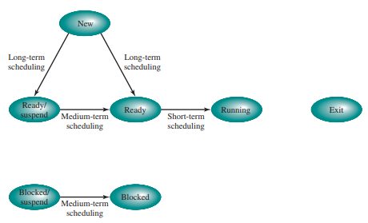

# Operating System

## Index
- [0. 개요](#0-개요)
- [1. OS의 발전 이야기](#1-os의-발전-이야기)
  - [OS의 목적](#os의-목적)
  - [OS의 발전](#os의-발전)
- [2. 프로세스(Process)란?](#2-프로세스란)
  - [Program vs Process](#program-vs-process)
  - [Process Description](#process-descriptopn)
  - [Process State](#process-state)
  - [Process Image](#process-image)
  - [Mode switch vs Context switch](#mode-switch-vs-context-switch)
  - [Process 생성 및 종료](#process-생성-및-종료)
- [3. 프로세스 스케줄링(feat. 알고리즘 장단점 비교)](#3-프로세스-스케줄링feat-알고리즘-장단점-비교)
  - [Scheduling 분류 3가지](#scheduling-분류-3가지)
  - [Scheduling Algorithms](#scheduling-algorithms)
  - [시뮬레이션 결과](#시뮬레이션-결과)
  - [Round Robin 심화](#round-robin-심화)

## 0. 개요
이 문서는 [이 곳](https://letsmakemyselfprogrammer.tistory.com/category/CS/Operating%20System?page=2)의 정리들을 토대로 다시 정리한 것이며 원본글을 보는 것이 이해가 더 쉬울 수 있다.
참고로 귀찮아서 여러 글을 하나로 합쳤기에 매우 길 것이다.

gyuhong님이 가지고 있는 **운영체제 10th EDITION**에 더욱 자세하게 나와있다.

## 1. OS의 발전 이야기

### OS의 목적
OS는 **자원관리자**로서의 성격이 강하다.
주로 기기 사용자가 안전하고 효율적으로 하드웨어를 사용할 수 있도록 돕는다.
이러한 OS의 목적은 크게 3가지로 나타낼 수 있다.

- **편의성**: 컴퓨터 사용자가 하드웨어를 조작하기 위한 instruction이나 구현방법 등을 알지 못해도 안전하게 사용할 수 있게 한다.
- **효율성**: 사용자 경험을 최대화하기 위해 cpu utilization, cache memory, scheduling 등 자원을 관리 한다.
- **유연함**: OS가 개선될 때, 기존 User Application에 영향을 주지 않으면서 발전할 수 있도록 한다.

### OS의 발전

#### 1) Serial Processing System
애니악이 활동하던 시기에는 OS는 존재하지 않았다.
왜냐하면 애니악은 매우 비쌌으며 세계의 연구소들이 사용하기 위해 예약을 했다.
뚀한 사용하기 위해 complier에 해당하는 펀치카드(프로그램)을 로딩한 후에, 수행하고자 하는 본래의 펀치카드(프로그램)을 로딩하고 결과물을 테이프에 저장해서 가져가는 형식이었기 때문이다.

이처럼 사람이 직접 개입하여 작업들을 진행하는 **job-to-job transition**에는 두 가지 문제가 필연적으로 발생한다. 

- Scheduling time  
한정된 자원을 여러 사용자들이 나누어서 사용해야하기에 컴퓨터 시간을 분배해야 한다. 사용자 사용 시간을 분배하는 일부터, 정해진 시간이 되면 해당 프로그램을 종료시키고 다음 사용자가 사용할 수 있도록 준비하는 일이 포함된다.

- Set-up time
원하는 프로그램을 수행하기 위해서 complier와 같은 프로그램을 로딩하고, 언로딩하는 일이 필요하다.

그렇기에 **스케쥴링을 자동화하고, set-up time을 줄이는 방향으로 OS가 발전**하기 시작한다.

#### 2) Simple Batch System

set-up time을 줄이기 위해, 동일한 컴파일러를 사용하는 job을 묶어서 처리하려는 batch 시스템이 고안된다.
또 사람이 일일이 개입하는 job-to-job transition을 자동화하기 위해, JCL(Job Control Language)이 등장한다. 이 시기를 Simple Batch System이라고 한다.

이 시기에 **최초의 batch OS격인 Monitor**가 등장한다.
사람이 아닌 OS가 처음으로 등장하면서 요구되는 사항이 생기기 시작한다.

- job sequencing을 수행하기 위해서는 OS가 항상 메모리에 상주해야하기 때문에, OS와 사용자 프로그램의 메모리 공간을 분리해야 한다. (Memory Protection)
- 한 프로그램이 CPU를 독점하는 것을 방지하기 위한 System timer가 필요해진다. (CPU Protection)
- 그 당시 컴퓨터는 국가적 자원이었기에 CPU가 idle(게으른, 쉬고있는, 헛되)한 것을 막고 utilization(이용, 효율)을 높이기 위해, IO 장치 컨트롤러가 도입되었고 비동기적 io request에 대한 [interrupt 방식](https://ko.wikipedia.org/wiki/%EC%9D%B8%ED%84%B0%EB%9F%BD%ED%8A%B8)이 고안되었다.
- 위와 같은 OS만의 기능들을 사용자들이 함부로 사용할 수 없도록 Privileged Instruction들이 생겨난다.

하지만 여전히 CPU utilization은 낮았다.
synchronous한 blocked IO job에서는 cpu가 사용되지 않음에도 io device의 결과를 기다리는 경우가 많았기 때문이다. (synchronous, blocked는 [이 곳](https://evan-moon.github.io/2019/09/19/sync-async-blocking-non-blocking/) 참고)
컴퓨터는 국가적 자원이었기에 cpu를 idle하게 방치할 수 없었고, **cpu utilization을 더 높일 수 있는 방법으로 발전**한다.

#### 3) Multi-programmed Batch System

Synchronous blocked io 상황에서 cpu utilization을 높이기 위해서는, **block되어있는 동안 다른 프로그램을 실행**하면 된다.
Single Batch System에서는 메모리에 OS와 사용자 프로그램 단 두 개만 load되어 있는 상태였고 이를 uni-programming이라고 했다.
따라서 메모리에 2개 이상의 프로그램을 load하여 상황에 맞게 cpu를 사용하는 것을 **multi-programming**이라 한다. (이는 메모리 관점의 용어이며, 흔히 말하는 multi-process는 cpu 관점에서의 용어이다.)

그렇기에 이 시기에 중요한 기술적 문제는 1) 한 프로그램이 block 되었을 때, 어떤 프로그램을 실행시킬 것인지에 대한 선택 문제(scheduling)와 2) 우선순위가 낮은 프로그램은 disk로 swap out하거나 다른 프로그램을 swap in 시키면서 메모리 내에서 프로그램의 주소가 동적으로 변하는 문제(memory protection)가 있다.
따라서 OS뿐만 아니라 **사용자 프로그램끼리의 메모리 보호 문제가 대두되면서 MMU(Memory Management Unit)와 같은 하드웨어의 지원을 받기 시작**한다.

#### 4) Time Sharing System
시간이 흘러, 하드웨어가 저렴해지고 인건비가 상대적으로 비싸졌다.
이는 CPU는 열심히 일을 하지만 상대적으로 더 비싼 인간의 노동력이 idle한 상태가 되도록 만들었다.

이러한 상태는 **사람의 노동력의 낭비로 이어졌고 이는 사람의 utilization을 더 높이려는 사회적 요구**를 발생시켰다.

현대의 키보드, 모니터, 마우스처럼 interative(반복적인)하게 작업을 수행하는 것이 중요해졌고, 프로그램의 **respones time(처음 job이 제출되고 대기하다가 처음 cpu에 의해 처리될 때의 시간)이 짧아지도록 하는 것이 우선 시 되었다.**
이를 위해 프로그램이 cpu를 점유하는 시간을 아주 짧게 정해서 순환하도록 했다. 즉 **time sharing system**의 방향으로 발전했다.

JCL(Job Control Language)은 유닉스 터미널과 같은 형태로 변경되었고, 여러 사용자가 한 번에 접속해서 작업을 요청할 수 있도록 환경이 바뀌었다.
자연스레 multi-user 환경으로 발전하면서 사용자 간의 information protection이 중요해지고, access control 등의 기술들이 점차 생겨나기 시작한다.

## 2. 프로세스란?

### Program vs Process

- Program
  - 디스크에 byte sequence로 저장되어 있는 passive entity(수동적인 개체)
  - 위키백과: 하드 디스크 등에 저장되어 있는 실행코드
- Process
  - 메모리에 execution sequence로 load되어 있는 active entity(능동적인 개체)
  - 위키백과: 프로그램을 구동하여 프로그램 자체와 프로그램의 상태가 메모리 상에서 실행되는 작업 단위

> 개체(entity)와 객체(object)의 차이란 무엇인가?
>
> -> 더 공부가 필요하다.

### Process Descriptopn
프로세스를 설명할 때는 크게 세 가지 맥락을 고려한다.

#### 1) System Level

시스템의 관점에선 프로세스를 **OS의 관리 대상**으로 바라본다.
OS는 프로세스의 전체 목록을 가지고 있다.
이를 process table이라고도 하는데 Unix 초창기엔 array 형태로 구현되어있었고 현재는 linked list 형태로 수정되었다.

프로세스를 관리한다는 것은 현재 CPU를 점유할 프로세스를 고르는 'Scheduling'에 관련된 정보와 'State', '메모리 정보', 'File Descripter table', 'Kernel Stack', 'Process ID', 'IPC([프로세스 간 통신](https://dar0m.tistory.com/233))' 등을 다루는 것을 모두 포함한다.
이 모든 정보를 프로세스 하나당 한 개로 묶어 관리하는데, 이를 **[PCB(Process Control Block)](https://yoongrammer.tistory.com/52)**이라고 한다.위에 언급된 세부항목들은 Identification, State Information, Control Information으로 나누어 PCB에서 관리하며 PCB는 모두 메모리에 적재되어 관리된다.

#### 2) User Program Level

사용자 프로그램 관점에선 프로세스를 **사용자의 프로그램을 메모리에 올려 실행시킨다는 관점**에서 프로세스를 바라본다.
실제 메모리에선 segment, page 단위로 쪼개져서 적재되기 때문에 논리적인 의미의 가상메모리 형태로 생각한다.

- text 영역: 코드가 저장되는 메모리 영역
- data 영역: 변수들이 저장되는 영역
- user stack 영역: 지역변수를 저장하는 영역
- PCB

#### 3) Register Level

> #### [레지스터(Register)](https://ko.wikipedia.org/wiki/%ED%94%84%EB%A1%9C%EC%84%B8%EC%84%9C_%EB%A0%88%EC%A7%80%EC%8A%A4%ED%84%B0)
> - 컴퓨터의 프로세서 내에서 자료를 보관하는 아주 빠른 기억 장소
> - 메모리 계층의 최상위에 위치하기에 가장 빠르게 접근 가능한 메모리

프로그램을 실행시킨다는 것은 메모리에 적재된 instruction(명령어) 집합을 하드웨어가 fetch->execute를 반복하는 작업이다. 이 과정은 하드웨어의 지원이 필요하며 이 때는 프로세스를 **cpu 내부의 레지스터들에 대한 정보**로 프로세스를 바라본다.

> #### [명령어 사이클](https://dheldh77.tistory.com/entry/%EC%BB%B4%ED%93%A8%ED%84%B0%EA%B5%AC%EC%A1%B0-%EB%AA%85%EB%A0%B9%EC%96%B4Instruction)
> 1. Fetch stage(인출 단계)
> - 메모리에 저장된 명령어를 읽어들임
> - 현재 실행할 명령어를 읽어 명령어 레지스터(IR, Instruction Register)에 저장
> - 다음에 실행할 명령어를 읽어 프로그램 카운터(PC, Program Counter)에 저장
>
> 2. Execution stage(실행 단계)
> - 명령어 레지스터에 저장된 명령어를 실행
> - 제어장치는 명령어를 해독하고 제어신호를 생성해 각 구성요소에 전달
> - 제어신호에 따라 [ALU(산술 논리 장치)](https://ko.wikipedia.org/wiki/%EC%82%B0%EC%88%A0_%EB%85%BC%EB%A6%AC_%EC%9E%A5%EC%B9%98)는 해당하는 연산을 수행
> - 각 신호와 데이터는 [내부버스(cpu 내 레지스터들을 연결)](http://www.ktword.co.kr/test/view/view.php?m_temp1=2555)를 통해 전달
> - 연산에 필요한 데이터와 명령어는 레지스터에 저장

PCB의 state information에 저장된 정보들은 pc, psw, sp, bp 등의 특수목적 레지스터뿐 아니라 caller callee saved register, reture address register 등의 일반적인 레지스터 정보를 모두 포함한다.

### Process State
프로세스의 상태는 OS마다 상이하게 정의하지만, william stalling 교재에서는 대략적인 OS의 state의 개념을 3단계에 걸쳐서 설명한다.

#### 1) 2-state model
**not runnung**과 **running** 두 가지 상태만 존재하는 가장 단순한 모델이다.
허나 두 가지 상태만으론 short-term scheduler의 성능을 저하시킬 수 있다.
실행 중인 프로세스가 IO 작업요청으로 block되면 **not running** 상태로 전환된다.
나중에 스케줄러에 의해 프로세스가 다시 선택되었을 때, 아직도 block 상태라면 선택되는 것이 부적절하다.
이러한 문제를 해결하기 위해, **ready**와 **block** 상태를 추가할 필요가 있다.

> #### [Scheduler](https://technote-mezza.tistory.com/70)
> 어떤 프로세스에게 자원을 할당할지를 결정하는 운영체제 커널의 모듈을 지칭한다.
> 스케줄러에 프로세스 상태가 바뀌게 된다.
>
> [챕터 3](#3-프로세스-스케줄링feat-알고리즘-장단점-비교)에서도 자세히 설명이 나온다.
>
> 이때 단기 스케줄러(short-term scheduler)란 CPU 스케줄러라고도 하며 준비상태의 프로세스 중에서 어떤 것을 실행 상태로 바꿀지 결정하는 스케줄러이다.

#### 2) 5-state model
**ready**와 **block** 상태가 추가되고 **new**, **exit** 상태가 들어왔다.
그러나 mid-term scheduler의 향상을 위해 현재 모델도 수정사항이 존재한다.
swap out되는 victim 프로세스를 선정할 때, 메모리에 있으면서 block된 프로세스가 가장 유력한 후보이다. 따라서 메모리에 있는지 디스크에 swap out된 상태인지 구분할 필요가 있다.

> 이때 중기 스케줄러(mid-term scheduler)란 현 시스템에서 메모리에 너무 많은 프로그램이 동시에 올라가는 것을 조절하는 스케줄러이다.

> #### Swap out이란?
> 
>
> 메모리에 많은 수의 프로세스가 올라와 프로세스 당 할당된 메모리 양이 적어서 작업 수행에 문제가 생기고 이로 인해 디스크 I/O(이 단어가 지표를 뜻하는데 아마 과부하를 이야기하는게 아닌가 싶음)가 자주 발생하게 되는데 이는 시스템의 성능을 저하시킨다.
> 이를 해결하기 위해 메모리에 올라와 있는 프로세스 중 일부 프로세스의 메모리를 통째로 빼앗아 그 내용을 디스크의 스왑 영역에 저장하게 된다.
> 이를 스왑 아웃이라고 한다.
>
> 예시) 10개의 프로세스가 메모리에 올라와있을 때, 11번째 프로세스가 실행된다고 하자.
> 올릴 공간은 없고 올라와있는 임의의 프로세는 계속 이벤트를 기다리고 있다면 메모리가 낭비되고 있는 것이다.
> 이를 막기 위해 기다리는 프로세스를 내리고 11번째 프로세스를 올려 실행하는 동작이 바로 스왑 아웃이다.

#### 3) 7-state model
**ready/suspend**와 **block/suspend**가 추가된 현재 최신 형태이다.

- new: 프로세스 생성 중
  - 프로세스를 생성하고 있는 단계로 커널 공간에 PCB가 만들어진 상태
- ready: 프로세스가 CPU를 기다리는 상태
  - 프로세스가 메모리에 적재된 상태로 실행하는데 필요한 모든 자원을 얻은 상태
  - 아직 cpu를 받지는 않았지만 cpu를 할당 받으면 바로 실행이 가능한 상태
  - ready 상태를 가지는 여러 개의 프로세스들이 존재할 수 있다.
- running: 프로세스가 CPU를 할당받아 명령어를 수행 중인 상태
  - 일반적으로 cpu가 하나이기 때문에, 여러 프로세스가 동시에 실행되도 실제로 실행 중인 프로세스는 매 시점 하나뿐이다.
- blocked: 프로세스가 CPU를 할당받아도 당장 실행할 수 없는 상태
  - 현재 프로세스가 [I/O 작업(입출력)](https://chelseafandev.github.io/2021/07/13/os-io-system/) 등을 처리 중인 상태
  - 예시)
    - 프로세스 A가 cpu를 할당받음(running)
    - 명령어를 실행하다가 I/O 작업을 해야 하는 경우, 디스크 I/O 작업은 cpu 처리 속도에 비해 오래 걸리는 작업이기 때문에 디스크 I/O 작업 동안은 cpu를 점유하고 있어도 다음 명령어를 수행하지 못함(cpu 낭비)
    - 이를 막기 위해 디스크 I/O 작업을 하는 프로세스는 cpu를 반납하고 장치 큐에 가서 줄을 서게 된다.(block)
    - 이후, 디스크 컨트롤러에 의해 서비스를 받아 일을 수행하면(마그네틱 원판에서 원하는 데이터를 로컬 버퍼로 읽어오고 나면) 디스크 컨트롤러가 cpu에게 일이 끝났음을 알린다.(interrupt)
    - 이후 프로세스 A를 장비 큐에서 빼서 준비 큐로 넣어주고 프로세스 A가 한 일(로컬 버퍼에 저장)은 메모리에 올라가게 된다.
- terminated(exit): 프로세스의 실행 종료
  - 프로세스의 실행이 완료되고 할당된 cpu를 반납
  - 커널 공간 내의 PCB는 남아있다.
- suspended: 프로세스의 중지 상태
  - suspended 상태의 프로세스는 메모리를 강제로 뺏긴 상태로 특정한 이유로 프로세스의 수행이 정지된 상태를 의미
  - 외부에서 다시 재개시키지 않는 이상 다시 활성화 될 수 없다.
  - 중기 스케줄러에 의해 디스크로 스왑 아웃된 프로세스의 상태가 suspended 상태의 대표적 예시
  - suspended는 다시 두 가지로 분류할 수 있다.
    - suspended ready: ready 상태에 있던 프로세스가 디스크로 swap out
    - suspended blocked: block 상태에 있던 프로세스가 디스크로 swap out

> #### blocked와 suspended의 차이
> - blocked: 잠시 중지되어있다가(blocked) 끝나면 다시 ready 상태로 돌아옴
> - suspended: 잠시 중지되어있다가(suspended) 누군가가 재개시켜줘야 다시 ready 상태로 돌아옴

> #### interrupt란
> cpu가 프로그램을 실행하고 있을 때, 입출력하드웨어 등의 장치에 예외상황이 발생하여 처리가 필요할 경우, cpu에게 알려 처리할 수 있도록 하는 것을 말한다.
### Process Image

앞서 프로세스의 논리적인 의미를 3가지 관점(System Level, User Level, Register Level)에서 살펴보았다.
이러한 3가지 관점에서 필요한 모든 정보를 포함하는 실제 물리적 메모리 구성을 **Process Image**라고 한다.

스냅샷과 같이 한 시점에서 프로세스의 상태를 복사한 것이라고 할 수 있다.

### Mode switch vs Context switch

#### 1) Mode switch
OS는 자원 관리자로서, 두 가지의 mode를 제공한다.
하나는 **user mode**이고 다른 하나는 **kernel mode**이다.
OS는 사용자로부터 자원을 안전하게 보호하기 위해 사용자는 사용할 수 없는 privileged instruction을 수행할 수 있다.
즉, **kernel mode**여야만 접근할 수 있다.
이 외의 사용자 프로그램을 실행 중일 때는 **user mode** 상태로 수행한다.

**user mode**에서 **kernel mode**로 전환되는 경우는 3가지로 정리할 수 있다.

1. user program을 수행하다가 exception이 발생하는 경우(segmentation fault, stack overflow, zero division 등)
2. interrupt가 발생했을 경우
3. 사용자가 syscall을 호출할 경우(read, write, listen 등)

위의 세 가지 경우가 **kernel mode로의 진입점**이 된다.

모드 간의 switch는 mode bit를 사용한다.
kernel mode bit를 활성화(register level)하고 현재 수행 중이던 user context를 메모리 스택에 저장한다.
그 이후로는 kernel stack을 이용하여 OS의 kernel stack을 이용하여 OS의 kernel code를 수행한다.
OS가 작업을 마치면 반대로 user mode bit를 활성화하고 이전에 수행 중이던 user context를 메모리에서 cpu로 복원한다.

> #### kernel mode bit
> 커널 모드와 사용자 모드를 구분하기 위해 하드웨어 적으로 cpu 내부에 mode bit를 사용한다.
> mode bit가 0이면 커널 모드, 1이면 사용자 모드이다.

#### 2) Context switch(=Process switch)
context switch는 cpu를 점유하는 프로세스의 전환을 의미한다.
context라는 말은 cpu 내부의 register 정보들을 의미한다.
프로그램을 실행하다보면 '현재 실행 중인 메모리 주소', '프로세스 상태', '지역변수 값', '리턴 값', 'user stack pointer', 'thread pointer' 등의 정보들이 register에 저장되어 사용된다.

예를 들어 preemption 될 때, 즉 cpu를 점유하다가 우선순위에서 밀려날 때 cpu 내부의 레지스터 정보들을 메모리에 저장해야 한다. 그래야 나중에 다시 cpu를 점유하게 될 때, 메모리에서 프로세스의 context를 cpu로 복원해서 그 지점, 그 상태에서 다시 시작할 수 있다.

프로세스 간 전환이 일어나는 경우는 다음과 같다.

1. blocking 되었을 때
   - I/O 장치에 작업을 요청했을 때가 그 예시
2. time out이 발생했을 때
   - 현대 OS는 time sharing system으로 한 프로세스가 cpu를 독점하지 못하게 한다.
   - 일정간격으로 cpu 내부 타이머에 의해 timer interrupt가 발생하는데, 이 때마다 timer interrupt handler를 통해 os는 프로세스가 할당된 시간을 다 소모했는지 검사한다.
   - 만약 다 소모했다면 time out이 발생하고, 스케줄 함수를 통해 다음으로 우선순위가 높은 프로세스에게 cpu가 배정된다.
3. exception이 발생해서 더이상 진행할 수 없을 때

위의 세 가지 경우가 **Context switch의 주요 발생지점**이다.

그리고 Context switch가 발생했을 때, 내부 진행 상황은 아래와 같다.

1. 현재 process context를 메모리에 저장
2. PCB를 현재 process 상태에 맞게 업데이트
3. PCB를 적절한 대기 큐로 이동
4. 스케줄 함수 호출 $O(\log{N})$ -> 우선순위가 가장 높은 프로세스 id를 얻음
5. 다음 process의 PCB 정보를 업데이트
6. 다음 process의 context를 복원

**프로세스 전환은 모드 전환에 비해 비용이 매우 비싸다.** (스케줄 함수 호출 비용 + [TLB](https://wpaud16.tistory.com/304) 갱신으로 인한 cache collision)

### Process 생성 및 종료

#### 1) 프로세스 생성
직접 생성하는 경우와 복사하는 경우가 있다.
UNIX에서는 root process만 직접 생성되고, 나머지 프로세스는 복제 후, 변신 과정(fork() -> execve())을 거쳐 생성된다.
그래서 부모 프로세스와 자식 프로세스를 구분할 수 있다.
fork()해서 동일한 프로세스를 만들면, 부모와 자식은 코드 text 영역만 공유하고, user data는 복제해서 따로 소유한다.
PCB는 복제 후, pid와 ppid를 자식 프로세스에 맞게 수정하고 대기큐에 넣는다.

복제 cost를 줄이기 위해 **COW(Copy On Write)** 방식을 사용하기도 한다. 복제 시, 처음에는 모든 메모리 page가 공유되었다고 표시만 하고, 실제 메모리에 변경이 일어나면 copy가 진행되도록 하는 방식이다.

#### 2) 프로세스 종료
자식 프로세스가 종료되면 바로 OS에 자원을 반납하지 않는다.
부모 프로세스가 자식 프로세스를 회수할 때까지 대기하는데, 이처럼 실제로는 작업이 완료되었지만 아직 OS에 자원을 반납하지 않아서 PCB가 살아있는 상태를 **Zombi process**라고 한다.
자식 프로세스를 회수해야 할 부모 프로세스가 먼저 죽으면 **Orphan process**라고 하는데, root process가 일정시간마다 고아들을 회수한다.

자세한 메커니즘은 [IPC - signal 처리](https://velog.io/@tank3a/IPC-SIGNAL)를 확인하면 된다.

## 3. 프로세스 스케줄링(feat. 알고리즘 장단점 비교)

### Scheduling 분류 3가지

#### 1) Long-term schedule
- **job scheduler**라고도 한다.
- 제출된 프로그램 실행 요청 중에서 <U>어떤 것을 프로세스로 실행시킬 지 결정</U>하는 스케줄링이다.
- 사용자가 OS에 프로그램 실행 요청을 제출한다. -> **요청 대기큐**
- OS는 **요청 대키큐** 중 어떤 프로그램을 **ready state 큐**로 넣을지 결정한다.
- 큐에 넣어져서 실행 가능한 대기 상태가 되면, 프로그램에 대한 PCB가 만들어져서 프로세스가 된다.

#### 2) Mid-term schedule
- **swapper**라고도 하며, 보통 swap function을 가리키는 말
- multiprogramming의 정도를 결정하는 요인이 된다.
- <U>swap out, swap in 할 대상의 프로세스를 결정</U>한다.

> #### multiprogramming
> 프로세서의 자원 낭비를 최소화하기 위해 낭비되는 시간을 다른 프로세스 수행에 쓰게 하여 하나의 프로세서에서 여러 프로세스를 교대로 수행할 수 있게 하는 것

#### 3) Short-term schedule
- **cpu scheduler** 또는 **dispatcher**라고도 하며, 흔히 cpu 관점에서 말하는 스케줄링에 해당한다.
- <U>cpu를 점유할 프로세스를 결정</U>한다.
- clock interrupt, IO interrupt, signals, system call 등의 경우, 발생할 수 있다.

### Scheduling Algorithms
이 챕터에선 short-term sechduling을 다룬다.
즉, multi-process 환경에서 cpu를 얼마나 공정하고 효과적으로 분배할 수 있는가에 대한 솔루션이다.
아래는 알고리즘을 설명하기 위한 용어이다.

- decision mode: preemptiv(선점형) 또는 nonpreemptive(비선점형)
- selection function: 다음 프로세스를 고르기 위한 우선순위 계산 함수
- turnarround time: 프로그램이 제출된 이후 완료될 때까지 걸린 시간
- response time
  - 프로그램이 제출된 이후, 처음으로 반응하기까지 걸린 시간
  - 편의상 처음 cpu를 점유하기까지 걸린 시간으로 계산하기도 한다.
  - 유저 입장에선 turnarround time보다 더 중요한 요소로 여겨진다.
- deadline
  - 사용자가 제출한 예상시간 내에 얼마나 잘 처리했는지를 나타냄
  - real time system에서 중요
- throughput: 단위시간 당 처리하는 프로세스의 개수
- utilization: 자원(cpu, io, device)을 얼마나 효율적으로 사용하는지 나타낸 지표
- fairness: 얼마나 공정하게 자원을 배분했는지 나타낸 지표

#### 1) FCFS
- **First Come First Service**의 준말로 가장 간단한 방식
- FIFO와 동일
- Selection function = max[w], w=total waiting time
- decision mode: non preemptive
- 장점
  - 구현이 가장 간단하다.
  - starvation(기아 상태, 특정 프로세스의 우선 순위가 낮아서 원하는 자원을 계속 할당받지 못하는 상태)이 발생하지 않는다.
- 단점
  - convoy effect(짧은 작업을 수행하기 위해 오랫동안 기다려야하는 현상) 발생
  - cpu bound job(상대적으로 cpu를 많이 소비하는 작업)이 IO bound job(상대적으로 cpu를 적게 사용하지만 시간이 많이 걸림)에 비해 더 유리하다.
  - 작업시간이 긴 프로세스일수록 더 유리하다.

#### 2) Round Robin
- FCFS에서 convoy effect를 보완한 형태
- FIFO 기반은 동일하지만, 일정한 time quantum 이상 cpu를 점유하는 것을 방지한다.
- time quantum 결정 문제가 굉장히 중요하다.
- 장점
  - 구현이 가장 간단하다.
  - starvation이 발생하지 않는다.
- 단점
  - time quantum 결정 문제 존재
  - cpu bound job이 IO bound job에 비해 더 유리하다.

#### 3) SPN
- Shortest Process Next
- <U>예상 실행 시간이 가장 짧은 프로세스</U>부터 작업하는 방식
- 최적에 가깝다.
- selection function = min[s], s=프로세스들이 요구하는 total service time
- decision mode: non preemptive
- 장점
  - turnarround time이 최적에 가깝다. -> throughput이 높다.
- 단점
  - 예상 실행 시간을 예측하는 것이 어렵다.
  - workload에 따라서 starvation이 발생할 수 있다.

#### 4) SRT
- Shortest Remaining Time
- SPN의 preemption 버전
- 새로운 프로세스가 제출되는 순간에 preemption 발생, <U>남은 시간이 가장 짧은 순서대로 작업</U>

## 참고문헌
- [개발자가 되어보자, CS/Operation System](https://letsmakemyselfprogrammer.tistory.com/category/CS/Operating%20System?page=2)
- [Evans Libray](https://evan-moon.github.io/2019/09/19/sync-async-blocking-non-blocking/)
- [DR-Kim, [OS]프로세스 간 통신 방법(Inter Process Communication, IPC)](https://dar0m.tistory.com/233)
- [yoongrammer, 프로세스 제어 블록(PCB:Process Control Block) 알아보기](https://yoongrammer.tistory.com/52)
- [위키백과, 프로세서 레지스터](https://ko.wikipedia.org/wiki/%ED%94%84%EB%A1%9C%EC%84%B8%EC%84%9C_%EB%A0%88%EC%A7%80%EC%8A%A4%ED%84%B0)
- [테리의 일상, [컴퓨터구조] 명령어(Instruction)](https://dheldh77.tistory.com/entry/%EC%BB%B4%ED%93%A8%ED%84%B0%EA%B5%AC%EC%A1%B0-%EB%AA%85%EB%A0%B9%EC%96%B4Instruction)
- [위키백과, 산술 논리 장치](https://ko.wikipedia.org/wiki/%EC%82%B0%EC%88%A0_%EB%85%BC%EB%A6%AC_%EC%9E%A5%EC%B9%98)
- [정보통신기술용어해설, Computer Bus](http://www.ktword.co.kr/test/view/view.php?m_temp1=2555)
- [wikipedia, System image](https://en.wikipedia.org/wiki/System_image)
- [메자곰, [운영체제 OS]프로세스의 상태와 스케줄러의 종류, 하는 일](https://technote-mezza.tistory.com/70)
- [첼시팬 개발자 작업 공간, I/O는 어떻게 처리될까?](https://chelseafandev.github.io/2021/07/13/os-io-system/)
- [박연호의 개발 블로그, [운영체제]커널 모드, 사용자 모드](https://kosaf04pyh.tistory.com/196)
- [You Are Right, TLB란? (page table, 48bit 가상 공간, virtual memory, ASID, TTBR, arm)](https://wpaud16.tistory.com/304)
- [Jongwon의 velog, IPC - SIGNAL](https://velog.io/@tank3a/IPC-SIGNAL)
- [개발자를 꿈꾸는 프로그래머, Multiprocessing과 Multiprogramming, Multithreading의 차이](https://jwprogramming.tistory.com/19)
- [위키백과, 인터럽트](https://ko.wikipedia.org/wiki/%EC%9D%B8%ED%84%B0%EB%9F%BD%ED%8A%B8)
- [woga.log, Starvation(기아 상태)란?](https://velog.io/@woga1999/Starvation-%EA%B8%B0%EC%95%84-%EC%83%81%ED%83%9C-%EB%9E%80)
