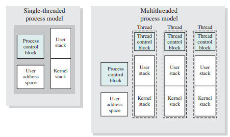

# Operating System

## Index
- [0. 개요](#0-개요)
- [1. OS의 발전 이야기](#1-os의-발전-이야기)
  - [OS의 목적](#os의-목적)
  - [OS의 발전](#os의-발전)
- [2. 프로세스(Process)란?](#2-프로세스란)
  - [Program vs Process](#program-vs-process)
  - [Process Description](#process-descriptopn)
  - [Process State](#process-state)
  - [Process Image](#process-image)
  - [Mode switch vs Context switch](#mode-switch-vs-context-switch)
  - [Process 생성 및 종료](#process-생성-및-종료)
- [3. 프로세스 스케줄링](#3-프로세스-스케줄링)
  - [Scheduling 분류 3가지](#scheduling-분류-3가지)
  - [Scheduling Algorithms](#scheduling-algorithms)
- [4. 쓰레드(Thread)와 동기화 문제](#4-쓰레드thread와-동기화-문제)
  - [쓰레드의 의미](#쓰레드의-의미)
  - [Concurrency vs Parallelism](#concurrency-vs-parallelism)
  - [Multi-Threading](#multi-threading)
  - [Race condition](#race-condition)
- [5. 동기화 - (1) 용어 및 개념정리](#5-동기화---1-용어-및-개념정리)
  - [동기화 관련 용어](#동기화-관련-용어)
  - [Critical Section Problem](#critical-section-problem)
- [6. 동기화 - (2) 상호배제 전략(Mutex)](#6-동기화---2-상호배제-전략mutex)
  - [SW approach](#sw-approach)
  - [HW approach](#hw-support)
  - [pthread.h 예시](#pthreadh-예시)
  - [semaphore.h 예시](#semaphoreh-예시)
- [7. 동기화 - (3) 조건동기화](#7-동기화---3-조건동기화)
  - [조건 동기화](#조건-동기화)
  - [Condition Variable](#condition-variables)
  - [Condition Operation](#condition-operation)
  - [pthread.h API 예시](#pthreadh-api-예시)
  - [join() 구현 예제](#join-구현-예제)
- [참고 문헌](#참고문헌)

## 0. 개요
이 문서는 [이 곳](https://letsmakemyselfprogrammer.tistory.com/category/CS/Operating%20System?page=2)의 정리들을 토대로 다시 정리한 것이며 원본글을 보는 것이 이해가 더 쉬울 수 있다.
참고로 귀찮아서 여러 글을 하나로 합쳤기에 매우 길 것이다.

gyuhong님이 가지고 있는 **운영체제 10th EDITION**에 더욱 자세하게 나와있다.

## 1. OS의 발전 이야기

### OS의 목적
OS는 **자원관리자**로서의 성격이 강하다.
주로 기기 사용자가 안전하고 효율적으로 하드웨어를 사용할 수 있도록 돕는다.
이러한 OS의 목적은 크게 3가지로 나타낼 수 있다.

- **편의성**: 컴퓨터 사용자가 하드웨어를 조작하기 위한 instruction이나 구현방법 등을 알지 못해도 안전하게 사용할 수 있게 한다.
- **효율성**: 사용자 경험을 최대화하기 위해 cpu utilization, cache memory, scheduling 등 자원을 관리 한다.
- **유연함**: OS가 개선될 때, 기존 User Application에 영향을 주지 않으면서 발전할 수 있도록 한다.

### OS의 발전

#### 1) Serial Processing System
애니악이 활동하던 시기에는 OS는 존재하지 않았다.
왜냐하면 애니악은 매우 비쌌으며 세계의 연구소들이 사용하기 위해 예약을 했다.
뚀한 사용하기 위해 complier에 해당하는 펀치카드(프로그램)을 로딩한 후에, 수행하고자 하는 본래의 펀치카드(프로그램)을 로딩하고 결과물을 테이프에 저장해서 가져가는 형식이었기 때문이다.

이처럼 사람이 직접 개입하여 작업들을 진행하는 **job-to-job transition**에는 두 가지 문제가 필연적으로 발생한다. 

- Scheduling time  
한정된 자원을 여러 사용자들이 나누어서 사용해야하기에 컴퓨터 시간을 분배해야 한다. 사용자 사용 시간을 분배하는 일부터, 정해진 시간이 되면 해당 프로그램을 종료시키고 다음 사용자가 사용할 수 있도록 준비하는 일이 포함된다.

- Set-up time
원하는 프로그램을 수행하기 위해서 complier와 같은 프로그램을 로딩하고, 언로딩하는 일이 필요하다.

그렇기에 **스케쥴링을 자동화하고, set-up time을 줄이는 방향으로 OS가 발전**하기 시작한다.

#### 2) Simple Batch System


set-up time을 줄이기 위해, 동일한 컴파일러를 사용하는 job을 묶어서 처리하려는 batch 시스템이 고안된다.
또 사람이 일일이 개입하는 job-to-job transition을 자동화하기 위해, JCL(Job Control Language)이 등장한다. 이 시기를 Simple Batch System이라고 한다.

이 시기에 **최초의 batch OS격인 Monitor**가 등장한다.
사람이 아닌 OS가 처음으로 등장하면서 요구되는 사항이 생기기 시작한다.

- job sequencing을 수행하기 위해서는 OS가 항상 메모리에 상주해야하기 때문에, OS와 사용자 프로그램의 메모리 공간을 분리해야 한다. (Memory Protection)
- 한 프로그램이 CPU를 독점하는 것을 방지하기 위한 System timer가 필요해진다. (CPU Protection)
- 그 당시 컴퓨터는 국가적 자원이었기에 CPU가 idle(게으른, 쉬고있는, 헛되)한 것을 막고 utilization(이용, 효율)을 높이기 위해, IO 장치 컨트롤러가 도입되었고 비동기적 io request에 대한 [interrupt 방식](https://ko.wikipedia.org/wiki/%EC%9D%B8%ED%84%B0%EB%9F%BD%ED%8A%B8)이 고안되었다.
- 위와 같은 OS만의 기능들을 사용자들이 함부로 사용할 수 없도록 Privileged Instruction들이 생겨난다.

하지만 여전히 CPU utilization은 낮았다.
synchronous한 blocked IO job에서는 cpu가 사용되지 않음에도 io device의 결과를 기다리는 경우가 많았기 때문이다. (synchronous, blocked는 [이 곳](https://evan-moon.github.io/2019/09/19/sync-async-blocking-non-blocking/) 참고)
컴퓨터는 국가적 자원이었기에 cpu를 idle하게 방치할 수 없었고, **cpu utilization을 더 높일 수 있는 방법으로 발전**한다.

#### 3) Multi-programmed Batch System

Synchronous blocked io 상황에서 cpu utilization을 높이기 위해서는, **block되어있는 동안 다른 프로그램을 실행**하면 된다.
Single Batch System에서는 메모리에 OS와 사용자 프로그램 단 두 개만 load되어 있는 상태였고 이를 uni-programming이라고 했다.
따라서 메모리에 2개 이상의 프로그램을 load하여 상황에 맞게 cpu를 사용하는 것을 **multi-programming**이라 한다. (이는 메모리 관점의 용어이며, 흔히 말하는 multi-process는 cpu 관점에서의 용어이다.)


그렇기에 이 시기에 중요한 기술적 문제는 1) 한 프로그램이 block 되었을 때, 어떤 프로그램을 실행시킬 것인지에 대한 선택 문제(scheduling)와 2) 우선순위가 낮은 프로그램은 disk로 swap out하거나 다른 프로그램을 swap in 시키면서 메모리 내에서 프로그램의 주소가 동적으로 변하는 문제(memory protection)가 있다.
따라서 OS뿐만 아니라 **사용자 프로그램끼리의 메모리 보호 문제가 대두되면서 MMU(Memory Management Unit)와 같은 하드웨어의 지원을 받기 시작**한다.

#### 4) Time Sharing System
시간이 흘러, 하드웨어가 저렴해지고 인건비가 상대적으로 비싸졌다.
이는 CPU는 열심히 일을 하지만 상대적으로 더 비싼 인간의 노동력이 idle한 상태가 되도록 만들었다.

이러한 상태는 **사람의 노동력의 낭비로 이어졌고 이는 사람의 utilization을 더 높이려는 사회적 요구**를 발생시켰다.

현대의 키보드, 모니터, 마우스처럼 interative(반복적인)하게 작업을 수행하는 것이 중요해졌고, 프로그램의 **respones time(처음 job이 제출되고 대기하다가 처음 cpu에 의해 처리될 때의 시간)이 짧아지도록 하는 것이 우선 시 되었다.**
이를 위해 프로그램이 cpu를 점유하는 시간을 아주 짧게 정해서 순환하도록 했다. 즉 **time sharing system**의 방향으로 발전했다.

JCL(Job Control Language)은 유닉스 터미널과 같은 형태로 변경되었고, 여러 사용자가 한 번에 접속해서 작업을 요청할 수 있도록 환경이 바뀌었다.
자연스레 multi-user 환경으로 발전하면서 사용자 간의 information protection이 중요해지고, access control 등의 기술들이 점차 생겨나기 시작한다.

## 2. 프로세스란?

### Program vs Process

- Program
  - 디스크에 byte sequence로 저장되어 있는 passive entity(수동적인 개체)
  - 위키백과: 하드 디스크 등에 저장되어 있는 실행코드
- Process
  - 메모리에 execution sequence로 load되어 있는 active entity(능동적인 개체)
  - 위키백과: 프로그램을 구동하여 프로그램 자체와 프로그램의 상태가 메모리 상에서 실행되는 작업 단위

> 개체(entity)와 객체(object)의 차이란 무엇인가?
>
> -> 더 공부가 필요하다.

### Process Descriptopn
프로세스를 설명할 때는 크게 세 가지 맥락을 고려한다.

#### 1) System Level


시스템의 관점에선 프로세스를 **OS의 관리 대상**으로 바라본다.
OS는 프로세스의 전체 목록을 가지고 있다.
이를 process table이라고도 하는데 Unix 초창기엔 array 형태로 구현되어있었고 현재는 linked list 형태로 수정되었다.

프로세스를 관리한다는 것은 현재 CPU를 점유할 프로세스를 고르는 'Scheduling'에 관련된 정보와 'State', '메모리 정보', 'File Descripter table', 'Kernel Stack', 'Process ID', 'IPC([프로세스 간 통신](https://dar0m.tistory.com/233))' 등을 다루는 것을 모두 포함한다.
이 모든 정보를 프로세스 하나당 한 개로 묶어 관리하는데, 이를 **[PCB(Process Control Block)](https://yoongrammer.tistory.com/52)**이라고 한다.위에 언급된 세부항목들은 Identification, State Information, Control Information으로 나누어 PCB에서 관리하며 PCB는 모두 메모리에 적재되어 관리된다.

#### 2) User Program Level


사용자 프로그램 관점에선 프로세스를 **사용자의 프로그램을 메모리에 올려 실행시킨다는 관점**에서 프로세스를 바라본다.
실제 메모리에선 segment, page 단위로 쪼개져서 적재되기 때문에 논리적인 의미의 가상메모리 형태로 생각한다.

- text 영역: 코드가 저장되는 메모리 영역
- data 영역: 변수들이 저장되는 영역
- user stack 영역: 지역변수를 저장하는 영역
- PCB

#### 3) Register Level

> #### [레지스터(Register)](https://ko.wikipedia.org/wiki/%ED%94%84%EB%A1%9C%EC%84%B8%EC%84%9C_%EB%A0%88%EC%A7%80%EC%8A%A4%ED%84%B0)
> - 컴퓨터의 프로세서 내에서 자료를 보관하는 아주 빠른 기억 장소
> - 메모리 계층의 최상위에 위치하기에 가장 빠르게 접근 가능한 메모리

프로그램을 실행시킨다는 것은 메모리에 적재된 instruction(명령어) 집합을 하드웨어가 fetch->execute를 반복하는 작업이다. 이 과정은 하드웨어의 지원이 필요하며 이 때는 프로세스를 **cpu 내부의 레지스터들에 대한 정보**로 프로세스를 바라본다.

> #### [명령어 사이클](https://dheldh77.tistory.com/entry/%EC%BB%B4%ED%93%A8%ED%84%B0%EA%B5%AC%EC%A1%B0-%EB%AA%85%EB%A0%B9%EC%96%B4Instruction)
> 1. Fetch stage(인출 단계)
> - 메모리에 저장된 명령어를 읽어들임
> - 현재 실행할 명령어를 읽어 명령어 레지스터(IR, Instruction Register)에 저장
> - 다음에 실행할 명령어를 읽어 프로그램 카운터(PC, Program Counter)에 저장
>
> 2. Execution stage(실행 단계)
> - 명령어 레지스터에 저장된 명령어를 실행
> - 제어장치는 명령어를 해독하고 제어신호를 생성해 각 구성요소에 전달
> - 제어신호에 따라 [ALU(산술 논리 장치)](https://ko.wikipedia.org/wiki/%EC%82%B0%EC%88%A0_%EB%85%BC%EB%A6%AC_%EC%9E%A5%EC%B9%98)는 해당하는 연산을 수행
> - 각 신호와 데이터는 [내부버스(cpu 내 레지스터들을 연결)](http://www.ktword.co.kr/test/view/view.php?m_temp1=2555)를 통해 전달
> - 연산에 필요한 데이터와 명령어는 레지스터에 저장

PCB의 state information에 저장된 정보들은 pc, psw, sp, bp 등의 특수목적 레지스터뿐 아니라 caller callee saved register, reture address register 등의 일반적인 레지스터 정보를 모두 포함한다.

### Process State
프로세스의 상태는 OS마다 상이하게 정의하지만, william stalling 교재에서는 대략적인 OS의 state의 개념을 3단계에 걸쳐서 설명한다.

#### 1) 2-state model
**not runnung**과 **running** 두 가지 상태만 존재하는 가장 단순한 모델이다.
허나 두 가지 상태만으론 short-term scheduler의 성능을 저하시킬 수 있다.
실행 중인 프로세스가 IO 작업요청으로 block되면 **not running** 상태로 전환된다.
나중에 스케줄러에 의해 프로세스가 다시 선택되었을 때, 아직도 block 상태라면 선택되는 것이 부적절하다.
이러한 문제를 해결하기 위해, **ready**와 **block** 상태를 추가할 필요가 있다.


> #### [Scheduler](https://technote-mezza.tistory.com/70)
> 어떤 프로세스에게 자원을 할당할지를 결정하는 운영체제 커널의 모듈을 지칭한다.
> 스케줄러에 프로세스 상태가 바뀌게 된다.
>
> [챕터 3](#3-프로세스-스케줄링feat-알고리즘-장단점-비교)에서도 자세히 설명이 나온다.
>
> 이때 단기 스케줄러(short-term scheduler)란 CPU 스케줄러라고도 하며 준비상태의 프로세스 중에서 어떤 것을 실행 상태로 바꿀지 결정하는 스케줄러이다.

#### 2) 5-state model
**ready**와 **block** 상태가 추가되고 **new**, **exit** 상태가 들어왔다.
그러나 mid-term scheduler의 향상을 위해 현재 모델도 수정사항이 존재한다.
swap out되는 victim 프로세스를 선정할 때, 메모리에 있으면서 block된 프로세스가 가장 유력한 후보이다. 따라서 메모리에 있는지 디스크에 swap out된 상태인지 구분할 필요가 있다.


> 이때 중기 스케줄러(mid-term scheduler)란 현 시스템에서 메모리에 너무 많은 프로그램이 동시에 올라가는 것을 조절하는 스케줄러이다.

> #### Swap out이란?
> 
>
> 메모리에 많은 수의 프로세스가 올라와 프로세스 당 할당된 메모리 양이 적어서 작업 수행에 문제가 생기고 이로 인해 디스크 I/O(이 단어가 지표를 뜻하는데 아마 과부하를 이야기하는게 아닌가 싶음)가 자주 발생하게 되는데 이는 시스템의 성능을 저하시킨다.
> 이를 해결하기 위해 메모리에 올라와 있는 프로세스 중 일부 프로세스의 메모리를 통째로 빼앗아 그 내용을 디스크의 스왑 영역에 저장하게 된다.
> 이를 스왑 아웃이라고 한다.
>
> 예시) 10개의 프로세스가 메모리에 올라와있을 때, 11번째 프로세스가 실행된다고 하자.
> 올릴 공간은 없고 올라와있는 임의의 프로세는 계속 이벤트를 기다리고 있다면 메모리가 낭비되고 있는 것이다.
> 이를 막기 위해 기다리는 프로세스를 내리고 11번째 프로세스를 올려 실행하는 동작이 바로 스왑 아웃이다.

#### 3) 7-state model
**ready/suspend**와 **block/suspend**가 추가된 현재 최신 형태이다.


- new: 프로세스 생성 중
  - 프로세스를 생성하고 있는 단계로 커널 공간에 PCB가 만들어진 상태
- ready: 프로세스가 CPU를 기다리는 상태
  - 프로세스가 메모리에 적재된 상태로 실행하는데 필요한 모든 자원을 얻은 상태
  - 아직 cpu를 받지는 않았지만 cpu를 할당 받으면 바로 실행이 가능한 상태
  - ready 상태를 가지는 여러 개의 프로세스들이 존재할 수 있다.
- running: 프로세스가 CPU를 할당받아 명령어를 수행 중인 상태
  - 일반적으로 cpu가 하나이기 때문에, 여러 프로세스가 동시에 실행되도 실제로 실행 중인 프로세스는 매 시점 하나뿐이다.
- blocked: 프로세스가 CPU를 할당받아도 당장 실행할 수 없는 상태
  - 현재 프로세스가 [I/O 작업(입출력)](https://chelseafandev.github.io/2021/07/13/os-io-system/) 등을 처리 중인 상태
  - 예시)
    - 프로세스 A가 cpu를 할당받음(running)
    - 명령어를 실행하다가 I/O 작업을 해야 하는 경우, 디스크 I/O 작업은 cpu 처리 속도에 비해 오래 걸리는 작업이기 때문에 디스크 I/O 작업 동안은 cpu를 점유하고 있어도 다음 명령어를 수행하지 못함(cpu 낭비)
    - 이를 막기 위해 디스크 I/O 작업을 하는 프로세스는 cpu를 반납하고 장치 큐에 가서 줄을 서게 된다.(block)
    - 이후, 디스크 컨트롤러에 의해 서비스를 받아 일을 수행하면(마그네틱 원판에서 원하는 데이터를 로컬 버퍼로 읽어오고 나면) 디스크 컨트롤러가 cpu에게 일이 끝났음을 알린다.(interrupt)
    - 이후 프로세스 A를 장비 큐에서 빼서 준비 큐로 넣어주고 프로세스 A가 한 일(로컬 버퍼에 저장)은 메모리에 올라가게 된다.
- terminated(exit): 프로세스의 실행 종료
  - 프로세스의 실행이 완료되고 할당된 cpu를 반납
  - 커널 공간 내의 PCB는 남아있다.
- suspended: 프로세스의 중지 상태
  - suspended 상태의 프로세스는 메모리를 강제로 뺏긴 상태로 특정한 이유로 프로세스의 수행이 정지된 상태를 의미
  - 외부에서 다시 재개시키지 않는 이상 다시 활성화 될 수 없다.
  - 중기 스케줄러에 의해 디스크로 스왑 아웃된 프로세스의 상태가 suspended 상태의 대표적 예시
  - suspended는 다시 두 가지로 분류할 수 있다.
    - suspended ready: ready 상태에 있던 프로세스가 디스크로 swap out
    - suspended blocked: block 상태에 있던 프로세스가 디스크로 swap out

> #### blocked와 suspended의 차이
> - blocked: 잠시 중지되어있다가(blocked) 끝나면 다시 ready 상태로 돌아옴
> - suspended: 잠시 중지되어있다가(suspended) 누군가가 재개시켜줘야 다시 ready 상태로 돌아옴

> #### interrupt란
> cpu가 프로그램을 실행하고 있을 때, 입출력하드웨어 등의 장치에 예외상황이 발생하여 처리가 필요할 경우, cpu에게 알려 처리할 수 있도록 하는 것을 말한다.
### Process Image


앞서 프로세스의 논리적인 의미를 3가지 관점(System Level, User Level, Register Level)에서 살펴보았다.
이러한 3가지 관점에서 필요한 모든 정보를 포함하는 실제 물리적 메모리 구성을 **Process Image**라고 한다.

스냅샷과 같이 한 시점에서 프로세스의 상태를 복사한 것이라고 할 수 있다.

### Mode switch vs Context switch

#### 1) Mode switch
OS는 자원 관리자로서, 두 가지의 mode를 제공한다.
하나는 **user mode**이고 다른 하나는 **kernel mode**이다.
OS는 사용자로부터 자원을 안전하게 보호하기 위해 사용자는 사용할 수 없는 privileged instruction을 수행할 수 있다.
즉, **kernel mode**여야만 접근할 수 있다.
이 외의 사용자 프로그램을 실행 중일 때는 **user mode** 상태로 수행한다.

**user mode**에서 **kernel mode**로 전환되는 경우는 3가지로 정리할 수 있다.

1. user program을 수행하다가 exception이 발생하는 경우(segmentation fault, stack overflow, zero division 등)
2. interrupt가 발생했을 경우
3. 사용자가 syscall을 호출할 경우(read, write, listen 등)

위의 세 가지 경우가 **kernel mode로의 진입점**이 된다.

모드 간의 switch는 mode bit를 사용한다.
kernel mode bit를 활성화(register level)하고 현재 수행 중이던 user context를 메모리 스택에 저장한다.
그 이후로는 kernel stack을 이용하여 OS의 kernel stack을 이용하여 OS의 kernel code를 수행한다.
OS가 작업을 마치면 반대로 user mode bit를 활성화하고 이전에 수행 중이던 user context를 메모리에서 cpu로 복원한다.

> #### kernel mode bit
> 커널 모드와 사용자 모드를 구분하기 위해 하드웨어 적으로 cpu 내부에 mode bit를 사용한다.
> mode bit가 0이면 커널 모드, 1이면 사용자 모드이다.

#### 2) Context switch(=Process switch)
context switch는 cpu를 점유하는 프로세스의 전환을 의미한다.
context라는 말은 cpu 내부의 register 정보들을 의미한다.
프로그램을 실행하다보면 '현재 실행 중인 메모리 주소', '프로세스 상태', '지역변수 값', '리턴 값', 'user stack pointer', 'thread pointer' 등의 정보들이 register에 저장되어 사용된다.

예를 들어 preemption 될 때, 즉 cpu를 점유하다가 우선순위에서 밀려날 때 cpu 내부의 레지스터 정보들을 메모리에 저장해야 한다. 그래야 나중에 다시 cpu를 점유하게 될 때, 메모리에서 프로세스의 context를 cpu로 복원해서 그 지점, 그 상태에서 다시 시작할 수 있다.

프로세스 간 전환이 일어나는 경우는 다음과 같다.

1. blocking 되었을 때
   - I/O 장치에 작업을 요청했을 때가 그 예시
2. time out이 발생했을 때
   - 현대 OS는 time sharing system으로 한 프로세스가 cpu를 독점하지 못하게 한다.
   - 일정간격으로 cpu 내부 타이머에 의해 timer interrupt가 발생하는데, 이 때마다 timer interrupt handler를 통해 os는 프로세스가 할당된 시간을 다 소모했는지 검사한다.
   - 만약 다 소모했다면 time out이 발생하고, 스케줄 함수를 통해 다음으로 우선순위가 높은 프로세스에게 cpu가 배정된다.
3. exception이 발생해서 더이상 진행할 수 없을 때

위의 세 가지 경우가 **Context switch의 주요 발생지점**이다.

그리고 Context switch가 발생했을 때, 내부 진행 상황은 아래와 같다.

1. 현재 process context를 메모리에 저장
2. PCB를 현재 process 상태에 맞게 업데이트
3. PCB를 적절한 대기 큐로 이동
4. 스케줄 함수 호출 $O(\log{N})$ -> 우선순위가 가장 높은 프로세스 id를 얻음
5. 다음 process의 PCB 정보를 업데이트
6. 다음 process의 context를 복원

**프로세스 전환은 모드 전환에 비해 비용이 매우 비싸다.** (스케줄 함수 호출 비용 + [TLB](https://wpaud16.tistory.com/304) 갱신으로 인한 cache collision)


### Process 생성 및 종료

#### 1) 프로세스 생성
직접 생성하는 경우와 복사하는 경우가 있다.
UNIX에서는 root process만 직접 생성되고, 나머지 프로세스는 복제 후, 변신 과정(fork() -> execve())을 거쳐 생성된다.
그래서 부모 프로세스와 자식 프로세스를 구분할 수 있다.
fork()해서 동일한 프로세스를 만들면, 부모와 자식은 코드 text 영역만 공유하고, user data는 복제해서 따로 소유한다.
PCB는 복제 후, pid와 ppid를 자식 프로세스에 맞게 수정하고 대기큐에 넣는다.

복제 cost를 줄이기 위해 **COW(Copy On Write)** 방식을 사용하기도 한다. 복제 시, 처음에는 모든 메모리 page가 공유되었다고 표시만 하고, 실제 메모리에 변경이 일어나면 copy가 진행되도록 하는 방식이다.

#### 2) 프로세스 종료
자식 프로세스가 종료되면 바로 OS에 자원을 반납하지 않는다.
부모 프로세스가 자식 프로세스를 회수할 때까지 대기하는데, 이처럼 실제로는 작업이 완료되었지만 아직 OS에 자원을 반납하지 않아서 PCB가 살아있는 상태를 **Zombi process**라고 한다.
자식 프로세스를 회수해야 할 부모 프로세스가 먼저 죽으면 **Orphan process**라고 하는데, root process가 일정시간마다 고아들을 회수한다.

자세한 메커니즘은 [IPC - signal 처리](https://velog.io/@tank3a/IPC-SIGNAL)를 확인하면 된다.

## 3. 프로세스 스케줄링

### Scheduling 분류 3가지


#### 1) Long-term schedule
- **job scheduler**라고도 한다.
- 제출된 프로그램 실행 요청 중에서 <U>어떤 것을 프로세스로 실행시킬 지 결정</U>하는 스케줄링이다.
- 사용자가 OS에 프로그램 실행 요청을 제출한다. -> **요청 대기큐**
- OS는 **요청 대키큐** 중 어떤 프로그램을 **ready state 큐**로 넣을지 결정한다.
- 큐에 넣어져서 실행 가능한 대기 상태가 되면, 프로그램에 대한 PCB가 만들어져서 프로세스가 된다.

#### 2) Mid-term schedule
- **swapper**라고도 하며, 보통 swap function을 가리키는 말
- multiprogramming의 정도를 결정하는 요인이 된다.
- <U>swap out, swap in 할 대상의 프로세스를 결정</U>한다.

> #### multiprogramming
> 프로세서의 자원 낭비를 최소화하기 위해 낭비되는 시간을 다른 프로세스 수행에 쓰게 하여 하나의 프로세서에서 여러 프로세스를 교대로 수행할 수 있게 하는 것

#### 3) Short-term schedule
- **cpu scheduler** 또는 **dispatcher**라고도 하며, 흔히 cpu 관점에서 말하는 스케줄링에 해당한다.
- <U>cpu를 점유할 프로세스를 결정</U>한다.
- clock interrupt, IO interrupt, signals, system call 등의 경우, 발생할 수 있다.

### Scheduling Algorithms
이 챕터에선 short-term sechduling을 다룬다.
즉, multi-process 환경에서 cpu를 얼마나 공정하고 효과적으로 분배할 수 있는가에 대한 솔루션이다.
아래는 알고리즘을 설명하기 위한 용어이다.

- decision mode: preemptiv(선점형) 또는 nonpreemptive(비선점형)
- selection function: 다음 프로세스를 고르기 위한 우선순위 계산 함수
- turnarround time: 프로그램이 제출된 이후 완료될 때까지 걸린 시간
- response time
  - 프로그램이 제출된 이후, 처음으로 반응하기까지 걸린 시간
  - 편의상 처음 cpu를 점유하기까지 걸린 시간으로 계산하기도 한다.
  - 유저 입장에선 turnarround time보다 더 중요한 요소로 여겨진다.
- deadline
  - 사용자가 제출한 예상시간 내에 얼마나 잘 처리했는지를 나타냄
  - real time system에서 중요
- throughput: 단위시간 당 처리하는 프로세스의 개수
- utilization: 자원(cpu, io, device)을 얼마나 효율적으로 사용하는지 나타낸 지표
- fairness: 얼마나 공정하게 자원을 배분했는지 나타낸 지표


알고리즘에 대해선 [본문](https://letsmakemyselfprogrammer.tistory.com/93)과 [멀티 코어 프로세스 스케줄링](https://letsmakemyselfprogrammer.tistory.com/96)을 참고하면 된다.

## 4. 쓰레드(Thread)와 동기화 문제

### 쓰레드의 의미

프로세스의 의미는 두가지 측면에서 설명할 수 있다.

1. (자원 관점)자원 소유자로서의 최소 단위
2. (제어 관점)schedule의 최소 단위 / 실행 단위


보통 개발할 때 하나의 실행흐름(single execution sequence)만 생각하기 쉽다. 하지만 실제로 프로세스는 실타래와 같이 여러 개의 실행흐름(multiple execution sequence)이 존재할 수 있다. 이 떄의 <u>**실행의 단위(the unit of excution sequence)**</u> 를 **thread** 라고 정의한다. 따라서 현대 os에서 **multithreading** 은 단일 프로세스 내에서 여러 개의 실행흐름을 지원할 수 있는 능력을 의미한다. 가장 중요한 점은 <u>다수의 thread는 같은 프로세스 내의 자원을 공유할 수 있다는 것</u>이다.

### Concurrency vs Parallelism

#### 1) Concurrency


- 병행성, 동시성
- 여러 job들이 interleaving하면서 진행
- 실제로 동시에 진행되고 있지는 않지만, 사용자 입장에서는 동시에 진행되는 듯함

> #### interleaving
> - 주기억장치(컴퓨터 메모리)를 접근하는 속도를 빠르게 하는데 사용
> - 인접한 메모리 위치를 서로 다른 메모리 뱅크에 둠으로써 동시에 여러 곳을 접근할 수 있게 하는 것

#### 2) Parallelism


- 병렬성
- 여러 코어에서 실제로 동시에 실행되고 있는 것을 말함
- concurrent하지 않아도 parallel할 수 있다.

### Multi-Threading

#### 1) multithread 장단점


MS/DOS의 경우 단일 프로세스-단일 스레드 구조였다. 인터넷이 발전하면서, 동시 접속자를 빠르게 처리해야하는 웹서버의 요구가 생겨났다.간단하게 프로세스를 여러 개로 fork하는 방법도 있고, 멀티 스레드를 지원하는 방법도 있다. (보통 스레들르 생성하는 것이 더 저렴하다.) One progress - Multiple threads 모델은 JVM 환경이 대표적인 예시다. 대부분의 UNIX 계열 OS는 Multiple processes - Multiple threads per process 구조이다. 멀티 스레드는 아래와 같은 장점이 있다.

- **응답성** 이 좋아진다.
  - ex. WebServer, Remote Procedure Call
- **경제성** 이 좋아진다.
  - 프로세스 대비 creation, switch, resource sharing, communication, memory space 등
  - light weight process 라고도 함
  - 멀티코어에서 **병렬적** 으로 수행할 경우, 더 좋은 성능을 낸다.

> #### RPC(Remote Procedure Call)
> 원격 프로시저 호출(RPC)란, 별도의 원격 제어를 위한 코딩 없이 다른 주소 공간에서 리모트의 함수나 프로시저를 실행할 수 있게하는 프로세스 간 통신 기술이다. 다시 말해 원격 프로시저 호출을 이용하면 프로그래머는 함수가 실행 프로그램에 로컬 위치에 있든, 원격 위치에 있든 동일한 코드를 이용할 수 있다.


하지만 스레드가 무한정 증가한다고 성능이 무한정 증가하진 않는다. 이는 두 가지 이유 때문인데

1. 스레드가 너무 많아서 스케줄링과 switch에 드는 오버헤드가 훨씬 커지기 때문
2. 스레드를 분할하고 다시 합치는 과정에서 serial하게 작업할 수 밖에 없는 부분이 존재하기 때문(Amdahl의 법칙)
     - 갈수록 완만하게 증가하는 이유

그렇기에 멀티코어 환경에서 멀티스레딩을 하는게 좋은 상황은 다음과 같다.

1. tasks가 서로 독립적이어서 병렬로 처리될 수 있는 경우 (task parallelism)
2. 각 스레드에 동등한 workload를 분배할 수 있는 경우 (load balancing)
3. 처리되는 data에 의존성이 없는 경우 (data parallelism, 있다면 동기화해야 함)

#### 2) process image


Single-threaded process image는 PCB, User stack, Kernel stack, User address space를 포함한다. 여기에 멀티스레드에서는 각 스레드마다 State(runnung, block 등)와 stack을 따로 가져야하며, OS가 각 스레드를 관리하기 위한 Thread control block도 따로 가져야 한다.



기존의 process image에서 스레드간 공유가 가능한 것과 그렇지 않은 것을 구분할 필요가 있다. 새롭게 스레드가 생성된다고 가정하면, 텍스트 코드나 데이터들은 공유가 가능하므로 새로 복제할 필요가 없다. 하지만 스레드는 각자 다른 실행흐름을 가지므로 **배타적으로 관리해야할 정보** 들을 모아야하고, 이를 모아 구조체로 만든 것이 **TCB** 이다. 이를 반영하여 현재 OS는 오른쪽 그림과 같은 프로세스 이미지를 가진다.

### Race condition

만약 메인 스레드가 자식 스레드를 2개 만들고, 하나는 공유변수를 1000번 증가시키고 다른 하나는 1000번 감소하는 경우다. 그렇다면 예상되는 결과는 0이 되어야 할 것 같지만, 그렇지 않다. 결과는 보장할 수 없다.

그 이유는 (x = val + 1)과 (x = val - 1) 이라는 **코드가 atomic하지 않기 때문** 이다. [바이트 코드](https://ko.wikipedia.org/wiki/%EB%B0%94%EC%9D%B4%ED%8A%B8%EC%BD%94%EB%93%9C)의 어셈블리어로 보면 3단계의 명령어로 이루어져 있다.

1. 전역변수 x를 레지스터로 load
2. 해당 레지스터의 값을 1만큼 증가 또는 감소
3. 전역변수 x의 메모리 주소에 저장

위 3가지 코드가 중간에 끊기지 않고 실행되어야 한다. 그런데 2번을 수행하고 나서 time-out interrupt가 발생해 context switch가 진행되고, 다시 원래 스레드로 돌아왔을 때, 3번 명령을 실행한다. 즉, 최신화된 x 값을 load하면서 시작하는 것이 아니라 예전에 저장되어 있던 예전의 x값을 덮어쓰면서 시작한다. 이런 상황 때문에 공유 변수에 대한 동기화 문제가 발생한다. 동시에 접근하는 것이 문제인 것이다.

## 5. 동기화 - (1) 용어 및 개념정리

### 동기화 관련 용어

#### 1) Race Condition

멀티쓰레드 또는 멀티 프로세스 환경에서 공유자원에 동시에 접근할 때, 의도치 않은 결과를 낳는 것을 race condition이라고 하고 다음과 같은 특성을 갖는다.

- Non-Deterministic: 의도하지 않은 결과를 냄, 결과를 예측할 수 없다.
- Reproducible: 재현 가능하다.

근본적으로는 [cpu 스케줄링 + 캐시(레지스터 포함) + non-atomic instruction] 때문에 발생하며, 이를 방지하기 위해서는 공유자원에 대한 동기화가 필요하다.

#### 2) Critical Section

공유자원에 접근하는 코드 영역이다. 동기화 문제는 결국 이 critical section을 어떻게 다루는가에 대한 문제로 볼 수 있다. 크게는 상호배제(mutual exclusion) 전략과 조건동기화(conditional synchronization) 전략 두가지로 나눌 수 있다. 참고로 공유자원에 대해서 read-only만 수행한다면 race condition은 발생하지 않는다.

#### 3) Mutual Exclusion

상호 배제라는 뜻으로, critical section을 수행하는 실행흐름(thread or process)은 단 한 개로 한정되어야 한다는 뜻이다. 다른 말로는 공유자원에 접근할 때, 동시에 여러 개의 프로세스나 스레드가 접근할 수 없도록 제한하는 방식이다.

#### 4) Conditional Synchronization

조건부 동기화 방식으로 특정 조건에서만 공유자원에 접근할 수 있도록 제한하는 방식이다.

### Critical Section Problem

동기화 문제를 해결한다는 것은, 임계영역에 대한 접근을 잘 제어한다는 것이다. 구체적으로는 아래의 3가지를 만족시켜야 한다.

1. Mutual Exclusion(상호 배제)
    - 임계 영역에 접근하는 실행흐름(process/thread)은 동시에 둘 이상이 될 수 없다.
2. Progress(진행)
    - 임계 영역을 아무도 실행하고 있지 않을 때, 무제한 대기하지 않고 임계영역으로 들어갈 수 있어야 한다.
    - deadlock 상황을 예로 들 수 있다.
3. Bounded Waiting(한정 대기)
    - starvation이 발생하면 안 된다.
    - 즉 공유자원에 대한 access 요청을 했는데, 다른 프로세스들은 계속 접근하면서, 특정 프로세스만 무한정 대기하고 있으면 안 된다.
    - 공유자원 요청을 하면 언제가는 해당 자원을 할당 받을 수 있어야 한다.

## 6. 동기화 - (2) 상호배제 전략(Mutex)

상호배제 전략은 SW 방식과 HW 방식으로 나눌 수 있다.

### SW approach

SW 방식은 다시 1) Peterson의 알고리즘과 2) Interrupt 차단방식으로 예를 들 수 있다. 결론부터 이야기하자면, SW 방식은 효과적이지 못하며 HW의 도움을 받아야 한다.

#### 1) Peterson's Algorithm

3가지 단계로 나눠서 설명한다.

##### 1) Native approach

가장 빨리 떠올릴 수 있는 간단한 방법은, flag 변수를 선언하는 것이다. 아래와 같이 critical section에 진입할 때, flag를 활성화시키고, 빠져나올 때 비활성화하는 방법이다. 그리고 critical section에 진입하기 위해 flag 변수를 busy-waiting 방식으로 계속 확인한다.

```c
while (1) // critical section start
{
  if (!occupied)
  {
    occupied = ture;
    break;
  }
}

// access shared resource here!

occupied = false // critical section end
```

하지만 이 방법은 옳은 방법이 아니다. occupied라는 flag 변수 역시 공유변수이기 때문에, 상호배제 시켜야 한다. 구체적으로 문제가 되는 곳은 <if 블럭에 진입한 후> ~ <occupied가 true로 변하기 전>에 스케줄링 되는 상황이다.

1. Process A가 if 블럭에 진입, 즉시 스케줄링 되어 occupied가 true로 변경되지 않고 false임
2. Process B가 critical section에 진입하여 공유자원에 wirte 작업을 수행하던 중 스케줄링
3. Process A가 if문 내부에서 재실행되면서 공유자원 접근
    - 원래 의도는 Process B가 critical section에 있기 때문에 occupied가 true인 것을 확인하고 block 되어야 한다.
    - 공유자원의 변경값이 메모리에 적용되기 전에 다중쓰기가 되므로 동기화 실패

##### 2) Better approach

위의 상황에서 문제는 flag 변수 또한 공유변수라는 점이다. 그러면 flag 변수를 공유변수가 아닌, 프로세스마다 개별적으로 사용하게끔 해서 좀 더 나은 방법을 만들 수 있다.

아래의 예시는 두 개의 프로세스가 있을 때, flag 변수를 프로세스 하나당 할당하는 예제이다.

```c
/* 0번 Process */
do {
    accupied[0] = true;
    while (accupied[1]); // 1번 Process 가 점유중이면 기다림.
    
        /* Critical Section */
        
    accupied[0] = false;
    
// Remainder Section
    
} while(1)
```

```c
/* 1번 Process */
do {
    accupied[1] = true;
    while (accupied[0]); // 0번 Process 가 점유중이면 기다림.
    
        /* Critical Section */
        
    accupied[1] = false;
    
// Remainder Section
    
} while(1)
```

하지만 아직도 문제가 존재하는데, 0번 프로세스가 critical section 밖에 존재하고, 1번 프로세스가 flag[1] = true;를 수행한 뒤 while 전에 스케줄링 되는 상황을 생각해보자.

1. 1번 프로세스가 accupied[1] = true; 를 수행한 뒤, while 전에 스케줄링
2. 0번 프로세스가 accupied[0] = true; 를 수행함. while (accupied[1]); 에서 block
3. 1번 프로세스도 while (accupied[0]); 에서 block
4. 둘 다 block -> deadlock

두 프로세스 모두 공유자원에 접근할 수 없는 **deadlock** 이 발생한다. Progress requirement를 만족시키지 못하는 상황이다.

즉, 공유자원인 flag 변수를 분리함으로써 mutual exclusion requirement를 위배하는 상황은 해결했지만, Progress requirement를 만족시키지 못했기에 critical section에 대한 접근제어를 적절히 했다고 평가할 수 없다.

##### 3) Peterson's solution

위에서의 문제인 progress requirement를 해결하기 위해, 공통된 flag를 하나 더 도입하는 방법이다. 즉, (분리된 flag 2개) + (공유 flag 1개) 를 사용한다.

```c
/* 0번 Process */
do {
    accupied[0] = true;
    turn = 1;  // 1번 프로세스가 실행할 의사가 있으면 양보.
    while (accupied[1] && turn==1); // 1번 Process 가 점유중이면 기다림.
    
        /* Critical Section */
        
    accupied[0] = false;
    
// Remainder Section
    
} while(1)
```

```c
/* 1번 Process */
do {
    accupied[1] = true;
    turn = 0; // 0번 프로세스가 실행할 의사가 있으면 양보.
    while (accupied[0] && turn==0); // 0번 Process 가 점유중이면 기다림.
    
        /* Critical Section */
        
    accupied[1] = false;
    
// Remainder Section
    
} while(1)
```

위와 같은 상황에서 1번 프로세스가 accupied[1] = true를 실행하고 스케줄링 되었다고 생각해보자.

1. 1번 프로세스가 accupied[1] = true를 실행하고 스케줄링
2. 0번 프로세스가 accupied[0] = true; turn = 1; 를 실행하고 while 에서 기다림
3. 1번 프로세스가 turn = 0;를 실행하고 while 에서 기다림
4. 0번 프로세스가 while을 지나치고 실행됨

이 방법은 두 프로세스(또는 스레드)에서 동기화 문제를 잘 해결했지만, 너무 복잡하다는 문제가 있다. 프로세스 개수가 3개 이상부터는 기하급수적으로 복잡해진다.

또 현대 OS에서는 적용할 수 없는데, compiler에 의해 instruction reordering이 발생하기 때문이다. low level에서 명령어들의 순서가 바뀔 수 있어서 결국 accupied[i] = true; turn = i;의 실행 순서가 보장되지 않아 적용할 수 없다.

#### 2) Disabling Interrupts

초창기 OS에서 사용하던 방식이다. single-processor system에서 고안되었다. Critical section에 진입하면 모든 인터럽트를 끄는 방식이다. 이는 3가지 단점이 있었다.

1. 인터럽트 신호를 잃어버릴 수 있다.
2. 악의적으로 cpu를 독점할 수 있다.
3. 멀티 프로세서 시스템에서는 더더욱 비효율적이다.

이는 마치 횡단보도 하나를 건너기 위해 전국의 횡단보도를 끄는 셈이다. system timer interrupt, io interrupt 등을 다 비활성화 시키기 때문에, 스케줄링이 원칙적으로 금지된다.

### HW support


위에서 봤듯이, 소프트웨어의 구현만으로는 동기화 문제를 처리할 수 없다. 왜냐하면 동기화 문제는 근본적으로 하드웨어의 구조적 문제로 발생하기 때문이다.

1. main 메모리와 캐시메모리의 분리
2. 데이터를 수정할 때, 하드웨어에서는 여러 단계의 작업이 필요
3. 중간 단계에서 갑자기 스케줄링
4. race condition

따라서 하드웨어 수준에서 다음과 같은 조치를 취한다면, race condition을 방지할 수 있다.

1. 여러 단계의 하드웨어 작업을 atomic 하게 수행할 수 있도록 묶어서 instruction(지침)을 만든다.
2. 하나의 instruction을 수행하는 도중에는 스케줄링이 될 수 없으므로(물리적으로 불가능) race condition이 발생하지 않는다.

HW의 도움을 받는다는 것은 결국 single atomic operation을 지원받는 것을 의미한다. 아래의 예시는 실제 HW 수준에서 제공하는 atomic한 단일 instruction을 c언어 수준에서 설명한다.

#### 1) Test-And-Set (TAS)

다음 psuedo code와 같은 instruction을 HW에서 제공한다.

```c
/**
 * 아래의 TestAndSet 함수는 low-level 에서의 machine code 를 c언어로 표현한 것이다.
 * 하드웨어 수준에서 atomic 한 instruction을 제공한다.
 */
int TestAndSet(int *old_ptr, int new) {
    int old = *old_ptr;
    *old_ptr = new;
    return old;
}

void unlock(lock_t *lock) {
    lock->flag = 0;
}

void lock(lock_t *lock) {
    // 공유변수 lock 을 다른 프로세스가 선점하고 있다면, *old_ptr == 1
    // 즉 1을 리턴하고 busy waiting
    // 공유변수 lock 을 아무도 점유하고 있지 않다면, *old_ptr == 0
    // lock 을 점유하고 빠져나감!
    while(TestAndSet(&lock->flag, 1) == 1);
}
```

#### 2) Compare-And-Swap (CAS)

TAS와 동일한 기능을 제공한다. 다만 TAS는 매번 변수에 new value를 대입하지만, CAS는 기존값이 expected value와 동일할 때만 변경해준다.

```c
/**
 * 아래의 CompareAndSet 함수는 low-level 에서의 machine code 를 c언어로 표현한 것이다.
 * 하드웨어 수준에서 atomic 한 instruction을 제공한다.
 */
int CompareAndSet(int *old_ptr, int expected, int new) {
    int old = *old_ptr;
    if (old == expected) // TAS 에 비교해서 추가된 기능
        *old_ptr = new;
    return old;
}

void unlock(lock_t *lock) {
    lock->flag = 0;
}

void lock(lock_t *lock) {
    // 공유변수 lock 을 다른 프로세스가 선점하고 있다면, *old_ptr == 1
    // 즉 1을 리턴하고 busy waiting
    // 공유변수 lock 을 아무도 점유하고 있지 않다면, *old_ptr == 0
    // lock 을 점유하고 빠져나감!
    while(CompareAndSet(&lock->flag, 0, 1) == 1);
}
```
위와 같은 wait 방식을 **busy-waiting** 또는 **spin-waiting** 이라고 한다. 이는 기다리는동안 cpu를 계속 사용하면서 조건을 확인하는 방식이다. 매우 짧은 시간동안만 기다릴 것으로 예측되는 경우에는 효과적이다. Scheduling 시에 타이밍에 기대기 때문에, cpu 관점에서는 공평하진 않다.

반면 프린트 출력 작업과 같이 오랜시간동안 기다릴 것으로 예상될 때에는 sleep하고 다른 프로세스를 실행시키는 것이 효과적이다. 이때 사용되는 것이 **semaphore** 이다. 세마포는 상호배제 측면 뿐만 아니라 조건동기화 측면에서도 사용될 수 있다.

### pthread.h 예시

pthread는 UNIX 계열 OS에서 제공하는 스레드 라이브러리이다. 전역변수 x를 두 개의 child threads가 각각 1000번씩 더하고 빼는 예시이다. 코드에 있는 pthread_mutex_lock, pthread_mutex_unlock 함수는 위의 설명처럼 HW의 도움을 받아 상호배제 전략의 동기화를 제공한다.

```c
#include <pthread.h>
#include <stdio.h>
#include <stdlib.h>
#include <unistd.h>
#define ITER 1000

void *thread_increment(void *arg); 
void *thread_decrement(void *arg); 
int x;  
pthread_mutex_t m; 

int main() {

    pthread_t tid1, tid2; 
    pthread_mutex_init(&m, NULL); 
    pthread_create(&tid1, NULL, thread_increment, NULL); 
    pthread_create(&tid2, NULL, thread_decrement, NULL); 
    pthread_join(tid1, NULL); 
    pthread_join(tid2, NULL); 
    
    if (x != 0)
    	printf("BOOM! counter=%d\n", x);
    else
    	printf("OK counter=%d\n", x);
        
    pthread_mutex_destroy(&m);
}

void *thread_increment (void *arg) {

    int i, val;
    for (i=0; i< ITER ; i++) {
    	pthread_mutex_lock(&m);
    	val = x;
    	printf("%u:%d\n",(unsigned int) pthread_self(), val);
    	x = val + 1;
    	pthread_mutex_unlock(&m);
    }
    
	pthread_exit(NULL);
}

void *thread_decrement (void *arg) {

    int i, val;
    for (i=0; i< ITER ; i++) {
        pthread_mutex_lock(&m);
        val = x;
        printf("%u: %d\n", (unsigned int) pthread_self(), val);
        x = val - 1;
        pthread_mutex_unlock(&m);
    }
    
	pthread_exit(NULL);
}
```

### semaphore.h 예시

세마포어는 위에서 소개된 동기화 방식의 일반화한 방식이다. 상호배제 전략과 조건동기화 전략에 모두 사용될 수 있다. 위에서 설명했던 상호배제에서는 flag = 1이면 자원이 사용중이라 대기해야하고, flag = 0이면 바로 사용가능한 상태였다. 즉, critical section에 들어갈 수 있는 실행흐름이 단 한 개였다. 근데 세마포어는 critical section에 들어갈 수 있는 실행흐름의 개수를 여러 개로 설정할 수 있다. 상호배제의 측면에서는 자원의 개수로 볼 수 있고, 조건동기화 측면에서는 조건(상태)로 볼 수 있다. 


semWait 함수를 통해서 lock을 얻을 수 있는지 확인하는데, lock이 1 이상이면 lock을 얻고 critical section으로 진입한다. 이때, lock 습득 유무에 상관없이 semWait 함수 마지막에 lock 값을 1씩 감소시킨다. 또한 자원에 접근하지 못할 때에는 대기큐에 들어가서 sleep한다.

자원을 다 사용하면 semSignal 함수를 통해서 lock을 1개 relase한다. 이 때 lock이 0 이하면, sleep하고 있는 다른 프로세스가 있다는 의미이므로, signal을 발생시켜서 대기중인 다른 프로세스를 깨운다. 시그널 발생 유무와 상관없이 semSignal 함수 마지막에는 lock 값을 1씩 증가시킨다.

## 7. 동기화 - (3) 조건동기화

앞선 파트에서 계속 설명했듯이, 멀티프로세스 또는 멀티쓰레드 환경에서 공유자원을 사용하다보면 race condition이 발생할 수 있고 이를 해결하기 위해서는 동기화가 필요하다. 동기화에는 상호배제 전략과 조건 동기화 전략이 있다. 앞서 봤듯이 상호배제는 공유자원이 한 번에 하나씩 사용하는데 집중한다. 비슷하지만 조건동기화는 critical section에 대기하는 프로세스 (또는 쓰레드)를 ordering 하는 전략이다.


### 조건 동기화

조건동기화는 특정 조건을 만족할 때까지 스레드(또는 프로세스)를 대기시킨다. 그리고 조건이 만족될 때, 해당 스레드를 깨워서 실행시키는 방법이다. 조건 변수(conditional variable)를 통해서 작동한다. 조건 변수에 대한 특정 조건을 만족시킬 때, 실행하도록 하고 아니면 대기할 수 있도록 wait(), signal() 등의 연산이 존재한다.

### Condition Variables

아래와 같이 자식이 다 수행되기를 기다려야하는 상황을 생각해보자.

```c
//[Thread-1] 
int main(int argc, char *argv[]) { 

    pthread_t c; 
    printf("parent: begin\n"); 
    pthread_create(&c, NULL, child, NULL); 
    
    while (done == 0) { } // condition variable! 자식 스레드가 변경하기를 기다림!
     
    printf("parent: end\n"); 
    return 0; 
}
 
//[Thread-2]
void * child (void *arg) { 

    printf("child\n"); 
     
    pthread_mutex_lock(&m); 
    done = 1; // condition variable! 
    pthread_mutex_unlock(&m); 
     
    return NULL; 
}
```

자식이 언제 다 수행되었는지 알기 위해서 특정 상태변수(done)를 두어서 알아낼 수 있다. 이 때 done과 같은 상태변수를 **condition variable** 이라고 한다. condition variable은 다음과 같은 특성을 갖는다.

- event(진행조건이 만족될 때 발생)가 발생하기 전까지 대기시키는 역할을 한다.
- waiting queue와 같은 역할이다.
- 공유변수이기 때문에 동기화(상호 배제)가 필수적이다.

### Condition Operation

- wait(): critical section에 진입할 때 조건을 만족하지 않으면 대기큐로 이동해서 대기한다.
- signal(): 대기큐에 있는 스레드(프로세스) 중 하나를 깨운다. 모든 대기 스레드를 꺠우는 연산도 있다.

### pthread.h API 예시

```c
#include <pthread.h>

int pthread_cond_wait(pthread_cond_t *c, pthread_mutex_t *m);
int pthread_cond_signal(pthread_cond_t *c);

    // Returns: 0 if OK, error number on error
```

c에서 제공하는 pthread 라이브러리를 보면 위와 같은 조건 동기화 함수를 제공한다.

- **pthread_cond_t \***
  - 일종의 대기큐를 의미
- **pthread_mutex_t \***
  - lock 변수
  - wait() 함수에 인자로 전달되어야 한다.
  - 조건변수도 공유변수이기 때문에 상호배제되어야 한다.
  - 그렇기에 조건동기화의 wait() 함수에는 mutex가 항상 붙어다녀야한다고 생각하면 된다.

### join() 구현 예제

join() 함수는 보통 부모 스레드가 자식 스레드를 기다릴 때 사용하는 함수다. 부모 스레드가 join()을 실행하게 되면, 자식 스레드가 실행 완료했다는 시그널을 보낼 때까지 대기하게 된다.

조건 동기화를 구현하기 위해선 3가지 필수 요소가 존재한다.

1. State Variable
    - 상태 변수
    - 이 예제에서는 done 변수이다.
2. Lock for State Variable
    - 상태변수나 조건변수도 스레드 간 공유자원이기 때문에 상호배제가 필요하다.
3. Loop checking a condition
    - 스케줄링 문제로 인해 if가 아닌 while loop를 이용한 확인이 필요하다.
    - 동작 자체는 if와 동일

#### 1) 부모 스레드

```c
//[Thread-1]
int main(int argc, char *argv[]) {
    pthread_t c;
    pthread_create(&c, NULL, child, NULL);
    thr_join ();
    return 0;
}

void thr_join() {
    pthread_mutex_lock(&m);  // done 변수에 대한 상호배제
    while (done == 0)
    	pthread_cond_wait(&c, &m);
    pthread_mutex_unlock(m);  // done 변수에 대한 상호배제
}
```

우리는 위 코드에서 **pthread_cond_wait(&c, &m)** 을 주목할 필요가 있는데 여기서 lock 변수 m을 넘겨주는 이유가 드러나기 때문이다. wait() 함수를 만나면 부모 스레드는 대기큐로 들어가서 잠든다. 하지만 **문제는 critical section 안에서 잠든다는 것** 이다. 이는 자식 스레드 중 아무도 공유변수를 사용할 수 없음을 의미한다. 그렇기에 부모 스레드가 잠들기 전, **공유변수에 대한 lock을 해제** 하고 잠들어야 한다. 그래야 자식 스레드가 done에 접근할 수 있고 부모를 깨울 수 있기 때문이다.

**pthread_cond_wait(&c, &m)** 를 실행하면 다음과 같은 일이 벌어진다.

1. 공유변수에 대한 lock을 release한다.
2. 잠든다. (대기)
3. 신호를 받고 깨어나면 다시 lock을 잡는다.

정리하자면 os에서는 wait() 함수를 실행할 때, 내부에서 lock을 해제하고 잠든 다음, 깨면 다시 lock을 잡도록 되어있다.

#### 2) 자식 스레드

자식은 state variable을 변경하고, 대기 중인 스레드에게 시그널을 보내서 깨운다.

```c
[Thread-2]
void * child (void *arg) {
	// do something
    thr_exit ();
    return NULL;
}

void * thr_exit() {
    pthread_mutex_lock(&m);   // done 변수에 대한 상호배제
    done = 1;
    pthread_cond_signal(&c);
    pthread_mutex_unlock(&m); // done 변수에 대한 상호배제
}
```

조건동기화는 condition을 만족시킬 때, critical section에 들어가고, 만족시키지 못하면 대기하도록 하는 기법이다. 조건 동기화를 위해서는 1) 상태변수, 2) lock, 3) loop checking 이 필요함을 알고 있어야 한다.

## 8. 동기화 - (4) 생산자 소비자 문제

동기화를 해결하기 위해서 **상호배제** 전략과 **조건 동기화** 전략을 살펴보았다. 상호배제는 공유자원을 한 번에 하나씩 사용하는데 집중한다. 비슷하지만 조건 동기화는 다수의 실행흐름을 제어하는데 더 유리하다. critical section에 대시하는 프로세스나 스레드를 ordering하는 전략이다.

### 생산자-소비자 문제

조건동기화는 대기 큐를 사용한다. Critical section에 들어가기 전에 조건을 만족하지 않는 모든 스레드들이 대기하는 장소이다. 이 대기큐의 길이가 한정되어있기에 발생하는 문제가 있다. 이를 **Bounded Buffer problem** 또는 **Producer-Consumer problem** 이라고 한다.

가장 흔한 예시는 웹 서버를 예로 들 수 있다. 멀티 스레드 기반의 웹 서버를 생각한다면 웹 서버는 다수의 요청을 처리해야 한다.따라서 요청을 받기 위해 대기(listen)하는 스레드가 다수 존재한다. 요청이 들어오면 해당 요청을 받은 스레드가 그 요청(httpRequest)을 대기큐에 쌓아둔다. 또 요청을 처리하기 위한 다수의 스레드가 존재해서 대기큐에 있는 요청을 하나씩 꺼내서 처리한다.

대기큐에 요청을 집어넣는 스레드를 **생산자** , 대기큐에서 요청을 꺼내 처리하는 스레드를 **소비자** 라고 할 수 있다.

- **생산자** : 웹 서버에서 요청을 받기 위해 대기(listen) 하면서, 요청이 발생하면 대기큐에 해당 요청을 집어넣는 스레드
- **소비자** : 요청을 처리하기 위해 기다리면서, 대기큐에 요청이 있으면 하니씩 꺼내는 스레드

이런 상황이 문제가 되는 이유는 바로 **대기큐가 공유자원이고 race condition이 발생할 수 있기 때문** 이다. 생산자는 대기큐가 가득 차 있는지 확인해야하고, 소비자는 대기큐에 요청이 하나라도 있는지 계속 확인해야한다. 다수의 소비자와 다수의 생산자가 존재하는 대규모 소프트웨어 환경에서는 빈번하게 발생하는 상황이다. 이 문제를 해결하기 위해서는 상호배제 측면의 동기화보다는 대기큐의 상태를 고려하는 조건 동기화 측면으로 접근해야한다.

이제부터 condition variable을 이용하여 생산자 - 소비자 문제를 해결하는 코드를 설명한다. pthread 라이브러리를 사용하는 버전과 semaphore를 사용하는 버전이 있다.

### pthread를 이용하는 버전

처음부터 완성된 솔루션을 보면 이해하기가 힘들기 때문에 점진적으로 설명한다.

#### 1) Infinite Buffer

대기큐의 크기가 무한일 때는 put() 할 때는 신경쓰지 않아도 된다. get() 할 때만 버퍼가 비어있는지 확인하면 된다. 이전 파트에서 확인했듯이 조건 동기화를 위해선 1) 상태변수, 2) 상태변수에 대한 lock 3) loop checking 이 필요하다. 이 필요에 따라 count라는 상태변수를 선언하고, lock을 설정한 것을 볼 수 있다.

다만 아래의 코드에서는 while 대신 if를 사용했는제, loop checking의 필요성을 추후 설명하기 위함이다.

```c
void producer() {
    while (1) {
        pthread_mutex_lock(&m);  // 대기큐c 에 대한 lock (상호배제)
        put(value);
        pthread_cond_signal(&c);    // 대기하는 consumer 가 있으면 깨운다.
        pthread_mutex_unlock(&m);// 대기큐c 에 대한 lock (상호배제)
    }
}
void consumer() {
    while (1) {
        pthread_mutex_lock(&m);    // 대기큐c 와 count 변수 에 대한 lock (상호배제)
        if (count == 0)
    		pthread_cond_wait(&c, &m); // 소비할 것이 없으면 대기큐 c에서 대기한다.
        get();
        pthread_mutex_unlock(&m);  // 대기큐c 와 count 변수 에 대한 lock (상호배제)
    }
}
```

#### 2) 크기가 고정된 버퍼

버퍼의 크기가 고정된다면, 가득 찼을 때 더 넣을 수 없다. 따라서 producer에서 공유변수 count가 MAX인지 확인하는 코드를 추가해야 한다.

또 생산자가 대기하고 있고 누군가 소비해서 공간이 생겨난다면, 대기 중인 생산자를 깨워야한다. 따라서 소비자가 소비한 이후에 생산자를 깨우는 코드를 추가해야한다.

```c
void producer() {
    while (1) {
/*p1*/    pthread_mutex_lock(&m);  // 대기큐c 와 count 변수 에 대한 lock (상호배제)
/*p2*/    if (count == MAX)              // 추가된 코드
/*p3*/        pthread_cond_wait(&c, &m);    // 추가된 코드
/*p4*/    put(value);
/*p5*/    pthread_cond_signal(&c);
/*p6*/    pthread_mutex_unlock(&m);// 대기큐c 와 count 변수 에 대한 lock (상호배제)
    }
}
void consumer() {
    while (1) {
/*c1*/    pthread_mutex_lock(&m);    // 대기큐c 와 count 변수 에 대한 lock (상호배제)
/*c2*/    if (count == 0)
/*c3*/        pthread_cond_wait(&c, &m);
/*c4*/    get();
/*c5*/    pthread_cond_signal(&c);       // 추가된 코드, 대기하는 생산자가 있으면 깨운다.
/*c6*/    pthread_mutex_unlock(&m);  // 대기큐c 와 count 변수 에 대한 lock (상호배제)
    }
}
```

허나 위의 코드는 두 가지의 문제점이 있다.

#### 문제점 1

- 생산자 1명, 소비자 2명, 버퍼 크기가 1개라고 가정
- 생산자가 소비자A를 깨웠는데, os 스케줄러에 의해 소비자B가 선점하게 되면 발생
  - signal은 스레드의 상태를 변경시킬 뿐, 누가 실행될지는 os가 실행가능한 상태의 스레드들 중에서 결정한다.

1. 버퍼가 비어있을 때, 소비자A가 소비 시도 -> c3 코드에서 wait()
2. 생산자가 1개를 생산하고 signal을 보내서 소비자A가 ready 상태로 변경
    - 여기서 즉시 실행되지 않는데 이것이 문제의 원인이 된다.
3. 생산자가 하나 더 생산하려는데 버퍼가 가득참 -> p3에서 wait()
4. 소비자A, 소비자B 중에서 os가 소비자B를 실행 -> 1개 소비 후, 버퍼가 비어서 wait()
5. 마침내 소비자A가 실행
    - c3 코드라인에서 대기했으니, c3 이후부터 실행한다.
    - get()을 호출하는데 버퍼가 비어있으므로 오류 발생

문제가 되는 근본적인 이유는 생산자가 소비자A를 깨웠는데, OS 스케줄러에 의해 소비자B가 먼저 실행된 것이다. 이를 해결하는 방법은 두 가지가 있다.

- Mesa Sementics: 5번에서 깨어났을 때, 즉시 get()을 하지 않고 다시 한 번 버퍼(count)를 확인하는 방법 -> if 대신 while을 사용
- Hoare Sementics: 시그널을 통해 깨어난 스레드를 즉시 실행시킨다. -> os를 수정해야 함

대부분의 os는 Mesa Sementic으로 구현되어있기 때문에 if 대신 무조건 while을 사용하는 것이 좋다. 그렇기에 위의 코드를 if에서 while로 바꾸면 된다.

#### 문제점 2

- 생산자 1명, 소비자 2명, 버퍼 크기가 1개라고 가정
- 생산자와 소비자가 사용하는 condition variable이 같기 때문에 발생

1. 소비자A가 실행할 차례이고, 소비자B와 생산자가 wait()으로 sleep 상태에 있다고 가정
2. 소비자A가 성공적으로 버퍼에서 데이터를 소비
    - 이때 생산자가 깨어날 것을 기대하고, 데이터를 소비했다는 시그널을 보낸다.
3. 소비자A가 한번 더 수행하려다 버퍼가 비어있어서 sleep한다.
4. condition variable을 생산자와 소비자가 같은 것을 사용하기에 해당 시그널을 생산자가 아닌 소비자B가 받아서 깨어난다.
    - 소비자A와 생산자는 sleep
5. 소비자B도 버퍼가 비어있어서 sleep
6. 결과적으로 모든 스레드가 sleep

이때 생산자와 소비자가 기다리는 이벤트는 엄연히 다르다.

- 생산자
  - (기다림) 버퍼에 잔여공간이 생겨났다는 이벤트를 기다림 (empty 이벤트)
  - (발생) 버퍼에 새로운 데이터를 넣었다는 이벤트를 발생시킴 (fill 이벤트)
- 소비자
  - (기다림) 버퍼에 소비가능한 데이터가 생겼다는 이벤트 (fill 이벤트)
  - (발생) 버퍼에서 데이터를 소비했다는 이벤트를 발생시킴 (empty 이벤트)

그렇기에 condition variable을 구별해서 사용해야 한다.

위 두가지 문제를 해결한 코드는 다음과 같다.

```c
void producer() {
    while (1) {
        pthread_mutex_lock(&m);  // 대기큐 empty,fill 와 count 변수에 대한 lock (상호배제)
        while (count == MAX)              
    		pthread_cond_wait(&empty, &m);    // 수정된 부분 (소비이벤트를 기다림)
        put(value);
        pthread_cond_signal(&fill);           // 수정된 부분 (생산이벤트 발생시킴)
        pthread_mutex_unlock(&m);// 대기큐 empty,fill 와 count 변수에 대한 lock (상호배제)
    }
}
void consumer() {
    while (1) {
        pthread_mutex_lock(&m);    // 대기큐 empty,fill 와 count 변수에 대한 lock (상호배제)
        while (count == 0)
        	pthread_cond_wait(&fill, &m);  // 수정된 부분 (생산이벤트 기다림)
        get();
        pthread_cond_signal(&empty);       // 수정된 부분 (소비이벤트 발생시킴)
        pthread_mutex_unlock(&m);  // 대기큐 empty,fill 와 count 변수에 대한 lock (상호배제)
    }
}
```

### Semaphore를 이용하는 버전

세마포어는 상호배제와 조건동기화에 모두 적용할 수 있는 일반화된 동기화 방법이다. 상호배제의 측면으로 보면 가용한 자원의 수를 중심으로 자원을 guard하는 역할이고, 조건동기화에서는 다수의 스레드를 조건에 따라 대기시키면서 줄을 서게하는 역할로 볼 수 있다.

이때, 세마포어의 두가지 의미를 혼용하여 코드를 작성하면 해석하기가 힘들어진다. 아래의 코드는 두가지 의미를 모두 포함한 세마포어가 사용된다.

세마포어에서도 대기하는 wait(), 시그널을 보내는 post() 함수가 존재한다. wait() 함수는 실행되면서 조건변수를 1 감소시키고, post() 함수를 실행하면 조건변수를 1 증가시킨다. 조건변수가 0 이하이면 대기하거나 시그널을 보낸다.

아래는 phtread 라이브러리를 사용했던 것과 동일하게 세마포어로 구현한 코드이다.

```c
/* 상호배제 */
sem_init(&m, 0, 1); // critical section 에는 한 스레드만 들어갈 수 있다.

/* 조건 동기화 조건변수 */
sem_init(&empty, 0, MAX); // 처음에는 빈공간(생산할 수 있는 버퍼 남은 크기)이 MAX 이다.
sem_init(&fill, 0, 0);   // (소비할 수 있는 자원, 생상된 자원)은 처음에 아무것도 없다.

//[Producer]
void producer() {
    while (1) {
        sem_wait(&m);          // 상호배제, 공유자원인 버퍼 guard
        sem_wait(&empty);
        put(value);
        sem_post(& fill);            // 생산했다는 이벤트 발행
        sem_post(&m);          // 상호배제, 공유자원인 버퍼 guard
    }
}

//[Consumer]
void consumer() {
    while (1) {
        sem_wait(&m);          // 상호배제, 공유자원인 버퍼 guard
        sem_wait(& fill);            // 생산된 것이 있어야 소비가능
        get();
        sem_post(& empty);           // 소비했다는 이벤트 발행
        sem_post(&m);          // 상호배제, 공유자원인 버퍼 guard
    }
}
```

하지만 여기엔 문제가 하나 존재한다. 상호배제에 대한 lock 변수인 m을 잡고 wait하게 되면 생산자와 소비자 모두 critical section으로 진입하지 못하는 데드락 상황이 발생한다. pthread_wait(&c, &m) 에서는 내부적으로 m에 대한 lock을 풀고 sleep했기 때문에 문제가 되지 않았지만, 세모포어는 범용적인 버전이기 때문에 그런 작업을 지원하지 않는다. 따라서 lock 변수 m을 잡고 sleep하지 않도록 아래와 같이 수정해야 한다.

```c
/* 상호배제 */
sem_init(&m, 0, 1);    // critical section 에는 한 스레드만 들어갈 수 있다.

/* 조건 동기화 조건변수 */
sem_init(&empty, 0, MAX); // 빈공간(생산할 수 있는 버퍼 남은 크기)이 MAX 이다.
sem_init(&fill, 0, 0);  // (소비할 수 있는 자원, 생산된 자원)는 처음에 아무것도 없다.

//[Producer]
void producer() {
    while (1) {
        sem_wait(&empty);
        sem_wait(&m);          // 상호배제, 공유자원인 버퍼 guard
        put(value);
        sem_post(&m);          // 상호배제, 공유자원인 버퍼 guard
        sem_post(& fill);
    }
}

//[Consumer]
void consumer() {
    while (1) {
        sem_wait(& fill);
        sem_wait(&m);          // 상호배제, 공유자원인 버퍼 guard
        get();
        sem_post(&m);          // 상호배제, 공유자원인 버퍼 guard
        sem_post(& empty);
    }
}
```

## 9. 동기화 - (5) Deadlock

### 1. Deadlock이란?


다수의 스레드 혹은 프로세스가 서로 깨워주기를 기다리면서, 모두 대기하고 있는 상태를 **deadlock(교착상태)** 이라고 한다. 데드락은 실제로 자주 발생하는 문제는 아니다. 하지만 한 번 발생하면 심각한 장애를 발생시키고, 또 그 원인을 파악하기가 어렵다.

### 2. Resource

여태까지 동기화에 대해 이야기할 땐, 여러 실행 흐름을 제어하기 위한 관점에서 바라보았다. 허나 데드락에서는 자원의 분배 관점에서 바라보는 것이 더 유익할 듯 하다. 데드락은 Non-preemptable한 자원에 대해서 발생할 수 있다. 즉, 한 프로세스가 어떤 자원을 점유하고 있을 때 다른 프로세스가 그것을 강제로 빼앗을 수 없는 자원의 종류를 말한다. 크게 재사용 가능한 자원과 일회용 자원으로 나눌 수 있으며 두 자원 모두 non-preemptable하기 때문에 데드락이 발생할 수 있다.

- Reusable Resource
  - 한 프로세스가 사용한다고 해서 사라지지 않는 자원
  - 한번에 한 프로세스만 사용가능한 경우가 많다.
  - 보통 requeset -> lock -> use -> unlock 의 과정을 거친다.
  - cpu, memory, file, database 등
- Consumable Resource
  - 한 번 사용하면 사라지는 일회성 자원
  - interrupts, signals, message, IO buffers 등

### 3. Resource Allocation Graph


Resource Allocation Graph는 데드락이 발생할 수 있는 상황인지 파악할 수 있도록 프로세스와 자원 사이의 관계를 도식화하는 방법이다. 프로세스는 원, 공유자원은 사각형으로 표현된다. 사각형 내부의 그려진 점들은 자원의 개수를 의미하며 부분젹으로 뗴어줄 수 있다는 의미이다. 화살표의 방향은 의존관계를 나타낸다.

이 그래프에서 순환 의존 관계가 발생하게 되면 데드락이 발생할 수 있다. 그림 (c)는 데드락이 발생한 상황이다. 그림 (d)는 데드락 상황은 아니지만, 추후에 얼마든지 데드락이 발생할 수 있다.

### 4. 데드락 발생의 4가지 필요조건

1. 공유자원이 non-preemptive(비선점형)하다. 즉, 빼앗을 수 없다.
2. 공유자원에 대한 상호배제가 이루어진다.
3. 프로세스가 한 자원을 잡고 있으면서 다른 자원을 요청하는 Hold & Wait 상태가 발생한다.
4. 순환 대기가 발생한다.

### 5. 데드락을 해결하는 4가지

1. Deadlock Prevention
    - 4가지 조건을 모두 만족시키지 못하게 하는 방법
    - resource의 utilization이 낮아지고, concurreny가 저하된다.
2. Deadlock Avoidence
    - 자원 요청이 있을 때, deadlock이 발생가능하면 거절하고, 그렇지 않으면 할당하는 방법
    - 시스템의 모든 자원을 파악해야하고, 프로세스가 어떤 자원을 얼만큼 필요로하는지 미리 파악해야 한다.
3. Deadlock Detection & Recovery
    - deadlock이 발생했는지를 주기적으로 확인한다. 발생한 경우 자원을 회수하거나 프로세스를 종료하는 등의 조치를 취한다.
    - 교착상태는 매우 드물게 발생하기 때문에 overhead가 크다.
4. Ignore
    - 매우 드물게 발생한다. -> 무시하는게 오히려 효율성이 좋을 수도 있다.

## 10. 동기화 - (6) 식사하는 철학자 문제

식사하는 철학자 문제는 다익스트라가 제기한 대표적인 데드락 상황이다. 자세한 문제에 대해선 나무위키나 README.md를 참고하면 된다.

### 1. Prevention

**Prevention** 기법은 교착상태가 발생할 수 있는 4가지 조건을 모두 만족하지 않도록 적어도 1가지를 방지하는 기법이다.

- Hold & Wait
- Mutual exclusion
- Non preemption
- Circular wait

이 방법은 Concurrency가 낮아지고, 자원의 utilization이 나빠질 수 있다는 단점이 존재한다.

#### 1) 첫번째 방법

교착상태의 4가지 필수 조건 중 하나인 순환대기가 만들어지지 않도록 한 번에 4명만 식사하게 강제하는 방법이 있다.
세마포를 이용해서 4명만 방에 들어가도록 하고, 4명이 방에 들어있는 동안은 나머지 1명은 밖에서 대기해야한다.
즉, 스파게티를 한 입 먹으면 포크를 내려놓고 밖으로 나와야한다.

#### 2) 두번째 방법

Hold & Wait 하지 않도록 강제하는 방법이다. 즉 한 번에 포크를 2개 얻도록 강제하는 방식이다.

#### 3) 세번째 방법

자원의 순서를 바꿔서, 순환대기를 끊어내는 방법이다. 포크를 잡을 때, 번호가 낮은 것부터 잡도록 하는 것이다.
0 ~ 4번까지 존재한다고 가정하면, 기존에는 4번 철학자는 4번 포크를 잡은 뒤에 0번 포크를 잡으려 시도했었다.
이 순서를 뒤집어서 4번 철학자가 0번 포크를 먼저 잡도록 하면 전체적인 순환이 발생하지 않는다.

이 방법에 경우, 다른 방법과 다르게 추가적인 lock을 설정하지 않았다는 장점이 있다. 식사하는 철학자 문제에서는 꽤 괜찮은 접근법이지만,
resource 의존관계의 복잡성에 따라 구현 난이도가 달라진다는 점, OS의 입장에서는 resource ordering을 하는 것이 매우 어렵다는 점 등의 단점이 있다.

application level이고 특수한 상황일 때, 적용해볼만한 방법이다.

### 2. Avoidence

위에서 설명했던 방법들은 concurrency에 제약을 가하는 방식으로 교착상태를 방지한다.
그렇기에 자원 활용도가 떨어지고, concurrency가 저하된다는 단점이 있다.

이와 반대로 회피하는 기법은, 자원에 대한 요청이 있을 때, deadlock이 발생하지 않는 안전한 요청인지를 확인하고 허가하는 방식이다.
상대적으로 더 높은 자원 활용률과 concurrency를 보일 수 있다.
대표적인 알고리즘으로 [Banker's Algorithm](https://jhnyang.tistory.com/102)이 있다.

## 참고문헌
- [개발자가 되어보자, CS/Operation System](https://letsmakemyselfprogrammer.tistory.com/category/CS/Operating%20System?page=2)
- [Evans Libray](https://evan-moon.github.io/2019/09/19/sync-async-blocking-non-blocking/)
- [DR-Kim, [OS]프로세스 간 통신 방법(Inter Process Communication, IPC)](https://dar0m.tistory.com/233)
- [yoongrammer, 프로세스 제어 블록(PCB:Process Control Block) 알아보기](https://yoongrammer.tistory.com/52)
- [위키백과, 프로세서 레지스터](https://ko.wikipedia.org/wiki/%ED%94%84%EB%A1%9C%EC%84%B8%EC%84%9C_%EB%A0%88%EC%A7%80%EC%8A%A4%ED%84%B0)
- [테리의 일상, [컴퓨터구조] 명령어(Instruction)](https://dheldh77.tistory.com/entry/%EC%BB%B4%ED%93%A8%ED%84%B0%EA%B5%AC%EC%A1%B0-%EB%AA%85%EB%A0%B9%EC%96%B4Instruction)
- [위키백과, 산술 논리 장치](https://ko.wikipedia.org/wiki/%EC%82%B0%EC%88%A0_%EB%85%BC%EB%A6%AC_%EC%9E%A5%EC%B9%98)
- [정보통신기술용어해설, Computer Bus](http://www.ktword.co.kr/test/view/view.php?m_temp1=2555)
- [wikipedia, System image](https://en.wikipedia.org/wiki/System_image)
- [메자곰, [운영체제 OS]프로세스의 상태와 스케줄러의 종류, 하는 일](https://technote-mezza.tistory.com/70)
- [첼시팬 개발자 작업 공간, I/O는 어떻게 처리될까?](https://chelseafandev.github.io/2021/07/13/os-io-system/)
- [박연호의 개발 블로그, [운영체제]커널 모드, 사용자 모드](https://kosaf04pyh.tistory.com/196)
- [You Are Right, TLB란? (page table, 48bit 가상 공간, virtual memory, ASID, TTBR, arm)](https://wpaud16.tistory.com/304)
- [Jongwon의 velog, IPC - SIGNAL](https://velog.io/@tank3a/IPC-SIGNAL)
- [개발자를 꿈꾸는 프로그래머, Multiprocessing과 Multiprogramming, Multithreading의 차이](https://jwprogramming.tistory.com/19)
- [위키백과, 인터럽트](https://ko.wikipedia.org/wiki/%EC%9D%B8%ED%84%B0%EB%9F%BD%ED%8A%B8)
- [woga.log, Starvation(기아 상태)란?](https://velog.io/@woga1999/Starvation-%EA%B8%B0%EC%95%84-%EC%83%81%ED%83%9C-%EB%9E%80)
- [위키백과, 메모리 인터리빙](https://ko.wikipedia.org/wiki/%EB%A9%94%EB%AA%A8%EB%A6%AC_%EC%9D%B8%ED%84%B0%EB%A6%AC%EB%B9%99)
- [위키백과, 원격 프로시저 호출](https://ko.wikipedia.org/wiki/%EC%9B%90%EA%B2%A9_%ED%94%84%EB%A1%9C%EC%8B%9C%EC%A0%80_%ED%98%B8%EC%B6%9C)