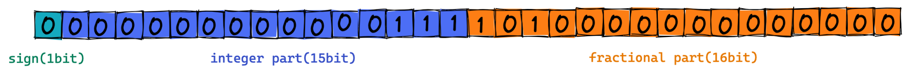
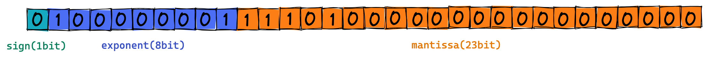
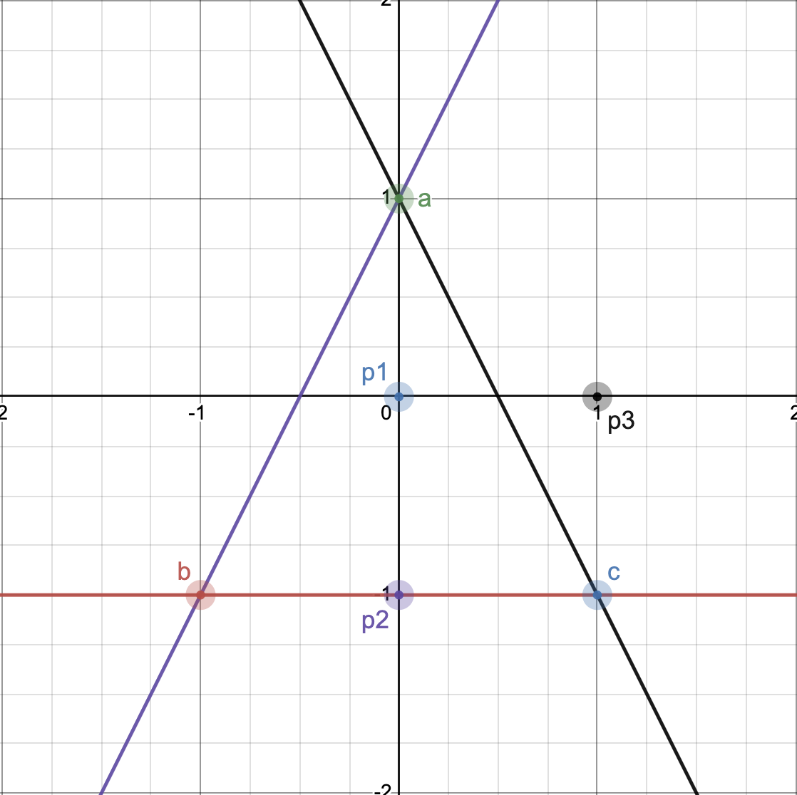

# C++ Module 02

## 개념

- `Ad-hoc polymorphism` : 애드혹 다형성(임시 다형성)
  - 같은 이름의 함수를 매개 변수의 개수 또는 타입을 변경하여 여러 개의 함수가 서로 다르게 행동할 수 있도록 하는 성질
- `operator overloading` : 연산자 오버로딩
  - 사용하는 인자의 자료형에 따라 기존에 정의된 연산자가 아닌 새로 정의한 연산자를 사용하는 방법
- `Orthodox Canonical class form`
  - 사용하지 않더라도 아래의 4가지 규칙을 적용하여 규정대로 클래스를 작성하는 것
    - 디폴트 생성자(default constructor) : 지금까지 사용한 생성자
    - 복사 생성자(copy constructor) : 다른 객체의 값을 복사하여 초기화하는데 사용하는 생성자
    - 복사 대입 연산자(copy assignment operator) : 이미 생성된 같은 타입의 객체에 값을 복사할 때 사용
      - 따로 정의되지 않은 기본 복사 대입 연산자는 얕은 복사를 실행
    - 소멸자(destructor) : 소멸할 때, 호출되는 소멸자

## 고정 소수점과 부동 소수점

컴퓨터에서 소수점을 표시하는 것은 때때로 문제가 된다. 끊임없이 나오는 소수점을 어디까지 저장하는지에 따라 메모리와 계산 정확성이 달라진다.
파이썬의 넘파이는 `float16` , `float32` , `float64` 등의 자료형으로 소수점을 저장할 비트를 정의한다.
이러한 제한된 비트를 가지고 실수를 다루는 두 가지 방법으로 `고정 소수점(Fixed Point)` 과 `부동 소수점(Floating Point)` 이 있다.
밑의 설명은 `float32` 를 기준으로 설명된다.

### 고정 소수점(Fixed Point)

고정 소수점은 정수를 표현하는 비트와 소수를 표현하는 비트 수를 미리 고정하고 해당 비트만 활용하여 실수를 표현한다.

- 첫 1비트는 `부호(sign)` 를 나타낸다. 0은 양수, 1은 음수
- 다음 15비트는 `정수부(integer part)` 를 나타낸다.
- 다음 16비트는 `소수부(fractional part)` 를 나타낸다.
- 정수부와 소수부의 경계를 소수점의 위치라고 생각하고 2진수로 변환된 수를 그대로 넣으면 된다.
- 남는 자리는 0으로 채운다.

예를 들어, 10진수 7.625를 32비트 고정 소수점으로 표현해보자.
먼저 7.625를 2진수로 표현하면 다음과 같다.

$$
7.625_{(10)} = 2^2 \cdot 1 + 2^1 \cdot 1 + 2^0 \cdot 1 + 2^{-1} \cdot 1 + 2^{-2} \cdot 0 + 2^{-3} \cdot 1 = 111.101_{(2)}
$$

이를 위 그림에 대입하여 고정 소수점으로 나타내면 다음과 같다.

#### 장점

- 부동 소수점 방식에 비해서 실수를 표현하는 방법이 단순
- 속도가 빠름

#### 단점
- 비트가 고정되어 있기에 큰 실수를 표현하기 어려움
- 정수부는 딱 15개, 소수부는 딱 16개의 비트만 사용 가능

### 부동 소수점(Floating Point)

우선 여기서 부동의 의미는 떠다닌다는 의미로 소수점이 고정되지 않고 옮겨다닌다고 이해하면 된다.

부동 소수점을 표현하기 위해 다양한 체계가 있는데 일반적으론 [IEEE 754](https://ko.wikipedia.org/wiki/%EC%A0%84%EA%B8%B0%EC%A0%84%EC%9E%90%EA%B3%B5%ED%95%99%EC%9E%90%ED%98%91%ED%9A%8C) 를 사용한다.
이 기준을 따르면 부동 소수점을 다음과 같이 표현할 수 있다.

- 2진수를 정규화(normalize)한다.
- 처음 1비트는 `부호(sign)` 를 나타낸다. 0은 양수, 1은 음수
- 다음 8비트는 `지수부(exponent)` 를 나타낸다. 정규화 과정에서 얻어낸 지수에 bias를 더한 값으로 채운다.
- 다음 23비트는 `가수부(mantissa)` 를 나타낸다. 소수 부분의 값으로 채운다.

#### 정규화

컴퓨터 공학에서 정규화란 2진수를 $1.\cdots X 2^n$ 형태로 나타내는 것이다.
10진수 7.625를 정규화하기 위해 먼저 2진수로 변환한 $111.101_{(2)}$ 를 가져온다.
그리고 이를 정규화하면 다음과 같다.

$$1.11101_{(2)} \cdot 2^2$$

여기서 지수부는 2가 됨을 알 수 있다.

#### 지수부(exponent)

지수부를 구했지만 IEEE 754에선 이것을 바로 넣지는 않는다.
IEEE 754 표준에서는 32비트로 실수를 표현할 때, $127_{(10)}$ 이라는 bias를 더한 값으로 채우라고 명시한다.
즉, $129(=127 + 2)$ 를 2진수로 변환한 $10000001_{(2)}$ 를 채운다.

bias를 더해주는 이유는 **지수가 음수일 경우를 대처하기 위해서** 다. 
실수를 표현하듯이 부호 비트를 따로 써도 되지만 그러면 표현할 수 있는 자릿수가 너무 줄어든다.
그렇기에 지수부는 항상 0과 양수값만 가질 수 있으며 8비트가 표현할 수 있는 0 ~ 255의 중간값인 127을 더하는 것이다.

- 0 ~ 127 구간은 음수와 0(실제 지수부는 -127 ~ 0)
- 128 ~ 255 구간은 양수(실제 지수부는 1 ~ 128)

참고로 $0(=00000000_{(2)})$ 과 $255(=11111111_{(2)})$ 는 각각 0과 무한대를 나타내기 위해 이미 예약된 숫자이다.
그렇기에 정규화 방법이 적용되지 않는다.

#### 가수부(mantissa)

가수부는 고정 소수점에서 소수부와 같은 역할을 한다. 정규화 결과의 소수 부분을 가수부 자리에 그대로 넣고 남은 자리는 0으로 채운다.

#### 예시

7.625를 부동 소수점으로 표현하면 다음과 같다.

1. 2진수 변환: $111.101_{(2)}$
2. 정규화: $1.11101_{(2)} X 2^2$
3. 지수부: $2_{(10)} + 127_{(10)}(bias) = 129_{(10)} = 10000001_{(2)}$
4. 가수부: $11101_{(2)}$

#### 장점

- 더 큰 실수 표현 가능
- 최대 $1111110_{(2)}$ 으로 10진수로 바꾸면 254이다. 이는 bias가 더해진 값으로 최대 $1. \cdots X 2^{127}$ 까지 표시할 수 있다.

#### 단점
- 실수 연산이 부정확할 수 있다. 컴퓨터 하드웨어의 본질적 한계로 해결 불가
- 예를 들어 0.3을 2진수로 변환하면 끝나지 않는데 비트를 다 쓰면 멈추기에 근사치로 표시된다.

## BSP 관련

삼각형에서 두 개의 점을 이은 선형방정식을 만들어서 우리가 확인하고자 하는 점과 삼각형의 남은 한 점의 위치가 같은 방향에 위치하는지 확인한다.
세 가지 경우의 수에서 모두 같은 방향에 있다면 그 점은 삼각형 안에 있다.

이때, 위치가 그 선 위에 있다면 점은 삼각형의 경계에 위치한다.

## 참고 문헌

- [42seoul, C++ Module 02](https://cdn.intra.42.fr/pdf/pdf/82236/en.subject.pdf)
- [생각과 고민, CS50 - 고정 소수점과 부동 소수점](https://gguguk.github.io/posts/fixed_point_and_floating_point/)
