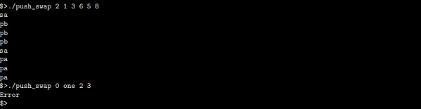
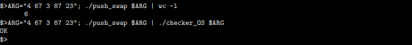

# Push_swap

## 0. Mandatory 개요

### 0.1 목표
- a와 b, 두 개의 스택을 이용하여 a 스택에 오름차순으로 정렬하는 것

### 0.2 조건
- a에 서로 중복되지 않는 음수, 혹은 양수 등 정수 범위 안에 난수가 있다.
- b는 비어있다.
- 인자에 정수가 아니거나 범위를 초과, 혹은 중복이 있으면 Error와 줄바꿈을 출력한다.
- 아래와 같은 연산만 사용 가능하다.

### 0.3 연산
- sa : swap a - 스택 a의 가장 위에 있는 두 원소의 위치를 서로 바꾼다. 원소가 하나이거나 없으면 아무것도 하지 않는다.

- sb : swap b - 스택 b의 가장 위에 있는 두 원소의 위치를 서로 바꾼다. 원소가 하나이거나 없으면 아무것도 하지 않는다.

- ss : sa와 sb를 동시에 실행한다.

- pa : push a - 스택 b에서 가장 위(탑)에 있는 원소를 가져와서, 스택 a의 맨 위(탑)에 넣는다. 스택 b가 비어 있으면 아무 것도 하지 않는다.

- pb : push b - 스택 a에서 가장 위(탑)에 있는 원소를 가져와서, 스택 b의 맨 위(탑)에 넣는다. 스택 a가 비어있으면 아무 것도 하지 않는다.

- ra : rotate a - 스택 a의 모든 원소들을 위로 1 인덱스 만큼 올린다. 첫 번째 원소(탑)는 마지막 원소(바텀)가 된다.

- rb : rotate b - 스택 b의 모든 원소들을 위로 1 인덱스 만큼 올린다. 첫 번째 원소(탑)는 마지막 원소(바텀)가 된다.

- rr : ra와 rb를 동시에 실행한다.

- rra : reverse rotate a - 스택 a의 모든 원소들을 아래로 1 인덱스 만큼 내린다. 마지막 원소(바텀)는 첫 번째 원소(탑)가 된다.

- rrb : reverse rotate b - 스택 b의 모든 원소들을 아래로 1 인덱스 만큼 내린다. 마지막 원소(바텀)는 첫 번째 원소(탑)가 된다.

- rrr : rra와 rrb를 동시에 실행한다.

### 0.4 규칙

- Makefile 제출, relink 안 됨
- 전역 변수 사용 불가
- 'push_swap' 이라는 이름의 프로그램 작성
- 정수 목록으로 포맷된 스택으로 인수 사용
- 첫 번째 인수가 스택에 가장 맨 위에 있어야 한다.
- 프로그램은 스택 a를 오름찬순 정렬할 수 있는 가장 작은 명령 목록을 푶시해야 한다.
- 명령어는 '\n'으로 구분해야 하며 그 외에는 아무 것도 구분하지 않는다.
- 최소 작업으로 정렬이 수행되도록 만들어야 한다.
- 매개변수가 입력되지 않은 경우, 프로그램은 아무 것도 표시하지 않고 프롬프트를 반환
- 오류의 경우, 표준 오류에 "Error"를 표시한 다음 "\n"을 표시해야 한다. 
	- 정수가 아닌 인자가 들어올 경우
	- 정수의 범위를 넘어가는 경우
	- 중복된 인자가 있는 경우
- 올바른 인자와 잘못된 인자가 들어왔을 때  
	
- checker를 사용했을 때  
	

# 참고 문헌
- [42 seoul, push_swap](https://cdn.intra.42.fr/pdf/pdf/67975/en.subject.pdf)
- [push_swap 가이드](https://www.notion.so/push_swap-c15e62229b9541d78fadec4d6aae8b50)
