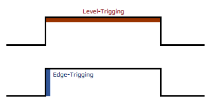
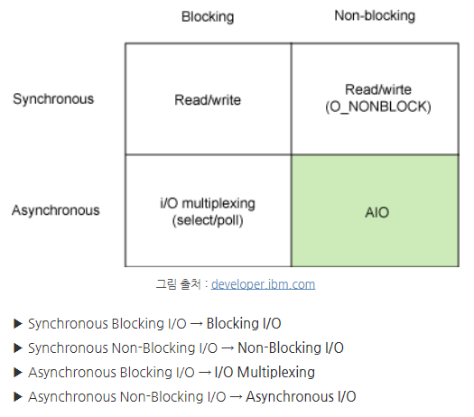

# Webserve

작업은 [이 곳](https://github.com/42WebservStudy/webserv)에서 진행했습니다.

## Index

- [0. Subject](#0-subject)
    - [0.1 개요](#01-개요)
    - [0.2 Mandatory](#02-mandatory)
    - [0.3 요구 사항](#03-요구-사항)
    - [0.4 For MacOS](#04-for-macos)
    - [0.5 Configuration file](#05-configuration-file)
    - [0.6 Bonus](#06-bonus)
- [1. 함수 정리](#1-함수-정리)
    - [1.1 socket address structures](#11-socket-address-structures)
        - [1.1.1 sockaddr](#111-sockaddr)
        - [1.1.2 sockaddr_in](#112-sockaddrin)
        - [1.1.3 sockaddr_in6](#113-sockaddrin6)
    - [1.2 socket()](#12-socket)
    - [1.3 bind()](#13-bind)
    - [1.4 listen()](#14-listen)
    - [1.5 accept()](#15-accept)
    - [1.6 connect()](#16-connect)
    - [1.7 select()](#17-select)
    - [1.8 epoll](#18-epoll)
        - [1.8.1 epoll_create()](#181-epollcreate)
        - [1.8.2 epoll_wait()](#182-epollwait)
        - [1.8.3 epoll_ctl()](#183-epollctl)
    - [1.9 kqueue()](#19-kqueue)
    - [1.10 htons(), htonl(), ntohs(), ntohl()](#110-htons-htonl-ntohs-ntohl)
- [2. IO Multiplexing](#2-io-multiplexing)
    - [2.1 기본 개념](#21-기본-개념)
    - [2.2 Multiplexing](#22-multiplexing)
- [3. Nginx](#3-nginix)
- [참고 문헌](#참고-문헌)

## 0. Subject

### 0.1 개요

- 이름: Webserv(마침내 왜 URL의 시작이 HTTP인지 이해할 수 있다.)
- version: 20.7
- 요약
    - 이 프로젝트는 자신만의 HTTP 서버를 작성하는 것
    - 실제 브라우저로 테스트 할 수 있어야 한다.
    - HTTP는 인터넷에서 가장 많이 사용되는 프로토콜이다.
    - 웹 사이트에 관한 작업을 하지 않을지라도 이 지식은 유용할 것이다.

### 0.2 Mandatory

| Name             | content                                                        |
|:-----------------|:---------------------------------------------------------------|
| Program name     | webserv                                                        |
| Trun in files    | Makefile, *.{h, hpp}, *.cpp, *.tpp, *.ipp, configuration files |
| Makefile         | NAME, all, clean, fclean, re                                   |
| Arguments        | [A configuration file]                                         |
| External functs. | Everything in C++ 98.<br/>그 외는 subject 파일 참고                   |
| Libft authorized | n/a                                                            |
| Description      | A HTTP server in C++ 98                                        |

- 반드시 C++ 98로 HTTP 서버를 작성해야 한다.
- 실행파일은 아래와 같이 실행되어야 한다.

```shell
./webserv [configuration file]
```

> subject와 평가표에 `poll()` 이 언급되어 있더라도,`select()`, `kqueue()`, `epoll()` 등 동등한 함수들을 사용할 수 있다.

### 0.3 요구 사항

- 실행 프로그램은 configuration 파일은 인자로 받거나 default 경로를 사용해야 한다.
- `execve` 함수로 또 다른 웹 서버를 실행할 수 없다.
- 서버는 절대로 차단해선 안 되며, 필요한 경우 클라이언트가 제대로 바운스될 수 있어야 한다.
- 서버는 차단되지 않은 상태여야 하며 클라이언트-서버 간의 모든 I/O 연산에 대해 `poll`이나 이에 상응하는 연산은 오직 1개만 사용되어야 한다.
- `poll`이나 이에 상응하는 연산은 읽기와 쓰기를 동시에 확인해야 한다.
- `poll` 이나 이에 상응하는 연산을 거치지 않고 읽기나 쓰기 작업을 수행해서는 안 된다.
- 구성 파일을 읽기 전에는 `poll` 이나 이에 상응하는 연산을 사용할 필요가 없다.

> 차단되지 않은 파일 디스크립터를 사용하기에 `poll`이나 이에 상응하는 함수없이 읽기/받기나 쓰기/보내기 함수를 사용할 수 있으며 서버는 차단되지 않는다.
> 하지만 시스템 자원을 더 많이 소비하게 된다.
> 따라서 `poll`이나 이에 상응하는 함수를 사용하지 않고 fd에서 읽기/받기나 쓰기/보내기를 시도하면 점수는 0이 된다.

- 모든 매크로를 사용할 수 있다. `FD_SET, FD_CLR, FD_ISSET, FD_ZERO` 와 같이 정의할 수 있다.
- 서버에 대한 요청이 절대 중단되지 않아야 한다.
- 서버는 선택한 웹 브라우저와 호환되어야 한다.
- Nginx는 HTTP 1.1을 준수하며 헤더와 응답 동작을 비교하는데 사용될 수 있다.
- HTTP의 응답 상태 코드가 정확해야 한다.
- 기본 오류 페이지가 제공되지 않는 경우 서버에 기본 오류 페이지가 있어야 한다.
- `fork`를 CGI가 아닌 다른 것(예: PHP, Python 등)에 사용할 수 없다.
- 완전히 정적인 웹 사이트를 제공할 수 있어야 한다.
- 클라이언트가 파일을 업로드할 수 있어야 한다.
- 최소한 `GET, POST, DELETE` 메소드가 필요하다.
- 서버에 대한 stress 테스트에도 서버는 항상 사용 가능한 상태를 유지해야 한다.
- 서버가 여러 포트를 수신할 수 있어야 한다. (configuration 파일 참조)

### 0.4 For MacOS

MacOS는 다른 UNIX와 다르게 `write`를 구현했기에 `fcntl`을 사용할 수 있다.
다른 UNIX와 유사한 동작을 얻으려면 차단되지 않은 모드에서 fd를 사용해야 한다.

하지만 `fcntl`은 오직 아래와만 같이 사용할 수 있다.

```c++
fcntl(fd, F_SETFL, O_NONBLOCK);
```

### 0.5 Configuration file

> Nginx의 구성 파일의 server 부분에서 영감을 얻을 수 있다.

구성 파일에서 아래와 같은 것을 수행할 수 있어야 한다.

- 각 서버의 포트와 호스트를 선택한다.
- `server_names`의 설정 여부를 선택한다.
- `host:port`의 첫번째 서버가 이 `host:port`의 기본값이 된다.(즉, 다른 서버에 속하지 않은 모든 요청에 응답한다.)
- 기본 오류 페이지를 설정한다.
- 클라이언트의 body 크기를 제한한다.
- 다음 규칙/구성 중 하나 또는 여러 개를 사용하여 경로를 설정한다.(경로에 정규식은 사용하지 않음)
    - 경로에 허용되는 HTTP 메소드 목록을 정의한다.
    - HTTP 리디렉션을 정의한다.
    - 파일을 검색할 디렉토리나 파일을 정의한다.
    - 디렉토리 목록을 켜거나 끈다.
    - 요청이 디렉토리일 경우, 응답할 기본 파일을 설정한다.
    - 특정 파일 확장자(예: PHP)를 기준으로 CGI를 실행한다.
    - POST 및 GET 메소드와 함께 작동하도록 설정한다.
    - 업로드된 파일을 허용하고 저장 위치를 설정할 수 있는 경로를 만든다.
        - CGI는 무엇인가?
        - CGI를 직접 호출하지 않기에 전체 경로를 `PATH_INFO`로 사용한다.
        - chunk된 요청의 경우 서버가 chunk를 unchunk해야 하며, CGI는 본문의 끝을 EOF로 예상한다는 것만 기억해야 한다.
        - CGI의 출력도 마찬가지다. CGI에서 `content_length`가 반환되지 않으면, EOF는 반환된 데이터의 끝을 표시한다.
        - 프로그램은 요청된 파일을 첫 번째 인자로 CGI를 호출해야 한다.
        - CGI는 상대 경로 파일에 접근하기 위해 올바른 디렉토리에서 실행되어야 한다.
        - 서버는 하나의 CGI(php-CGI, Python 등)로 작동해야 한다.

평가 중에 모든 기능이 작동하는지 테스트하고 시연할 수 있도록 몇 가지 구성 파일과 기본 파일을 제공해야 한다.

> 동작에 대한 의문이 있는 경우 Nginx와 비교해야 한다.
> 예를 들어 `server_name`이 어떻게 작동하는지 확인하면 된다.
>
> 작은 테스터가 함께 제공된다.
> 브라우저와 테스트에서 모든 것이 정상적으로 작동한다면 이 테스터를 반드시 통과해야 하는 것은 아니다.
> 하지만 도움이 될 수 있다.

> 중요한 건 서버는 절대 죽어선 안 된다.

> 하나의 프로그램으로만 테스트하면 안 된다.
> Python, Golang 등 편리한 언어로 테스트를 해보자.
> C++로도 테스트는 가능하다.

### 0.6 Bonus

- 쿠키 및 세션 관리 지원
- 여러 CGI를 처리

## 1. 함수 정리

### 1.1 socket address structures

소켓주소는 **IP + port**이다. 즉, 목적지를 찾아가려면 IP주소와 함께 port 정보까지 있어야 한다.
그리고 IP 주소도 IPv4냐 IPv6냐에 따라서 길이가 달라진다.
그렇기에 우리가 어떤 프로토콜을 사용하느냐에 따라 주소 정보를 나타내는 데이터 타입이 달라진다.
이를 사용하기 편하도록 주소구조체가 있으며 그에 맞는 틀을 형성해준다.

|  Socket Structure   | Address Family |
|:-------------------:|:--------------:|
| struct sockaddr_dl  |    AF_LINK     |
| struct sockaddr_in  |    AF_INET     |
| struct sockaddr_in6 |    AF_INET6    |
| struct sockaddr_ll  |   AF_PACKET    |
| struct sockaddr_un  |    AF_UNIX     |

이 구조체들은 `netline/in.h`에 포함되어 있으며 이 헤더가 `arpa/inet.h`에 정의되어 있으므로 둘 중 하나를 선언하면 된다.

#### 1.1.1 sockaddr

`sockaddr` 구조체는 소켓의 주소를 담는 **기본 구조체 틀의 역할**을 한다.
그래서 보통 `connect`와 같은 함수들이 인자 타입으로 `sockaddr`을 받는다.

즉, 위에 있는 어떤 구조체를 사용하더라도 `connect, bind` 등의 함수 인자로 쓸 땐 `(struct sockaddr*)`로 형변환을 해서 사용한다.
이때, `void *`를 사용하지 않는 이유는 `sockaddr*`이 처음 나올 때, void 포인터가 존재하지 않았기 때문이며 그 후에도 의미전달을 위해 `sockaddr*`을 사용한다.

```c++
struct sockaddr {
    u_short sa_family;
    char    sa_data[14];
};
```

- `sa_family`: 주소체계
- `sa_data`: 해당 주소체계에서 사용하는 주소 정보(IP정보 + 포트정보)

#### 1.1.2 sockaddr_in

`sockaddr_in` 구조체는 IPv4 주소를 사용한다.

```c++
struct sockaddr_in {
    sa_family_t     sin_family;
    uint16_t        sin_port;
    struct in_addr  sin_addr;
    char            sin_zero[8];
};
```

- `sin_family`: 주소체계를 저장하는 필드, `sockaddr_in`은 IPv4를 사용하니 AF_INET을 넣으면 된다.
  > `sockaddr_in`이 IPv4만 지원하는데 굳이 변수가 있는 이뉴는 처음 만들어질 당시, 여러 주소 체계가 사용될 것으로 예상했기 때문이다.
- `sin_port`: 포트 정보를 저장
- `sin_addr`: IPv4 주소를 저장
    ```c++
    struct in_addr {
        uint32_t    s_addr;  // 32비트 IPv4 주소
    };
    ```
- `sin_zero`: 사용하지 않는 필드, 0으로 채워야 함

#### 1.1.3 sockaddr_in6

`sockaddr_in6` 구조체는 IPv6 주소를 사용한다.

```c++
struct sockaddr_in6 {
    sa_family_t     sin6_family;
    in_port_t       sin6_port;
    uint32_t        sin6_flowinfo;
    struct in6_addr sin6_addr;
    uint32_t        sin6_scope_id;
};
```

- `sin6_family`: 주소체계를 저장하는 필드, `sockaddr_in6`은 IPv6를 사용하니 AF_INET6을 넣으면 된다.
- `sin6_port`: 포트 정보를 저장
- `sin6_flowinfo`: 32bit 필드, IPv6 헤더 정보에서 찾을 수 있는 traffic class와 flow label을 포함하고 있다.
    - ~20bit 전까지는 flow label, 20~27bit 까지는 traffic class를 의미한다.
    - 대게 필드는 0이다.
- `sin6_addr`: IPv6 주소를 저장
    ```c++
    struct sin6_addr {
        uint8_t    s6_addr[16];  // 8bit짜리 16개로 128bit 저장
    };
    ```
- `sin6_scope_id`: 인터페이스 scope identifier
    - link-local 주소체계에서는 모든 인터페이스가 같은 네트워크를 가지고 있다. 그래서 인터페이스를 구분하는데 사용하는 변수다.
    - 특정 조건에서만 사용되며 대부분은 0을 넣는다.

### 1.2 socket()

`socket`은 소켓을 생성하여 반환하는 함수다.

```c++
#include <sys/socket.h>

int socket(int domain, int type, int protocol);
```

- 인자
    - `domain`: 인터넷을 통해 통신할 지, 프로세스끼리 통신할 지 여부를 설정

| domain             | 내용                          |
|:-------------------|:----------------------------|
| PF_INET(AF_INET)   | IPv4 인터넷 프로토콜 사용            |
| PF_INET6(AF_INET6) | IPv6 인터넷 프로토콜 사용            |
| PF_LOCAL(AF_UNIX)  | 같은 시스템 내의 프로세스끼리 통신         |
| PF_PACKET          | Low level socket을 인터페이스로 사용 |
| PF_IPX             | IPX 노벨 프로토콜을 사용             |

- `type`: 데이터 전송 형태 지정

| type        | 내용              |
|:------------|:----------------|
| SOCK_STREAM | TCP/IP 프로토콜을 사용 |
| SOCK_DGRAM  | UDP/IP 프로토콜을 사용 |

- `protocol`: 특정 프로토콜 사용을 지정하기 위한 변수, 보통은 0으로 설정
- 반환값
    - `-1`: 실패
    - `그 외`: 소켓 디스크립터

### 1.3 bind()

`bind` 는 소켓에 로컬 주소를 할당하는 함수다.

```c++
#include <sys/socket.h>

int bind(int sockfd, struct sockaddr *myaddr, socklen_t addrlen);
```

- 인자
    - `sockfd`: 소켓 디스크립터
    - `myaddr`: 주소 정보
    - `addrlen`: myaddr 구조체의 크기
- 반환값
    - `0`: 성공
    - `-1`: 실패

### 1.4 listen()

`listen` 은 서버가 연결 요청 대기상태로 만드는 함수다.

```c++
#include <sys/socket.h>

int listen(int sock, int backlog);
```

- 변수
    - `sock`: 연결요청 대기상태에 두고자 하는 소켓 디스크립터, 여기서 전달된 소켓이 서버 소켓이 된다.
    - `backlog`: 연결요청 대기 큐의 크기정보, 만약 5가 들어가면 클라이언트의 연결요청을 5개까지 대기시킬 수 있다.
- 반환값
    - `0`: 성공
    - `-1`: 실패

> `연결요청 대기상태`: 클라이언트가 연결 요청을 했을 때, 연결이 수락될 때까지 서버 측에서 연결요청 자체를 대기시킬 수 있는 상태
> `연결요청 대기 큐`: 클라이언트가 연결요청을 했을 때, 서버 측에서 accept 함수로 허락하기 전까지 머물러 있는 일종의 대기실

### 1.5 accept()

`accept`는 클라이언트의 접속 요청을 수락하는 함수다.

```c++
#include <sys/socket.h>

int accept(int sockfd, struct sockaddr *addr, socklen_t *addrlen);
```

- 변수
    - `sockfd`: 소켓 디스크립터, end-point(듣기 소켓)이 들어간다.
    - `addr`: 연결이 성공하면 입력된 구조체에 클라이언트의 정보들이 있다.
    - `addrlen`: addr의 크기
- 반환값
    - `-1`: 실패
    - `그 외`: 소켓 디스크립터

### 1.6 connect()

`connect` 는 클라이언트가 서버에 연결 요청하는 함수다.

```c++
#include <sys/socket.h>

int connect(int sockfd, const struct sockaddr *serv_addr, socklen_t addrlen);
```

- 변수
    - `sockfd`: 소켓 디스크립터
    - `serv_addr`: 연결할 서버의 정보가 담긴 sockaddr 구조체
    - `addrlen`: 구조체의 크기
- 반환값
    - `0`: 성공
    - `-1`: 실패

### 1.7 select()

`select` 는 하나의 서버가 여러 개의 클라이언트와 통신할 때, 하나의 스레드에서 통신할 수 있도록 fd의 변화를 감지하는 함수이다.

```c++
#include <sys/select.h>

int select(int nfds, fd_set *readfds, fd_set *writefds, fd_set *exceptfds, struct timeval *timeout);
```

- 변수
    - `nfds`: 관리하느 fd의 개수, 최대 파일번호 + 1로 지정
    - `readfds`: 읽을 데이터가 있는지 확인할 fd가 들어있는 구조체
    - `writefds`: 쓰여진 데이터가 있는지 확인할 fd가 들어있는 구조체
    - `exceptfds`: fd에 예외사항이 있나 검사할 목록
    - `timeout`: 타임아웃 시간, NULL을 설정하면 타임아웃 없음
        - `select` 함수는 blocking 함수이므로 타임아웃을 주어 blocking 되는 것을 막음
- 반환값
    - `0`: 타임아웃
    - `양수`: 변화가 생긴 fd의 수
    - `-1`: 오류

그리고 `fd_set` 구조체를 위한 함수도 있다.

```c++
void FD_ZERO(fd_set *set);           // fd_set 초기화 함수
void FD_SET(int fd, fd_set *set);    // fd번째 fd_set을 1로 설정
void FD_CLR(int fd, fd_set *set);    // fd번째 fd_set을 0으로 설정
int  FD_ISSET(int fd, fd_set *set);  // fd번째 fd_set이 1인지 확인 -> fd에 변화가 생겼는지 확인 가능
```

`select` 는 대상 fd를 배열에다 쭉 집어넣고 하나하나 순차 검색하는 가장 원초적인 방식을 사용한다.
때문에 대상 fd가 늘어날수록 느려지며 O(n)의 시간복잡도를 가진다.
또한 고정된 단일 bit table을 사용하기에 관리할 수 있는 fd도 최대 1024개로 제한되어 있다.

### 1.8 epoll

`epoll` 은 `select` 함수처럼 multiplexing에서 fd를 관리한다.
관리할 수 있는 fd의 수는 무제한이며 `select, poll` 과 달리 fd의 상태가 kernel에서 관리하여 상태가 바뀐 것을 직접 통지해준다.
즉, fd_set을 검사하기 위해 루프를 돌 필요가 없다.
또한 변화가 감지된 fd의 목록 자체를 반환하기 때문에 파일을 추가 탐색할 필요가 없어 효율적이다.

epoll은 두 가지 방식이 존재한다.



1. Level-Triggered(LT): 특정 준위(상태)가 **유지**되는 동안 감지
    - 입력 buffer에 데이터가 남아있는 동안 계속해서 이벤트가 등록
    - `select, poll`은 Level-Triggered 방식만 지원
2. Edge-Triggered(ET): 특정 준위(상태)가 **변화**하는 시점에만 탐지
    - 입력 buffer로 데이터가 수신된 상황에 딱 한 번 이벤트가 등록
    - 이후 재설정은 하지 않는다.

```c++
typedef union epoll_data {
    void        *ptr;
    int         fd;
    _uint32_t   u32;
    _uint64_t   u64;
}   epoll_data_t;

struct epoll_event {
    __uint32_t      events; // 발생한 이벤트
    epoll_data_t    data;   // user data 직접 설정 가능
};
```

```c++
#include <sys/epoll.h>

int epoll_create(int size);
int epoll_wait(int epfd, struct epoll_event *events, int maxevents, int timeout);
int epoll_ctl(int epfd, int op, int fd, struct epoll_event *event);
```

#### 1.8.1 epoll_create()

입력한 size만큼 kernel에 polling 공간을 요청한다.

- 변수
    - `size`: 요청할 polling 공간의 크기
        - size는 예상되는 최대 동시 접속 수로 설정
        - 하지만 시스템 자원이 감당할 수 있는지 먼저 확인이 필요하다.
- 반환값: fd

#### 1.8.2 epoll_wait()

이벤트 발생까지 대기한다.

- 변수
    - `epfd`: `epoll_create` 에서 생성된 관심 대상 fd
    - `events`: 발생한 이벤트의 정보
    - `maxevents`: 처리할 최대 event 수 제한
    - `timeout`
        - `0`: 대기없이 즉시 종료
        - `-1`: 무한 대기
        - `그 외`: millisecond 단위 시간
- 반환값
    - `0`: timeout 내 이벤트가 발생하지 않았을 때
    - `그 외`: 발생한 이벤트 개수

#### 1.8.3 epoll_ctl()

어떤 fd에 대해 어떤 event를 관찰할지 관리한다.

- 변수
    - `op`: fd에 대해 어떤 작업을 할지 정의
        - `EPOLL_CTL_ADD`: fd 추가
        - `EPOLL_CTL_DEL`: fd 삭제
        - `EPOLL_CTL_MOD`: fd의 event 값 변경
    - `event`: 모니터링 대상 fd에 어떤 이벤트가 발생했을 때, 인지할 지 정의
        - `EPOLLIN`: read(입력) 이벤트 발생
        - `EPOLLOUT`: write(출력) 이벤트 발생
        - `EPOLLERR`: 에러 발생
        - `EPOLLHUP`: 연결 종려 또는 Half-close 발생
        - `EPOLLPRI`: 중요 데이터(OOB) 발생 여부 검사
        - `EPOLLLET`: Edge-Triggered 방식으로 설정, default는 Level-Triggerd

Edge-Triggered 방식을 사용하면 데이터 수신 시 딱 한 번만 이벤트를 발생시키기에 충분한 양의 buffer를 마련한 다음 한 번에 모든 데이터를 다 읽어들여야 깔끔하게 동작한다.
만약 buffer size보다 큰 데이터가 들어오면 여러 번에 걸쳐 write를 해야 하는데 도중 다음 wait 함수를 호출하게 된다면 Blocking 상태로 빠져버리는 문제점이 있다.
그렇기에 Edge-Triggered 방식으로 epoll을 구현할 때는 socket을 Non-Blocking socket으로 생성해야 한다.

여기서 Non-Blocking 방식이라면 데이터 수신이 완료되었는지 별도로 상태 체크(polling)를 해준다고 앞서 언급했다.
그렇기에 Edge-Triggered 방식으로 epoll을 구현할 때는 error.h를 추가해 반환되는 errno를 보고 완료 유무를 판단해야 한다.
errno가 `EWOULDBLOCK` 이 될 때까지, 즉 buffer가 비워질 때까지 읽는 것이다.
그렇기에 Non-Blocking으로 구현할 때는 buffer size를 고려하고 errno도 상시로 확인해야 한다.

### 1.9 kqueue()

먼저 `kqueue 기법`은 [FreeBSD](https://ko.wikipedia.org/wiki/FreeBSD) 환경에서 사용하는 I/O Multiplexing 기법이다.
kernel에 event를 저장할 queue를 생성하면, I/O event가 queue에 쌓이고 사용자가 이를 직접 polling하는 방식이기에 `select, poll` 처럼 event가 발생한 fd를 찾기 위한
추가 작업이 필요없다.
FreeBSD 환경에서의 `epoll`이라고도 할 수 있다.

```c++
#include <sys/event.h>

int kqueue(void);
int kevent(int kq, const struct kevent *changelist, int nchanges, \
           struct kevent *eventlist, int nevents, const struct timespec *timeover);
```

`kqueue` 는 event를 저장할 새로운 queue를 kernel에 요청하는 함수다. 해당 queue의 fd를 반환한다.

`kevent` 는 kqueue에 특정 event를 등록하고 보류중인 event를 등록하거나 사용자에게 반환하는 함수다.
즉, `kqueue`로 할당받은 공간을 `kevent`로 관리하는 것이다.

- 변수
    - `kq`: `kqueue` 함수가 반환한 kqueue의 fd
    - `chagelist`
        - <sys/event.h>에 정의된 kevent 구조의 배열에 대한 pointer
        - 변경 목록에 포함된 모든 변경사항은 큐에서 보류 중인 이벤트를 읽기 전에 적용
    - `nchanges`: 변경 목록의 크기
    - `eventlist`: kevent 구조체 배열에 대한 pointer
    - `nevents`: eventlist의 크기, 0이면 즉시 반환
    - `timeout`
        - null이면 kevent가 무한 대기
        - user process의 polling을 위해선 값이 0인 timespec 구조를 가리키게 구현해야 함

`kqueue` 함수에 대한 모든 작업은 같은 이름의 `kevent` 구조체에 의해 이루어진다.
`kevent` 는 ident, filter라는 인자를 하나의 key로 삼아 식별되며, kqueue 내에는 독립적인 kevent만 존재하게 된다.
filter까지 하나의 key로 보는 이유는 filter가 기존 저장된 event가 존재하는지 여부를 판단하는 역할을 하기 때문이다.

filter는 kevent의 초기 등록 시 실행되며, I/O event가 발생할 때마다 fileter가 확인을 하고, 신규 event일 때 kqueue에 배치된다.
사용자가 kqueue에서 kevent를 검색하려고 할 때도 실행되는데 만약 event 발생 조건에 부합되지 않는다면 해당 kevent는 kqueue에서 제거되고 return 되지 않는다.
이렇게 filter가 선분류를 진행해서 kqueue에는 kevent가 최소한으로 배치된다.

```c++
struct kevent {
  uintptr_t ident; /* identifier for this event */
  int16_t   filter; /* filter for event */
  uint16_t  flags; /* general flags */
  uint32_t  fflags; /* filter-specific flags */
  intptr_t  data; /* filter-specific data */
  void *    udata; /* opaque user data identifier */
  uint64_t  ext[4]; /* extensions */
};
```

- `ident`: event 식별자
- `filter`: event 선처리할 때 사용되는 filter
    - `EVFILT_READ`: fd를 ident로 지정 -> 읽을 data가 있을 때마다 반환
    - `EVFILT_WRITE`: fd를 ident로 지정 -> 쓸 data가 있을 때마다 반환
    - `EVFILT_EMPTY`: fd를 ident로 지정 -> 쓸 data가 없을 때마다 반환
    - `EVFILT_VNODE`: fd 또는 fflags에서 지정한 event를 ident로 지정 -> event 발생 시 반환
    - `EVFILT_PROC`: 감시할 pid 또는 fflags에서 지정한 event를 ident로 지정 -> event 발생 시 반환
    - `EVFILT_SIGNAL`: signal number를 ident로 지정 -> signal 발생 시 반환
    - `EVFILT_TIMER`: 임의의 timer를 ident로 지정 -> 주기마다 반환
- `flags`: event에 수행할 작업
    - `EV_ADD`
        - kqueue에 이벤트를 추가
        - 있는 event를 또 추가하면 인자가 update되어 중복 방지
        - 추가된 event는 `EV_DISABLE` 플래그로 재정의되지 않는 한 자동으로 활성화
    - `EV_ENABLE`: `kevent()` 호출 시, event 반환을 허용
    - `EV_DISABLE`: 이벤트를 비활성화하여 `kevent()`가 반환하지 않도록 함, 필터 자체는 비활성화되지 않음
    - `EV_DISPATCH`: 이벤트 전달 직후 `EV_DISABLE` 설정
    - `EV_DELETE`: kqueue에서 이벤트 제거
    - `EV_RECEIPT`: kqueue 대량 변경 시 유용(보류 중인 event 제외)
    - `EV_ONESHOT`
        - event 감지로 인한 첫 번째 filter 실행만 반환
        - 이후, 사용자가 kqueue에서 event를 검색하면 삭제됨
    - `EV_CLEAR`
        - 사용자가 event 검색 후 상태 재설정
        - 재 상태 대신 상태 변화를 보고하는 필터에 유용
    - `EV_ERROR`: 각종 error
- `fflags`: `filter`별 flag
- `data`: `filter`별 data 값
- `udata`: 명확하지 않은 user data
- `ex[4]`: kernel과 주고받는 확장 data
    - `ex[0], ex[1]`: filter에 의해 정의
    - `ex[2], ex[3]`: context

kevent 구조체를 쉽게 초기화하기 위한 `EV_SET()` 함수도 있다.

```c++
EV_SET(key, ident, filter, flags, fflagse, data, udata)
```

### 1.10 htons(), htonl(), ntohs(), ntohl()

## 2. IO Multiplexing

이 글은 [1부](https://blog.naver.com/n_cloudplatform/222189669084)
와 [2부](https://blog.naver.com/n_cloudplatform/222255261317)를 정리한 것이다.

### 2.1 기본 개념

I/O 작업은 커널에서 동작하기에 유저는 I/O 작업을 '요청'하고 '응답'을 받는다.
이에 따라 응답을 어떤 순서로 받는지(synchronous/asynchronous), 어떤 타이밍에 받는지(blocking/non-blocking)에 따라 여러 모델로 나뉜다.

| 종류                | 특징                                                                                                                                          |
|:------------------|:--------------------------------------------------------------------------------------------------------------------------------------------|
| Synchronous(동기)   | - 모든 I/O 요청-응답 작업이 **일련의 순서**에 따라 진행된다.<br/>- 작업의 순서가 보장된다.<br/>- 작업 완료를 유저가 판단하고 다음 작업을 언제 요청할지 결정한다.<br/>- 일련의 Pipeline을 준수하는 구조에서 효율적이다. |
| Asynchronous(비동기) | - 커널에 I/O 작업을 요청해두고 다른 작업 처리는 가능하나 순서는 보장되지 않는다.<br/>- 작업 완료를 커널이 통보한다.<br/>- 각 작업이 독립적이거나 작업 별 지연이 큰 경우 효율적이다.                             |

| 종류           | 특징                                                                                                 |
|:-------------|:---------------------------------------------------------------------------------------------------|
| Blocking     | - 요청한 작업이 모두 완료될 때까지 기다렸다가 완료될 때 응답과 결과를 반환받는다.<br/>- 요청한 작업 결과를 기다린다.                             |
| Non-Blocking | - 작업 요청 이후 결과는 나중에 필요할 때 전달받는다.<br/>- 요청한 작업 결과를 기다리지 않는다.<br/>- 중간중간 필요하면 상태 확인은 할 수 있다.(polling) |



위 특징에 따라 I/O 모델은 4가지로 나뉘지만 딱 잘라 정의할 수는 없다.
특별히 I/O Multiplexing은 Asynchronous Blocking 방식이라고 말하기엔 무리가 있다.
그렇기에 세부 기법을 위주로 이해하는 것을 저자는 추천한다.

각각의 특징들은 본문을 직접 참고할 것

### 2.2 Multiplexing

다중화는 하나를 여러 개처럼 보이게 동작한다는 의미이다.
이를 I/O 관점에서 해석하면 **한 프로세스가 여러 파일을 관리**하는 기법이다.
만약 server-client 환경이라면 하나의 server에서 여러 socket을 관리하여 여러 client가 접속할 수 있도록 구성된다.

프로세스에서 특정 파일에 접근할 때는 fd를 이용하는데 fd를 어떻게 감시하면서 대기하느냐에 따라 `select, poll, epoll(linux), kqueue(bsd), iocp(window)` 등 다양한
기법들로 나뉜다.

## 3. Nginx
### 3.1 개요
`Nginx`는 러시아 개발자인 Igor Sysoev가 개발한 **동시접속 처리에 특화된 웹 서버프로그램**이다.
`Apache`보다 동작이 단순하고 전달자 역할만하기 때문에 동시접속 처리에 특화되어 있다.

> #### Apache
> `Apache`는 1995년 개발된 오픈소스 웹서버다.
> 웹브라우저에서 아파치 서버에게 클라이언트의 요청을 보내면 이에 아파치 서버가 응답하여 html을 보내주는 것이 기본 동작이다.

| 구분       | Nginx                        | Apache                |
|:---------|:-----------------------------|:----------------------|
| 단순성, 편의성 | 복잡                           | 단순                    |
| 정적 컨텐츠   | 동시 연결 접속 가능(메모리, 속도 모두 더 좋음) | 하나의 클라이언트에 하나의 프로세스   |
| 동적 컨텐츠   | 자체 동적 컨텐츠 처리 기능 없음           | 자체 동적 컨텐츠 기능을 가질 수 있음 |

Nginx는 Event-Driven으로 동작하기에 Apache처럼 요청의 수만큼 자원이 들어가지 않고 단일 서버로 동시에 많은 연결을 처리할 수 있다.

Nginx가 하는 일은 크게 두 가지이다.

- 정적 파일을 응답해주는 **HTTP Web server**
- **Reverse Proxy Server**로 활용되어 WAS 서버의 부하를 줄이는 **로드 밸런서**

두 번째 목적은 클라이언트가 프록시 서버라는 가짜 서버에 요청을 하면 프록시 서버가 요청을 **분배**하여 리버스 서버에게 요청하여 받고 클라이언트에게 전달하는 것을 의미한다.
여기서 프록시 서버가 Nginx, 리버스 서버가 응용프로그램 서버이다.

### 3.2 nginx.conf
Nginx의 기본 설정 파일은 `nginx.conf`이며 아래의 경로 중 하나에 위치한다.

- /usr/local/nginx/conf
- /etc/nginx
- /usr/local/etc/nginx

Nginx의 모듈들은 configuration 파일에 있는 **directives**에 의해 제어된다.

기본적으로 주어지는 nginx.conf는 다음과 같다.

```shell
user www-data;
worker_processes auto;
pid /run/nginx.pid;
include /etc/nginx/modules-enabled/*.conf;

events {
        worker_connections 768;
        # multi_accept on;
}

http {

        ...

        include /etc/nginx/conf.d/*.conf;
        include /etc/nginx/sites-enabled/*;
}
```

directives는 다시 두 개로 나뉜다.

#### simple directives
이름, 인자값이 있고 ;으로 끝난다.

- `user`: linux 시스템의 어떤 사용자가 nginx 서버를 동작시킬지 설정한다.
- `worker_processes`: 몇 개의 thread가 사용될 지 정의한다. cpu 코어 수에 맞추는 것이 권장된다.
- `pid`: nginx pid가 적혀있는 파일이다.
- `include`: 외부 configuration 내용을 가져온다. 모듈에 따라 다른 파일에 작성하고 include하는 것이 권장된다.

#### block directives
중괄호로 구분된 집합 영역을 의미한다.
만약 block directives 내부에 또 다른 block directives를 가질 수 있는 경우, context라고 부른다.

- `core`: 환경 설정 파일의 최상단에 위치하며 한 번만 사용할 수 있다. nginx의 기본적인 동작 방식을 정의한다.
- `http`: 웹서버에 대한 동작을 설정하는 영역으로 server 블록과 location 블록의 루트 블록이다.
- `server`: 가상 호스팅의 개념으로 하나의 서버를 커버한다.
- `location`: server 블록 내에서 특정 URL을 처리하는 방법을 정의한다.
- `events`: 네트워크 동작에 관련된 내용을 설정한다.

적용은 **core -> http -> server -> location**순으로 적용된다.
만약 동일한 simple directives가 block 별로 정의될 경우 depth가 가장 깊은 block의 설정을 따라간다.

directives에 들어갈 수 있는 syntax는 [docs](https://nginx.org/en/docs/http/ngx_http_core_module.html)에 정의되어 있다.
읽는 방법은 아래와 같다.

```shell
Syntax:   log_not_found on | off;  # 문법
Default:  log_not_found on;        # 기본값
Context:  http, server, location   # 해당 Syntax가 적용되는 block directive
```

## 참고 문헌

- [42seoul, webserve](https://cdn.intra.42.fr/pdf/pdf/86733/en.subject.pdf)
- [Webserve tutorials](https://42seoul.gitbook.io/webserv/)
- [MDN, HTTP](https://developer.mozilla.org/ko/docs/Web/HTTP)
- [양햄찌가 만드는 세상, [소켓 프로그래밍]](https://jhnyang.tistory.com/251)
- [네이버클라우드, IO Multiplexing 기본 개념부터 심화까지 -1부-](https://blog.naver.com/n_cloudplatform/222189669084)
- [네이버클라우드, IO Multiplexing 기본 개념부터 심화까지 -2부-](https://blog.naver.com/n_cloudplatform/222255261317)
- [경영학도의 좌충우돌 코딩, Nginx 이해하기 및 기본 환경설정 세팅하기](https://whatisthenext.tistory.com/123)
- [Live Insight, [Linux] Apache Nginx 차이 비교 총정리!!](https://rootkey.tistory.com/143)
- [Icarus, [Nginx]Nginx 이해하기](https://icarus8050.tistory.com/57)
- [-o-k's story, [Ubuntu]Ubuntu 20.04에 Nginx 설치 및 이해](https://t-okk.tistory.com/154)
- [한 단계 더 깊게, [간단 정리]Nginx Tutorial](https://tyoon9781.tistory.com/entry/nginx-tutorial)
- [Gelog, Nginx 설정을 알아보자](https://velog.io/@gehwan96/Nginx-%EC%84%A4%EC%A0%95%EC%9D%84-%EC%95%8C%EC%95%84%EB%B3%B4%EC%9E%90)
