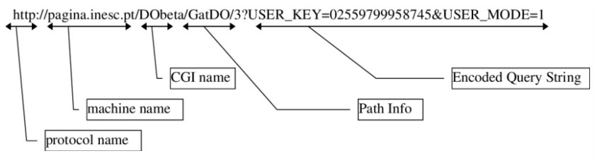

# webserve tutorials

[webserve turorials](https://42seoul.gitbook.io/webserv/)를 보면서 정리한 내용이다.

## Index
- [Web](#web)
- [Webserver](#webserver)
- [HTTP 훑어보기](#http-훑어보기)
- [Request](#request)
- [Response](#response)
- [CGI](#cgi)
- [RFC](#rfc)

## Web

TCP/IP, 웹이 동작하는 방식, HTTP가 하는 일에 대한 설명들은 아래의 글들을 통해 먼저 이해해야 한다.

- [해치지 않는 웹 네트워크 매거진](https://brunch.co.kr/magazine/webnetwork)
- [낭만기획 매거진](https://brunch.co.kr/magazine/romanplan)

그 중 해치지 않는 웹을 읽으며 정리한 것은 각각 [해치지 않는 웹 정리](webnetwork.md)에 간단히 정리했다.

## Webserver

위키에서는 웹 서버를 다음과 같이 정의한다.

> **웹 서버(Web Server)**는 HTTP를 통해 웹 브라우저에서 요청하는 HTML 문서나 오브젝트(이미지 파일 등)을 전송해주는 서비스 프로그램을 말한다.
> 웹 서버의 주된 기능은 웹 페이지를 클라이언트로 전달하는 것이다.
> 주로 그림, css, 자바스크립트로 포함한 HTML 문서가 클라이언트로 전달된다.

- 클라이언트
  - 특정 리소스를 원하는 방식으로 요청
  - 대표적으로 브라우저는 사용자를 대신해서 서버에게 요청하고 처리결과를 띄움
- 서버
  - 클라이언트에게 전달할 리소스들을 가지고 있음
  - 요청에 따라 클라이언트에게 전달
- HTTP
  - 서버와 클라이언트가 응답을 주고 받을 때 지킬 형식적 약속(프로토콜)

즉 웹 서버를 만드는 것은 **클라이언트가 리퀘스트를 보내면 보유하고 있는 특정 리소스를 클라이언트가 요청하는 방식대로 처리하고 그 결과를 돌려주는 프로그램을 만드는 것**이다.

## HTTP 훑어보기

구체적인 통신 방식을 알기 위해 다음 문서들을 훑어보아야 한다.

- [**An overview of HTTP**](https://developer.mozilla.org/en-US/docs/Web/HTTP/Overview)
- [HTTP 완벽 가이드 정리 블로그](https://feel5ny.github.io/2019/08/03/HTTP_001/)

## Request

HTTP 전반에 대한 학습을 끝냈다면, 이제 요청(request)을 이해해야 한다.

리퀘스트는 크게 시작 줄, 헤더 영역, 바디 영역으로 구분된다.

- 시작 줄
  - 클라이언트가 따르는 프로토콜의 버전(Version of the protocol)
  - 처리하기를 원하는 리소스의 서버 내 위치(Paht)
  - 처리방식(Method)
- 헤더 영역
  - 한 줄에 하나의 헤더(key, value 한 쌍)
- 바디 영역
  - method나 헤더 정보에 따라 있거나 없을수도 있다.

즉 리퀘스트는 **`header`를 참조하고 필요하다면 `body`를 사용하여 `path` 위치에 있는 `resource`에 `method`를 적용**하는 것이다.

그렇다면 우리는 두 가지를 더 살펴보아야 한다.

- 리소스에 대해 어떤 처리(method)들이 요청될 수 있는가
- 어떤 헤더들이 어떤 값을 가지고 올 수 있는가

[HTTP 응답코드 정리](https://javaplant.tistory.com/18)

## Response

응답은 요청과 형식이 크게 다르진 않다.

- 시작 줄
  - 프로토콜 버전이 앞에 나온다.
  - path와 method 대신 Status code와 Status message가 온다.
  - code와 message는 1:1 대응이며 메세지는 큰 의미는 없고 코드를 읽기 쉽게 문자로 나타낸 것이다.

- 헤더 영역
  - 요청과 비슷
  - 요청에만 쓰이는 헤더와 응답에만 쓰이는 헤더, 양쪽 모두 쓰이는 헤더 등 다양하게 있다.

- 바디 영역
  - 요청과 비슷

## CGI

새로운 주소들은 모두 만들어져 있는 것들을 그대로 돌려주는 **정적 리소스**와 실행시켜서 어떤 처리를 한 결과를 돌려주는 **동적 리소스** 등의 특정 리소스를 가리킨다.
이때 동적 리소스를 실행시키기 위해서 웹서버 프로그램을 마음대로 코딩할 수는 없다.
이는 그 프로그램을 개발한 개발자만 사용하고 웹서버를 혼란스럽게 만든다.  
그래서 서버가 동적 리소스 실행을 준비하고, 실행하고, 결과를 돌려 받는 일련의 과정에서 지켜야 할 기준들을 `**CGI(Common Gateway Interface)**` 라고 한다.
그리고 CGI를 잘 지켜서 만들어진 프로그램들을 CGI 프로그램, CGI 스크립트라고 한다.

서버 내에 존재하는 리소스들의 주소 체계를 클라이언트가 정확하게 알고 있고
서버 내의 리소스 내용을 변경하지 않는 단순한 요청만 원한다면 CGI의 개념은 불필요하다.
그러나 웹이 더 다양한 작업을 동적으로 처리하기 위해선 어떠한 처리가 필요하다.
예를 들어 회원가입을 하는 과정에서 정보들의 유효성을 검증하고 데이터베이스에 회원 인스턴스를 추가하는 작업 등이 생겨야 한다.

이를 웹 서버 안에 모두 구현하는 것은 사실상 불가능하다.
그렇기에 웹서버는 HTTP/1.1에 따라 범용적인 방식으로 동작하도록 설계하고, 요청(Method)에 따라 리소스를 **실행**하고 결과를 반환하도록 만드는 것이 더 효율적이다.

웹서버가 실행할 수 있는 CGI 프로그램들을 잘 만들어서 적절한 위치에 두면 웹서버에 구현하지 않아도 동적인 리소스들도 사용할 수 있게 된다.

거기다가 URL은 리소스의 서버 내 위치뿐만 아니라, 동적 리소스를 대상으로 참조할 일종의 인자(Pathinfo, Query)들까지 붙일 수 있다.
데이터가 큰 경우엔 body에 실어 보낼 수도 있다.

CGI 프로그램을 실행시킬 때, CGI 프로그램을 위한 환경변수들을 추가로 세팅하여 실행해야 한다.
그리고 이때, 각각의 CGI 환경변수들이 어떤 역할을 하는지 명확하게 이해해야 한다.
이에 대해서 [QAOS](https://qaos.com/sections.php?op=viewarticle&artid=194)에 체계적으로 정리되어있기에 살펴보아야 한다.

## RFC

> **RFC(Request for Comments)** 문서는 비평을 기다리는 문서라는 의미로, 컴퓨터 네트워크 공학 등에서 인터넷 기술에 적용 가능한 연구, 혁신, 기법 등을 아우르는 메모를 나타낸다.

위키에선 위와 같이 RFC를 정의한다.
우리가 정의해야 할 HTTP/1.1은 **[RFC 7230 ~ 7235 번역본](https://roka88.dev/105)**에 모두 설명되어 있다.

## 소켓과 TCP 커넥션

클라이언트와 서버가 통신하기 위해선 연결되어 있어야 한다.
이때 클라이언트와 서버가 1:1로 연결되는 것은 TCP 커넥션이다.
커넥션이 핸들링되는 방식은 3 way handshake이다.

이때, 연결되는 주체는 단순 호스트가 아니다.
호스트에는 수많은 프로세스들이 있고, 그 프로세스들은 각자 포트 번호를 가진다.
클라이언트의 특정 프로세스(즉 포트)와 서버의 특정 프로세스(역시 포트)가 연결되는 것이다.
이 때 서버 프로세스에서는 자신의 포트가 클라이언트와 메세지를 주고 받을 수 있도록 소켓을 생성한다.

> 소켓에 관한 이야기는 [소켓의 이해](http://jkkang.net/unix/netprg/chap2/net2_1.html)를 참고할 것

